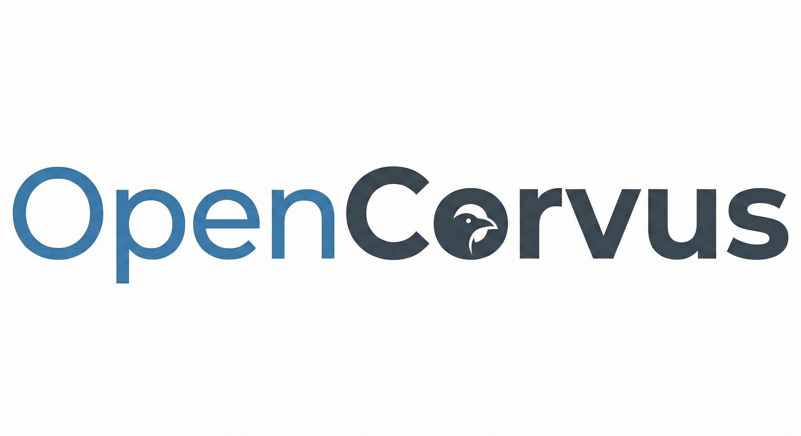

<p align="center">
  <a href="https://github.com/yangheng95/opencorvus">
    
  </a>
</p>

<h2 align="center">Headless coding orchestration for repositories, API, and Slack.</h2>

---

## Current Direction

OpenCorvus is being repositioned around a headless orchestration core.

Current primary path:

- async task intake over HTTP API
- durable `task / plan_version / run / interaction / delivery / evaluation`
- `opencode` as the first executor
- Slack as the first production channel
- goal and evaluator driven completion

Legacy TUI, overlay, and desktop automation code still exists in the repo, but it is no longer the product center for Headless V1.

## What Is OpenCorvus

OpenCorvus is an AI orchestration system for real software work.

- It can accept a coding task, create a plan, dispatch execution, evaluate the result, and iterate until pass or stop.
- It can work on your repository through the existing `opencode` execution kernel.
- It can expose that workflow through API server mode and Slack threads.

## Core Features

- Headless task orchestration with durable task and run state.
- Versioned planning with retry and replan behavior.
- Delivery and evaluation records, not just raw session messages.
- Human-in-the-loop blocking flows for permission and question handling.
- Slack thread binding for task creation, interaction replies, and status summaries.

## Typical Use Cases

- Submit a repo task over API and let the system iterate until evaluation passes.
- Create a task from a Slack root message and continue it in the same thread.
- Route failed evaluations into retry or replan instead of stopping at the first executor completion.
- Track delivery artifacts and acceptance results per run.

## Install

```bash
# npm
npm i -g opencorvus-ai@latest

# Homebrew (macOS/Linux)
brew install yangheng95/tap/opencorvus

# Windows
scoop install opencorvus
# or
choco install opencorvus

# Arch Linux
sudo pacman -S opencorvus

# Nix
nix run nixpkgs#opencorvus
```

## 3-Minute Start

```bash
# 1) Go to your project
cd /path/to/your/project

# 2) Start the headless API
opencorvus serve
```

Then create a task:

```bash
curl -X POST http://localhost:7878/task \
  -H "content-type: application/json" \
  -d '{
    "project": "your-project-id",
    "requestID": "req-001",
    "request": "Implement the requested change and run acceptance checks"
  }'
```

`requestID` is optional but recommended for idempotent task creation.

## Common Commands

```bash
# Start API server (headless orchestrator)
opencorvus serve

# Start Slack gateway
opencorvus slack

# Custom server port
opencorvus serve --port 8080
```

## Slack Gateway

```bash
# Use repo root .env or shell env
opencorvus slack
```

Required env keys:

- `SLACK_BOT_TOKEN`
- `SLACK_APP_TOKEN`
- optional `SLACK_SIGNING_SECRET`
- `SLACK_CHANNEL_ID` for live verification flows

Verified flows as of `2026-03-07`:

- real `auth.test`
- real `apps.connections.open`
- real `chat.postMessage` / `chat.delete`
- real Slack gateway start/stop
- real inbound root message -> task creation
- real permission interaction reply in thread

## Board UI

The headless board now has a web control surface in `packages/console/app`.

Current working entry for local development on Windows:

```text
/board?task_id=<task_id>&directory=<repo_path>
```

Why this shape:

- it works reliably with the current SolidStart route generation on Windows
- it keeps browser traffic same-origin
- it lets the console app proxy orchestrator auth server-side

Runtime behavior:

- initial board snapshot is SSR-backed
- live updates prefer SSE via `task/:id/events`
- polling remains as a fallback when the SSE stream is unavailable
- free-form operator input posts back into the task workbench and refreshes the board

Supporting local proxy routes inside `packages/console/app`:

- `GET /board-data`
- `POST /board-message`
- `GET /board-events`

## Use From Source (Repo Developers)

```bash
# repo root
bun install
bun run --cwd packages/opencorvus typecheck
```

Run the main verification set:

```bash
bun test --timeout 60000 test/channel/slack.test.ts test/orchestrator/service.test.ts test/planner/service.test.ts test/evaluator/service.test.ts test/server/orchestrator-routes.test.ts
```

Run the real Slack live tests only when you intentionally want to hit Slack APIs:

```bash
OPENCORVUS_RUN_LIVE_SLACK_TEST=1 bun test --timeout 180000 test/channel/slack-live.test.ts
```

## FAQ

### Is OpenCorvus production-ready?

Not fully. It is usable, but still early-stage and changing quickly.

### What is the fastest way to start?

Run `opencorvus serve` in your project directory and create a task over HTTP.

### When should I use `opencorvus serve`?

Use it for the headless orchestrator, API-driven workflows, and Slack integration.

### Is Slack really working end to end?

Yes. The repo now includes live Slack tests covering outbound delivery, inbound root-message task creation, and thread-based permission replies.

### What is still legacy?

TUI, overlay, and desktop automation paths are still in the repository, but they are not the primary Headless V1 direction.

### Where are detailed config references?

- Docs: <https://opencorvus.ai/docs>
- Bot env reference: `packages/bot/.env.example`
- Contributing guide: [`CONTRIBUTING.md`](./CONTRIBUTING.md)

## Early-stage Notice

OpenCorvus is still in early development.

- It is usable now, but the headless orchestration layer is still settling.
- The product direction is now API + Slack first.
- For architecture and plan alignment, see:
  - [`specs/opencode-architecture.md`](./specs/opencode-architecture.md)
  - [`specs/plan.md`](./specs/plan.md)
  - [`specs/headless-v1-status.md`](./specs/headless-v1-status.md)

## Acknowledgments

OpenCorvus is built upon code originally from [OpenCode](https://github.com/nicepkg/opencode). We are grateful to the OpenCode contributors for their foundational work.

## License

[MIT](./LICENSE)
