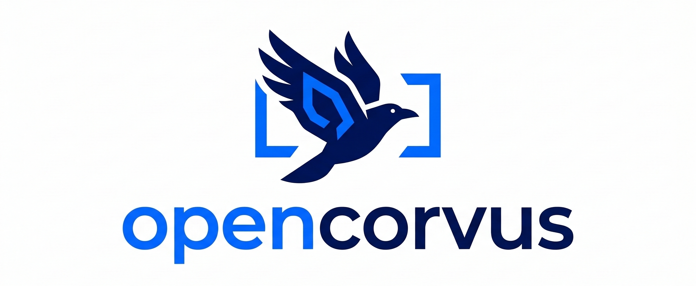

<p align="center">
  <a href="https://opencorvus.ai">
    
  </a>
</p>

<p align="center"><em>An open-source harness for AI coding agents</em></p>

Coding agents are powerful, but raw model output is unreliable. OpenCorvus is the **harness** that turns one-shot coding agents into durable, evidence-driven development workflows. You hand it a task. It captures requirements, decomposes them into independently verifiable goals, dispatches build agents, reviews the result with integrity evidence, and keeps iterating until the acceptance contract is satisfied or a real blocker is surfaced.

### Why a Harness

A coding agent writes code. A harness makes sure the code is correct.

Without a harness, you get a single attempt with no structured verification. With OpenCorvus, every task goes through a multi-agent pipeline where each stage has a clear contract:

- **Requirements agent** — turns a vague request into bounded, testable requirements and foundational decisions
- **Architect agent** — analyzes boundaries and decomposes the spec into at least two modest, independently verifiable implementation goals
- **Executor** — dispatches to OpenCorvus, Codex, or Claude Code against the real repo
- **Integrity review** — consolidates build evidence, specialist checks, runtime/visual evidence, and LLM review into the final workflow verdict

The result is **delegated development**: durable task orchestration with SQLite state persistence, scoped project memory shared across sessions, human-in-the-loop permission handling, and evaluator-driven retry loops — accessible from the headless HTTP API, overlay UI, Slack, or any of the 14 channel adapters in `packages/channel-runtime`.

### How It Works

```
task → requirements → goals → build → integrity ─┬→ done
                         ↑                       │
                         └── correction evidence ┘
```

1. Accept a task from API, Slack, or a local session.
2. **Requirements**: research, clarify, and write bounded requirements with acceptance criteria.
3. **Goals**: analyze boundaries, then decompose the spec into at least two independent implementation goals.
4. **Build**: dispatch a coding agent against the repo.
5. **Review**: run targeted checks and integrity review against the requirement/goal evidence.
6. Accept only when required items are satisfied accurately and completely; otherwise use the evidence to dispatch the next correction.

### Installation

```bash
git clone https://github.com/yangheng95/opencorvus.git
cd opencorvus
bun install
bun run --cwd packages/opencorvus build
bun packages/opencorvus/src/index.ts doctor
```

The repository-local, verifiable install path is the source build above. Do not
publish install-script or package-manager commands here until the repository owns
an automated verification check for that distribution channel.

### Quick Start

Start the headless server in the repository you want OpenCorvus to work on:

```bash
OPENCORVUS_SOURCE=/path/to/opencorvus/packages/opencorvus/src/index.ts
cd /path/to/your/repo
bun "$OPENCORVUS_SOURCE" serve
```

Open the local overlay UI at `http://127.0.0.1:7878/ui/`, then create a task over HTTP:

```bash
curl -X POST http://127.0.0.1:7878/task \
  -H "content-type: application/json" \
  -d '{
    "request": "Implement the requested change, run validation, and stop only when the acceptance is ready."
  }'
```

The server returns `202` with a `task_id`. Stream progress with SSE:

```bash
curl -N http://127.0.0.1:7878/task/<task_id>/events
```

Useful task endpoints:

- `GET /tasks`
- `GET /task/<task_id>`
- `GET /task/<task_id>/board`
- `POST /task/<task_id>/message`
- `POST /task/<task_id>/retry`
- `POST /task/<task_id>/replan`
- `POST /task/<task_id>/cancel`

> [!TIP]
> If you expose `opencorvus serve` beyond localhost, set `OPENCORVUS_SERVER_PASSWORD` first.

### Slack Threads

Slack is the first channel wired directly into the headless orchestrator.

```bash
export SLACK_BOT_TOKEN=xoxb-...
export SLACK_APP_TOKEN=xapp-...
opencorvus slack
```

What the Slack gateway does today:

- Starts a task from the first message in a thread
- Mirrors spec, plan, run, acceptance, and evaluation updates back into the thread
- Accepts permission replies like `allow`, `always`, and `reject`
- Accepts follow-up operator messages and routes them into the task loop

### Executors

OpenCorvus always has the built-in OpenCorvus executor. It can also dispatch to external coding CLIs when they are installed and auto-discovery is enabled.

```bash
export OPENCORVUS_AUTO_DISCOVER_EXECUTORS=1
```

Supported executor display names today:

- OpenCorvus (`opencorvus` executor id)
- Codex (`codex` executor id)
- Claude Code (`claude-code` executor id)

If `codex` or `claude-code` are not discovered, task creation with that executor is rejected instead of silently falling back.

### Product Surface

| Surface                        | Status    | Notes                                                                                                                                                               |
| ------------------------------ | --------- | ------------------------------------------------------------------------------------------------------------------------------------------------------------------- |
| Headless HTTP API              | Available | `opencorvus serve`, task lifecycle routes, SSE event stream                                                                                                         |
| Overlay UI                     | Available | Served from `/ui/` by the headless server                                                                                                                           |
| Slack gateway                  | Available | First integrated remote channel for the orchestrator                                                                                                                |
| Multi-channel runtime adapters | In repo   | `packages/channel-runtime` includes Slack, Telegram, Discord, Feishu, WhatsApp, Google Chat, Microsoft Teams, Line, Matrix, Mattermost, Signal, WeCom, and DingTalk |
| GitHub Action                  | Available | See [`github/README.md`](./github/README.md)                                                                                                                        |

### Development

```bash
# repo root
bun install

# core CLI and orchestrator
bun run --cwd packages/opencorvus typecheck
bun run --cwd packages/opencorvus test

# channel runtime adapters
bun run --cwd packages/channel-runtime test

# regenerate the JavaScript SDK
bun ./packages/sdk/js/script/build.ts
```

### FAQ

#### How is this different from a direct coding agent?

A coding agent is a single-turn tool. OpenCorvus is the harness around it — spec-first planning, goal decomposition, evaluator-driven retries, durable state, remote channels, and operator feedback loops. It doesn't replace your coding agent; it makes it reliable.

#### Is OpenCorvus only a Slack bot?

No. The repo includes a headless API server, overlay UI, GitHub Action, and a broader multi-channel runtime package in `packages/channel-runtime`. Slack is simply the first channel promoted into the headless task orchestration flow.

#### Does it keep state between runs?

Yes. Tasks, requirements, goals, runs, interactions, artifacts, acceptance evidence, session state, and project knowledge are persisted locally in SQLite.
OpenCorvus now keeps both session-scoped and global memory/preferences. New memory and preference entries default to global so they are available across future sessions in the same project.

#### Is it finished?

No. The core orchestration loop is implemented, but the product surface is still expanding. This README reflects what is in the repo today, not a promise that every planned interface is already fully integrated.

### Docs and Contributing

- Docs: <https://opencorvus.ai/docs>
- GitHub Action: [`github/README.md`](./github/README.md)
- Contributing: [`CONTRIBUTING.md`](./CONTRIBUTING.md)

### Acknowledgments

OpenCorvus is built on the idea that coding agents need structured harnesses — spec contracts, evaluation loops, and durable orchestration — to move from demo-grade to production-grade.

### License

[MIT](./LICENSE)
