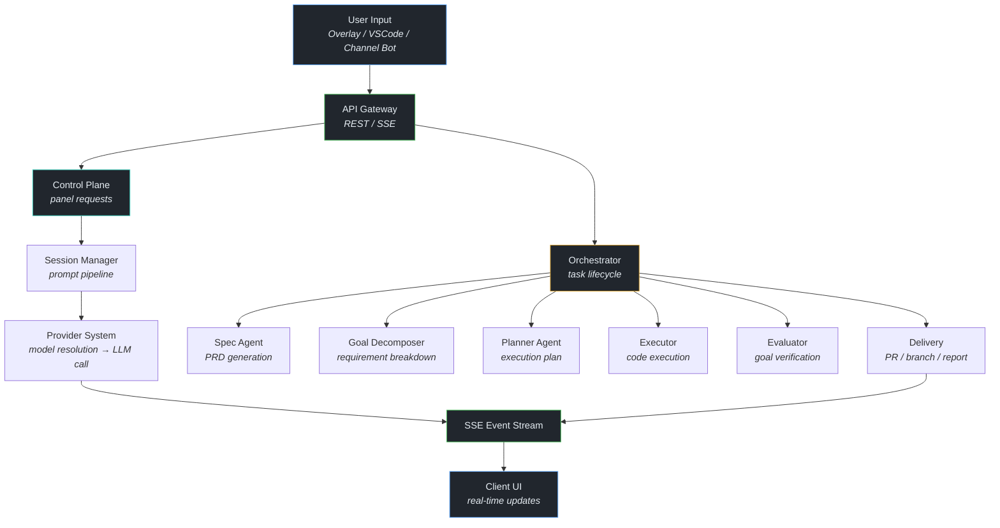
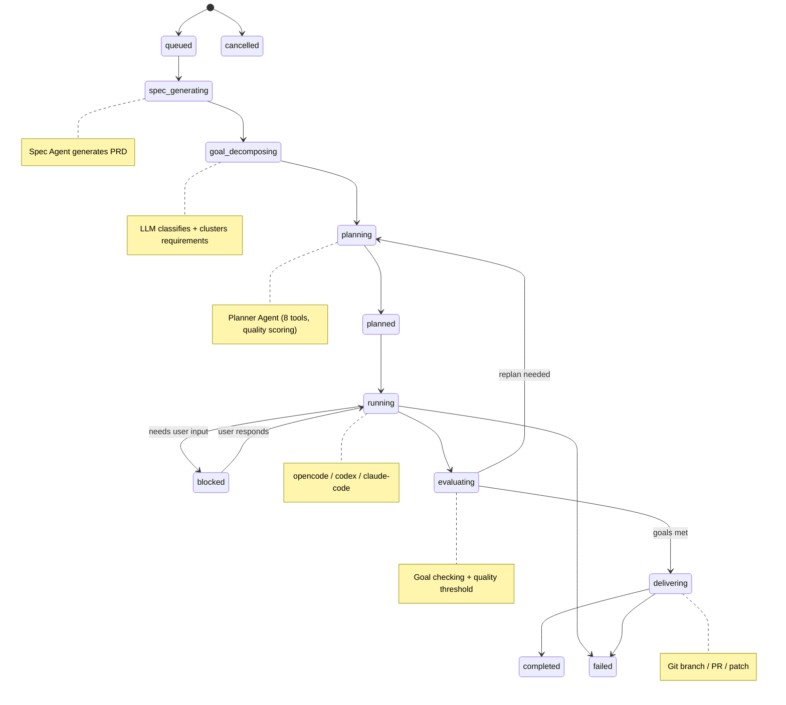
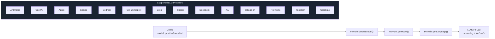
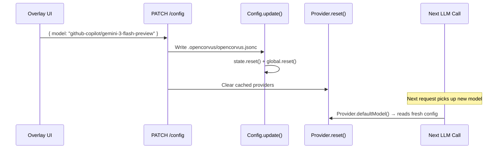
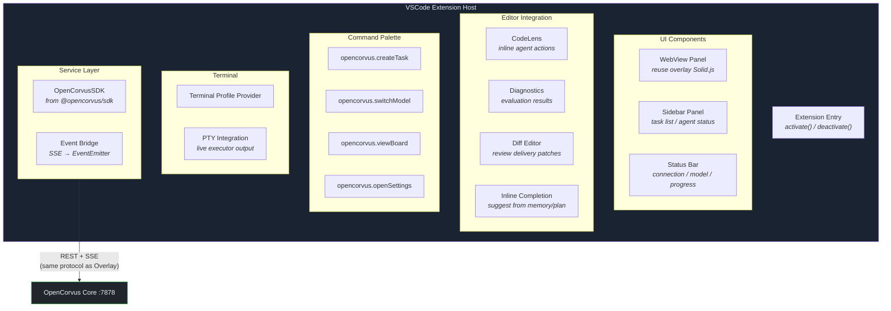
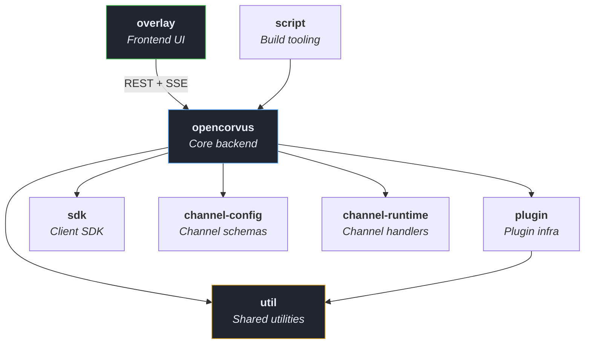
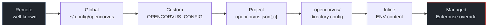

# OpenCorvus Architecture

## 1. System Architecture Overview

```mermaid
graph TB
    subgraph CLIENT["Client Layer"]
        direction LR
        OV["<b>Overlay UI</b><br/>Solid.js + Tauri Desktop<br/><i>components / stores / services</i>"]
        VS["<b>VSCode Extension</b><br/>WebView + Native Panel<br/><i>Future</i>"]
        CB["<b>Channel Bots</b><br/>Slack / Discord / Telegram<br/>Teams / Feishu / DingTalk"]
    end

    subgraph API["API Gateway — Hono HTTP :7878"]
        direction LR
        MW["Auth Middleware<br/>CORS / Error Handler"]
        ROUTES["REST Routes<br/>/config /session /task /goal /plan<br/>/provider /executor /channel /control<br/>/auth /mcp /skill /permission"]
        SSE["SSE Event Stream<br/>GET /task/{id}/events<br/>message.part.delta<br/>reasoning.delta"]
        WS["WebSocket<br/>PTY terminal"]
    end

    subgraph CORE["Core Engine Layer"]
        SM["<b>Session Manager</b><br/>CRUD / Message V2<br/>Prompt Pipeline<br/>Compaction / Revert"]
        ORC["<b>Orchestrator</b><br/>Task State Machine<br/>Pipeline / Runtime<br/>Strategy / Checks"]
        CP["<b>Control Plane</b><br/>Panel Requests<br/>Structured Output"]
        AG["<b>Agent System</b><br/>Configs / Permissions<br/>Prompt Construction"]
        MEM["<b>Memory</b><br/>Facts / Lessons<br/>FTS5 Search<br/>Scratchpad"]
        PROV["<b>Provider System</b><br/>15+ LLM Providers<br/>OAuth + API Key<br/>Streaming + Tools"]
        TOOLS["<b>Tool Registry</b><br/>70+ Tools:<br/>bash / edit / read / write<br/>glob / grep / webfetch / ..."]
        EXEC["<b>Executors</b><br/>opencode / codex<br/>claude-code"]
        EVAL["<b>Evaluator</b><br/>Goal Checking<br/>Quality Scoring"]
        DEL["<b>Delivery</b><br/>Git Branch / PR<br/>Patch / Report"]
    end

    subgraph INFRA["Infrastructure Layer"]
        DB["<b>SQLite + Drizzle ORM</b><br/>25+ tables: session / message / part<br/>orchestrator_* / memory / protocol"]
        BUS["<b>Event Bus</b><br/>Typed Pub/Sub<br/>GlobalBus IPC"]
        CFG["<b>Config System</b><br/>remote → global → project<br/>→ .opencorvus → managed"]
        PLG["<b>Plugin System</b><br/>Copilot / Codex / Anthropic<br/>External npm / local"]
        SKL["<b>Skills</b><br/>SKILL.md format<br/>Marketplace"]
        MCP["<b>MCP</b><br/>HTTP / SSE / stdio<br/>Tool Integration"]
        AUTH["<b>Auth Storage</b><br/>~/.opencorvus/auth.json<br/>OAuth / API Key"]
        SCHED["<b>Scheduler</b><br/>Cron / Event<br/>Task Queue"]
    end

    OV -->|REST + SSE| API
    VS -->|REST + SSE| API
    CB -->|REST| API

    API --> CORE
    CORE --> INFRA

    style CLIENT fill:#1a2332,stroke:#58a6ff,color:#e6edf3
    style API fill:#1a2332,stroke:#3fb950,color:#e6edf3
    style CORE fill:#1a2332,stroke:#bc8cff,color:#e6edf3
    style INFRA fill:#1a2332,stroke:#d29922,color:#e6edf3
    style OV fill:#21262d,stroke:#58a6ff,color:#e6edf3
    style VS fill:#21262d,stroke:#bc8cff,color:#e6edf3
    style CB fill:#21262d,stroke:#3fb950,color:#e6edf3
```



## 2. Data Flow



## 3. Orchestrator — Task State Machine



### Orchestrator Modules

| Module | File | Description |
|--------|------|-------------|
| Pipeline | `pipeline.ts` | Task queue processing |
| Runtime | `runtime.ts` | Execution runtime |
| Strategy | `strategy.ts` | Retry / replan decisions |
| Persist | `persist.ts` | State transitions |
| Checks | `checks.ts` | Goal verification |
| Interaction | `interaction.ts` | User interactions |
| Memory Bridge | `memory-bridge.ts` | Learning integration |
| Publisher | `publisher.ts` | Delivery publishing |
| Git | `git.ts` | Git operations |
| Agent Stream | `agent-stream.ts` | Agent message streaming |

## 4. Provider System



### Model Resolution Priority

```
input.model → agent.model → Provider.defaultModel() → Config.get().model
```

### Config Update Flow (UI Model Switch)



## 5. VSCode Extension Architecture (Future)



## 6. Package Dependency Graph



## 7. Database Schema (25+ tables)

| Group | Tables |
|-------|--------|
| **Session** | `session`, `message`, `part`, `todo`, `permission` |
| **Orchestrator** | `orchestrator_task`, `_run`, `_plan_version`, `_goal`, `_milestone`, `_spec_snapshot`, `_spec_item`, `_evaluation`, `_delivery`, `_artifact`, `_execution_session`, `_interaction_request` |
| **Control** | `control`, `control_timeline` |
| **Memory** | `memory`, `scratchpad`, `task_plan` |
| **System** | `protocol`, `project`, `workbench`, `share`, `cron`, `event`, `task_queue` |

## 8. Key Design Decisions

| # | Decision | Rationale |
|---|----------|-----------|
| 1 | **Protocol-first** | REST + SSE as universal interface — any UI connects identically |
| 2 | **Compiled binary** | `bun build --compile` → single executable with embedded UI assets |
| 3 | **SQLite + Drizzle** | Single-file DB, zero deps, event sourcing via protocol table |
| 4 | **Plugin architecture** | Auth, tools, hooks are pluggable (built-in + external npm/local) |
| 5 | **Multi-executor** | opencode / codex / claude-code via adapter pattern |
| 6 | **Config cascade** | remote → global → project → .opencorvus → inline → managed |

## 9. Config Priority Chain



> **Low → High priority**: 每一层覆盖前一层。`.opencorvus/opencorvus.jsonc` 是 UI 配置的写入目标。
