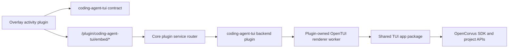

# Coding Agent TUI Independent Plugin Spec - 2026-06-06

## Problem

The current Coding Agent TUI integration is not an independent plugin.

The overlay activity is located under `packages/overlay/src/plugins/coding-agent-tui`, but the backend embed target is still owned by OpenCorvus core:

| Current call point | Current responsibility | Architectural problem |
| --- | --- | --- |
| `packages/overlay/src/plugins/coding-agent-tui/index.tsx` | Registers the right-side overlay activity. | This is only a frontend activity plugin. |
| `packages/overlay/src/plugins/coding-agent-tui/CodingAgentTuiPanel.tsx` | Renders captured OpenTUI spans and sends input/resize/poll requests. | Acceptable overlay adapter, but its backend target is core-owned. |
| `packages/overlay/src/plugins/coding-agent-tui/embedded-target.ts` | Calls `tui/embed/start`, `status`, `input`, `resize`, `stop`. | Hardcodes a core route namespace for a plugin feature. |
| `packages/opencorvus/src/server/routes/tui.ts` | Imports `EmbeddedTui` and exposes `/tui/embed/*`. | Core directly owns the plugin service endpoint. |
| `packages/opencorvus/src/tui/embedded.ts` | Owns sidecar lifecycle and JSON-lines protocol. | Plugin-specific renderer lifecycle is in core. |
| `packages/opencorvus/src/tui/embedded-worker.tsx` | Imports `TuiRoot`, renders frames with OpenTUI test renderer. | Plugin-specific worker is in core and imports internal app code. |
| `packages/opencorvus/test/tui/embedded-renderer.test.ts` | Asserts `TuiRoutes` calls `EmbeddedTui.start`. | The wrong architecture is pinned by regression tests. |
| `packages/overlay/test/tui-host-service.test.ts` | Asserts overlay calls `/tui/embed/*`. | The wrong route namespace is pinned by regression tests. |
| `packages/sdk/js/src/gen/*` and `packages/sdk/openapi.json` | Contain generated `/tui/embed/*` routes. | Plugin-specific routes have leaked into the public core SDK. |

This violates the intended plugin boundary: OpenCorvus core should not know that a coding-agent overlay TUI embed endpoint exists.

## Target Architecture

OpenCorvus core provides one generic capability: project-scoped plugin service routing.

The Coding Agent TUI plugin owns everything specific to the overlay TUI embed:



Core must not import `EmbeddedTui`, `embedded-worker`, or any coding-agent-tui module.

## Package Layout

### New Package

Create a workspace package:

```text
packages/coding-agent-tui/
  package.json
  src/
    contract.ts
    plugin.ts
    server/
      embedded.ts
      embedded-worker.tsx
```

Exports:

```json
{
  ".": "./src/plugin.ts",
  "./contract": "./src/contract.ts"
}
```

Responsibilities:

| File | Responsibility |
| --- | --- |
| `src/contract.ts` | Shared route constants, request schemas, response types, and error formatting helpers used by backend and overlay. |
| `src/plugin.ts` | Exports the backend plugin function that registers the plugin service routes. |
| `src/server/embedded.ts` | Owns worker lifecycle, request queue, diagnostics, and start/status/input/resize/stop methods. |
| `src/server/embedded-worker.tsx` | Owns frame capture, OpenTUI rendering, input injection, resize, and JSON-lines worker protocol. |

### Overlay Adapter

Keep a thin overlay host adapter in:

```text
packages/overlay/src/plugins/coding-agent-tui/
```

The overlay adapter may depend on `@opencorvus-ai/coding-agent-tui/contract`, but it must not know backend implementation details.

Required route namespace:

```text
plugin/coding-agent-tui/embed/start
plugin/coding-agent-tui/embed/status
plugin/coding-agent-tui/embed/input
plugin/coding-agent-tui/embed/resize
plugin/coding-agent-tui/embed/stop
```

`/tui/embed/*` must be deleted, not kept as a compatibility alias.

## Shared TUI App Boundary

The renderer worker currently imports `TuiRoot` from `packages/opencorvus/src/cli/cmd/tui/app.tsx`.

That import is still a core dependency. For a true independent plugin, the TUI app tree must become a public package boundary:

```text
packages/tui-app/
  package.json
  src/
    app.tsx
    ...
```

Consumers:

| Consumer | New dependency |
| --- | --- |
| OpenCorvus CLI `tui` command | Imports `TuiRoot` and `tui()` from `@opencorvus-ai/tui-app`. |
| Coding Agent TUI plugin worker | Imports `TuiRoot` from `@opencorvus-ai/tui-app`. |

This is the clean boundary because both the CLI and the plugin render the same app, but neither requires the plugin service to live in `packages/opencorvus`.

If this extraction is too large for the first implementation round, the acceptable first phase is:

1. Move `/tui/embed/*` and `EmbeddedTui` out of core.
2. Keep a temporary dependency from `packages/coding-agent-tui` to the current TUI app.
3. Track `packages/tui-app` extraction as the next required phase.

This is not the final state; it is only a scoped intermediate checkpoint. It must not add a core route or a core import of the coding-agent-tui plugin.

## Core Plugin Service API

The existing `@opencorvus-ai/plugin` backend API has hooks, tools, auth, config, and evaluation hooks, but no service route registration ability.

Add a route registration API using Hono rather than a hand-written router.

### Public Types

In `packages/plugin/src/index.ts`:

```ts
import type { Hono } from "hono"

export type PluginServiceInput = {
  directory: string
  worktree: string
  serverUrl: URL
}

export type PluginServiceRegistration = {
  id: string
  app: Hono
}

export interface Hooks {
  service?: (input: PluginServiceInput) => Promise<PluginServiceRegistration | PluginServiceRegistration[] | void>
}
```

Rules:

| Rule | Reason |
| --- | --- |
| `id` is required and must be stable. | It becomes the route namespace under `/plugin/:id/*`. |
| Duplicate `id` is an error. | No route shadowing or fallback order. |
| Service apps are project-scoped. | The existing directory guard remains the single source for project binding. |
| Plugin services are not generated into the core SDK. | Dynamic plugin endpoints do not belong to the static core OpenAPI surface. |
| Service registration errors are visible request errors. | Missing/broken plugins must not fall back to `/tui/embed/*`. |

### Core Runtime

In `packages/opencorvus/src/plugin/index.ts`:

1. Preserve loaded plugin metadata instead of storing only raw hooks.
2. Add `Plugin.services()` that returns the project-scoped service registrations.
3. Validate duplicate service IDs.
4. Cache service registrations in `lazyInstanceState`, same as hooks.
5. Do not import the Coding Agent TUI plugin directly.

In `packages/opencorvus/src/server/routes/plugin.ts`:

1. Add `PluginRoutes()`.
2. Dispatch `/plugin/:id/*` to the registered Hono app for `id`.
3. Return a typed named error when the plugin service ID is unknown.
4. Do not implement any feature-specific behavior in this router.

In `packages/opencorvus/src/server/routes/app.ts`:

```ts
.route("/plugin", PluginRoutes())
```

Place it after project directory enforcement, so plugin services remain project-scoped.

## Coding Agent TUI Backend Plugin

The backend plugin exports a normal OpenCorvus plugin:

```ts
export const codingAgentTui = async (input: PluginInput): Promise<Hooks> => ({
  service: async () => ({
    id: "coding-agent-tui",
    app: CodingAgentTuiRoutes(input),
  }),
})
```

Its route app owns:

| Method | Path | Responsibility |
| --- | --- | --- |
| `POST` | `/embed/start` | Validate start input and start the renderer worker. |
| `GET` | `/embed/status` | Return latest frame/status. |
| `POST` | `/embed/input` | Send text/key input. |
| `POST` | `/embed/resize` | Resize the renderer. |
| `POST` | `/embed/stop` | Stop the renderer. |

Schemas move from `packages/opencorvus/src/tui/embedded.ts` to `packages/coding-agent-tui/src/contract.ts`.

The worker lifecycle moves from `packages/opencorvus/src/tui/embedded.ts` to `packages/coding-agent-tui/src/server/embedded.ts`.

The worker moves from `packages/opencorvus/src/tui/embedded-worker.tsx` to `packages/coding-agent-tui/src/server/embedded-worker.tsx`.

## Default Availability

Default availability must not be implemented by a hardcoded core import.

Acceptable options:

| Option | Decision |
| --- | --- |
| Project/global config includes `@opencorvus-ai/coding-agent-tui`. | Preferred for a real plugin. |
| Overlay packaging installs/enables the plugin in its managed profile. | Acceptable product packaging layer. |
| `Plugin.INTERNAL_PLUGINS` imports the plugin directly. | Not acceptable for the final target because core would know the concrete plugin. |

For local development, use config-based enablement with the workspace package specifier or a file URL generated by the package manager. Tests may use a fixture plugin path.

## Migration And Deletion

Delete these core files after migration:

```text
packages/opencorvus/src/tui/embedded.ts
packages/opencorvus/src/tui/embedded-worker.tsx
```

Remove these imports/routes:

| File | Required change |
| --- | --- |
| `packages/opencorvus/src/server/routes/tui.ts` | Remove `EmbeddedTui` import and all `/embed/*` routes. |
| `packages/opencorvus/src/server/routes/app.ts` | Add generic `/plugin` route. |
| `packages/sdk/openapi.json` | Remove `/tui/embed/*` entries after route regeneration. |
| `packages/sdk/js/src/gen/sdk.gen.ts` | Remove generated `/tui/embed/*` calls after SDK regeneration. |
| `packages/sdk/js/src/gen/types.gen.ts` | Remove generated `/tui/embed/*` types after SDK regeneration. |
| `packages/overlay/src/plugins/coding-agent-tui/embedded-target.ts` | Use contract route constants for `/plugin/coding-agent-tui/embed/*`. |

No compatibility alias is allowed.

## Tests

### Core Plugin Service Tests

Add tests under `packages/opencorvus/test/plugin` or `packages/opencorvus/test/server`:

| Test | Assertion |
| --- | --- |
| Registers plugin service route | A fixture plugin with `service.id = "fixture"` handles `/plugin/fixture/ping`. |
| Unknown plugin service is visible error | `/plugin/missing/ping` returns a named error, not 404 from a hidden fallthrough. |
| Duplicate service ID fails | Two plugins registering the same `id` fail initialization visibly. |
| Project directory required | `/plugin/fixture/ping` requires `?directory=` or `x-opencorvus-directory`. |
| Core route inventory stays clean | Plugin dynamic routes do not leak into generated SDK as static core routes. |

### Coding Agent TUI Plugin Tests

Move and update renderer tests:

| Old test | New assertion |
| --- | --- |
| `packages/opencorvus/test/tui/embedded-renderer.test.ts` | No longer asserts `TuiRoutes` owns `EmbeddedTui`. |
| Renderer probe | Lives under `packages/coding-agent-tui/test` or uses the package worker path. |
| Input test | Calls plugin route `/plugin/coding-agent-tui/embed/input`. |
| Resize test | Calls plugin route `/plugin/coding-agent-tui/embed/resize`. |
| Stop test | Calls plugin route `/plugin/coding-agent-tui/embed/stop`. |

### Overlay Tests

Update:

```text
packages/overlay/test/coding-assistant-panel.test.ts
packages/overlay/test/tui-host-service.test.ts
packages/overlay/test/tui-host-panel.test.ts
packages/overlay/test/tui-host-panel-visual.test.ts
```

Required assertions:

| Test area | Assertion |
| --- | --- |
| Service calls | All requests use `plugin/coding-agent-tui/embed/*`. |
| No core embed route | Tests must not contain `tui/embed`. |
| Visible failure | Named plugin service errors render in the panel without leaking secret fields. |
| Visual panel | Mock server uses plugin route namespace and still renders a real captured frame. |

### Static Guards

Add guards:

| Guard | Assertion |
| --- | --- |
| Core must not import plugin implementation | `packages/opencorvus/src` contains no `coding-agent-tui` import. |
| Core must not contain embed renderer | `packages/opencorvus/src/tui` contains no `embedded.ts` or `embedded-worker.tsx`. |
| SDK must not expose `/tui/embed/*` | Generated SDK and OpenAPI contain no `/tui/embed`. |
| Overlay must not call `/tui/embed/*` | Overlay source contains no `tui/embed`. |

## Verification Commands

Targeted verification:

```powershell
bun test packages/opencorvus/test/plugin packages/opencorvus/test/server/plugin-service.test.ts
bun test packages/coding-agent-tui/test
bun test packages/overlay/test/tui-host-service.test.ts packages/overlay/test/tui-host-panel.test.ts packages/overlay/test/tui-host-panel-visual.test.ts
bun run --cwd packages/opencorvus typecheck
bun run --cwd packages/overlay typecheck
bun run --cwd packages/coding-agent-tui typecheck
bun run api:routes-check
bun run docs:check
```

Full pre-push verification remains the existing hook path.

## Implementation Phases

### Phase 1: Generic Plugin Service Mount

1. Extend `@opencorvus-ai/plugin` types with `Hooks.service`.
2. Add `Plugin.services()` in core plugin runtime.
3. Add generic `/plugin/:id/*` router.
4. Add fixture tests for registration, unknown ID, duplicate ID, and project directory binding.

Exit criteria: core can route a plugin-owned Hono app without knowing any concrete plugin.

### Phase 2: Move Coding Agent TUI Backend To Plugin Package

1. Create `packages/coding-agent-tui`.
2. Move schemas, worker lifecycle, and worker implementation into the package.
3. Register routes from the package plugin.
4. Remove `/tui/embed/*` from `TuiRoutes`.
5. Update tests to call `/plugin/coding-agent-tui/embed/*`.

Exit criteria: `rg "EmbeddedTui|tui/embed|embedded-worker" packages/opencorvus/src` returns no core implementation references.

### Phase 3: Overlay Contract Migration

1. Overlay service imports route constants and types from `@opencorvus-ai/coding-agent-tui/contract`.
2. Overlay tests assert the plugin namespace.
3. Visual tests use plugin route mocks.

Exit criteria: overlay has no hardcoded `/tui/embed/*`.

### Phase 4: SDK And Documentation Cleanup

1. Regenerate OpenAPI and SDK.
2. Remove `/tui/embed/*` from tracked generated files.
3. Update docs if any mention the core embed route.
4. Run `api:routes-check` and `docs:check`.

Exit criteria: core public API surface no longer lists plugin-specific embed routes.

### Phase 5: Shared TUI App Extraction

1. Extract the reusable TUI app tree into `packages/tui-app`.
2. Update OpenCorvus CLI to import the TUI app package.
3. Update coding-agent-tui worker to import the TUI app package.
4. Add static guard that plugin worker does not import `packages/opencorvus/src`.

Exit criteria: coding-agent-tui is a plugin package that depends on public packages only.

## Acceptance Criteria

The refactor is complete only when all are true:

1. No `/tui/embed/*` route exists.
2. No `EmbeddedTui` implementation exists in `packages/opencorvus/src`.
3. OpenCorvus core does not import `coding-agent-tui`.
4. The overlay calls `/plugin/coding-agent-tui/embed/*`.
5. The backend route is registered by the plugin service API.
6. The generated SDK and OpenAPI do not expose `/tui/embed/*`.
7. Visual overlay verification still shows a nonblank, readable OpenTUI frame.
8. Missing/broken plugin service produces a visible error, not a fallback route.
9. Tests cover the new plugin route, old route deletion, and overlay route migration.

## Superseded Spec

This supersedes the backend ownership conclusion in `specs/coding-agent-tui-overlay-plugin-decoupling-2026-06-06.md`.

That earlier spec correctly identified that a generic browser PTY terminal was not a valid OpenTUI embed, but it incorrectly accepted OpenCorvus core ownership of `/tui/embed/*`. This spec replaces that with a plugin-owned service route.
