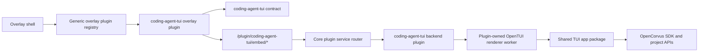

# Coding Agent TUI Independent Plugin Spec - 2026-06-06

## Problem

The current Coding Agent TUI integration is not an independent plugin.

The overlay activity is located under `packages/overlay/src/plugins/coding-agent-tui`, but the backend embed target is still owned by OpenCorvus core:

| Current call point | Current responsibility | Architectural problem |
| --- | --- | --- |
| `packages/overlay/src/plugins/coding-agent-tui/index.tsx` | Registers the right-side overlay activity. | This is only a frontend activity plugin. |
| `packages/overlay/src/plugins/coding-agent-tui/CodingAgentTuiPanel.tsx` | Renders captured OpenTUI spans and sends input/resize/poll requests. | Acceptable overlay adapter, but its backend target is core-owned. |
| `packages/overlay/src/plugins/coding-agent-tui/embedded-target.ts` | Calls `tui/embed/start`, `status`, `input`, `resize`, `stop`. | Hardcodes a core route namespace for a plugin feature. |
| `packages/overlay/src/main.tsx` | Directly imports `codingAgentTuiPlugin`. | The overlay shell still knows the concrete plugin at compile time. |
| `packages/overlay/test/coding-assistant-panel.test.ts` | Asserts the direct overlay import. | The frontend hardcoding is pinned by tests. |
| `packages/opencorvus/src/server/routes/tui.ts` | Imports `EmbeddedTui` and exposes `/tui/embed/*`. | Core directly owns the plugin service endpoint. |
| `packages/opencorvus/src/tui/embedded.ts` | Owns sidecar lifecycle and JSON-lines protocol. | Plugin-specific renderer lifecycle is in core. |
| `packages/opencorvus/src/tui/embedded-worker.tsx` | Imports `TuiRoot`, renders frames with OpenTUI test renderer. | Plugin-specific worker is in core and imports internal app code. |
| `packages/opencorvus/test/tui/embedded-renderer.test.ts` | Asserts `TuiRoutes` calls `EmbeddedTui.start`. | The wrong architecture is pinned by regression tests. |
| `packages/overlay/test/tui-host-service.test.ts` | Asserts overlay calls `/tui/embed/*`. | The wrong route namespace is pinned by regression tests. |
| `packages/sdk/js/src/gen/*` and `packages/sdk/openapi.json` | Contain generated `/tui/embed/*` routes. | Plugin-specific routes have leaked into the public core SDK. |

This violates the intended plugin boundary: OpenCorvus core should not know that a coding-agent overlay TUI embed endpoint exists.

## Target Architecture

OpenCorvus core provides generic capabilities only:

1. Project-scoped plugin service routing.
2. Overlay plugin manifest loading.
3. Shared TUI app package consumed through a public package boundary.

The Coding Agent TUI package owns everything specific to the overlay TUI embed:



Core OpenCorvus must not import `EmbeddedTui`, `embedded-worker`, or any coding-agent-tui module.

The overlay shell must not import `codingAgentTuiPlugin` directly. It imports a generic plugin registry only. Product packaging may generate that registry from plugin manifests, but feature code in `packages/overlay/src/main.tsx` must remain plugin-agnostic.

Completion requires backend and frontend plugin independence together. Moving only the backend service is not sufficient.

## Package Layout

### Shared TUI App Package

Create this package before moving the Coding Agent TUI worker:

```text
packages/tui-app/
  package.json
  src/
    app.tsx
    ...
```

Consumers:

| Consumer | New dependency |
| --- | --- |
| OpenCorvus CLI `tui` command | Imports `TuiRoot` and `tui()` from `@opencorvus-ai/tui-app`. |
| Coding Agent TUI plugin worker | Imports `TuiRoot` from `@opencorvus-ai/tui-app`. |

This is a hard precondition, not a later cleanup. The Coding Agent TUI package must not import from `packages/opencorvus/src`.

### Coding Agent TUI Package

Create a workspace package:

```text
packages/coding-agent-tui/
  package.json
  src/
    contract.ts
    backend/
      plugin.ts
      server/
        embedded.ts
        embedded-worker.tsx
    overlay/
      index.tsx
      CodingAgentTuiPanel.tsx
      embedded-target.ts
      terminal-size.ts
```

Exports:

```json
{
  "./backend": "./src/backend/plugin.ts",
  "./contract": "./src/contract.ts",
  "./overlay": "./src/overlay/index.tsx"
}
```

Responsibilities:

| File | Responsibility |
| --- | --- |
| `src/contract.ts` | Shared route constants, request schemas, response types, and error formatting helpers used by backend and overlay. |
| `src/backend/plugin.ts` | Exports the backend plugin function that registers the plugin service routes. |
| `src/backend/server/embedded.ts` | Owns worker lifecycle, request queue, diagnostics, and start/status/input/resize/stop methods. |
| `src/backend/server/embedded-worker.tsx` | Owns frame capture, OpenTUI rendering, input injection, resize, and JSON-lines worker protocol. |
| `src/overlay/*` | Owns the overlay activity manifest, panel, API target, resize helper, and visual rendering adapter. |

### Overlay Plugin Host

Move the concrete overlay adapter out of:

```text
packages/overlay/src/plugins/coding-agent-tui/
```

The overlay shell keeps only generic host code:

```text
packages/overlay/src/plugins/
  registry.ts
  right-activity.ts
```

`packages/overlay/src/main.tsx` imports only the generic registry. It must not import `@opencorvus-ai/coding-agent-tui/overlay` or any plugin-specific module directly.

Product packaging owns the default plugin list. A generated registry file may import `@opencorvus-ai/coding-agent-tui/overlay`, but that generated file is packaging output, not feature logic. The generated registry must be the single source for default overlay plugins.

The overlay adapter may depend on `@opencorvus-ai/coding-agent-tui/contract`, but it must not know backend implementation details.

Required route namespace:

```text
plugin/coding-agent-tui/embed/start
plugin/coding-agent-tui/embed/status
plugin/coding-agent-tui/embed/input
plugin/coding-agent-tui/embed/resize
plugin/coding-agent-tui/embed/stop
```

`/tui/embed/*` must be deleted, not kept as a compatibility alias.

## Core Plugin Service API

The existing `@opencorvus-ai/plugin` backend API has hooks, tools, auth, config, and evaluation hooks, but no service route registration ability.

Add a route registration API using Hono rather than a hand-written router.

`packages/plugin/package.json` must add `hono` as a direct dependency because `Hono` becomes part of the public plugin API.

### Public Types

In `packages/plugin/src/index.ts`:

```ts
import type { Hono } from "hono"

export type PluginServiceRegistration = {
  id: string
  app: Hono
}

export interface Hooks {
  service?: () => Promise<PluginServiceRegistration | PluginServiceRegistration[] | void>
}
```

The service hook captures `PluginInput` from the plugin initializer closure. Do not add a second `PluginServiceInput` copy of `directory`, `worktree`, or `serverUrl`; that would create a drifting type source.

Rules:

| Rule | Reason |
| --- | --- |
| `id` is required and must be stable. | It becomes the route namespace under `/plugin/:id/*`. |
| Duplicate `id` is an error. | No route shadowing or fallback order. |
| Service apps are project-scoped. | The existing directory guard remains the single source for project binding. |
| Plugin services are not generated into the core SDK. | Dynamic plugin endpoints do not belong to the static core OpenAPI surface. |
| Service registration errors are visible request errors. | Missing/broken plugins must not fall back to `/tui/embed/*`. |
| Registration diagnostics are stored by plugin specifier and service ID. | Requests must show the real load/register failure rather than a generic missing service. |

### Core Runtime

In `packages/opencorvus/src/plugin/index.ts`:

1. Preserve loaded plugin metadata instead of storing only raw hooks.
2. Add `Plugin.services()` that returns the project-scoped service registrations.
3. Validate duplicate service IDs.
4. Cache service registrations in `lazyInstanceState`, same as hooks.
5. Do not import the Coding Agent TUI plugin directly.
6. Store service diagnostics for install, load, duplicate ID, and registration failures.
7. Expose diagnostics to `PluginRoutes()` so `/plugin/:id/*` can return the real failure for a known-but-broken plugin.

In `packages/opencorvus/src/server/routes/plugin.ts`:

1. Add `PluginRoutes()`.
2. Register only an undocumented wildcard dispatch such as `all("/:id/*", ...)`.
3. Dispatch the suffix path to the registered Hono app for `id`.
4. Return `PluginServiceNotFoundError` when the service ID is unknown.
5. Return `PluginServiceRegistrationError` when the service ID is known but failed to load or register.
6. Do not implement any feature-specific behavior in this router.

In `packages/opencorvus/src/server/routes/app.ts`:

```ts
.route("/plugin", PluginRoutes())
```

Place it after project directory enforcement, so plugin services remain project-scoped.

In `packages/opencorvus/src/server/error-handler.ts`, add explicit status mapping:

| Error | Status |
| --- | --- |
| `PluginServiceNotFoundError` | `404` |
| `PluginServiceRegistrationError` | `500` |
| `PluginServiceDuplicateIDError` | `500` |

The route inventory checker must understand that `/plugin/:id/*` is a dynamic raw dispatch entry. Plugin internals do not enter `Server.routeInventoryApp()`, OpenAPI, or the generated SDK. If `api:routes-check` reports the wildcard, add only the wildcard route to `RAW_RUNTIME_ROUTES_WITHOUT_OPENAPI`; do not add feature-specific plugin paths.

## Coding Agent TUI Backend Plugin

The backend plugin exports a normal OpenCorvus plugin:

```ts
export const codingAgentTui = async (input: PluginInput): Promise<Hooks> => ({
  service: async () => ({
    id: "coding-agent-tui",
    app: CodingAgentTuiRoutes(input),
  }),
})
```

Its route app owns:

| Method | Path | Responsibility |
| --- | --- | --- |
| `POST` | `/embed/start` | Validate start input and start the renderer worker. |
| `GET` | `/embed/status` | Return frame/status for the requested task-scoped target. |
| `POST` | `/embed/input` | Send text/key input. |
| `POST` | `/embed/resize` | Resize the renderer. |
| `POST` | `/embed/stop` | Stop the renderer. |

### Contract

Schemas move from `packages/opencorvus/src/tui/embedded.ts` to `packages/coding-agent-tui/src/contract.ts`.

`contract.ts` must export one canonical path builder. Do not export both leading-slash and no-leading-slash path constants.

```ts
export const CODING_AGENT_TUI_SERVICE_ID = "coding-agent-tui"

export function codingAgentTuiPath(path: "embed/start" | "embed/status" | "embed/input" | "embed/resize" | "embed/stop") {
  return `plugin/${CODING_AGENT_TUI_SERVICE_ID}/${path}`
}
```

All service calls include a task-scoped preview target. The service must not keep one project-global latest frame.

```ts
export type CodingAgentTuiTarget = {
  kind: "task-preview"
  taskID: string
  targetID: string
}
```

Start/status/input/resize/stop requests are keyed by `{ directory, target }`. Responses include the same `target` and evidence metadata:

```ts
export type CodingAgentTuiEvidence = {
  kind: "opentui-frame"
  taskID: string
  targetID: string
  capturedAt: number
  frameHash: string
}
```

The overlay renders only the frame returned for the requested target. It must not use local signal/query overrides or a project-wide singleton frame to impersonate task-scoped evidence.

The worker lifecycle moves from `packages/opencorvus/src/tui/embedded.ts` to `packages/coding-agent-tui/src/backend/server/embedded.ts`.

The worker moves from `packages/opencorvus/src/tui/embedded-worker.tsx` to `packages/coding-agent-tui/src/backend/server/embedded-worker.tsx`.

## Default Availability

Default availability must not be implemented by a hardcoded core import.

Acceptable options:

| Option | Decision |
| --- | --- |
| Project/global config includes `@opencorvus-ai/coding-agent-tui`. | Preferred for a real plugin. |
| Overlay packaging installs/enables the plugin in its managed profile. | Acceptable product packaging layer. |
| `Plugin.INTERNAL_PLUGINS` imports the plugin directly. | Not acceptable for the final target because core would know the concrete plugin. |

For local development, use config-based enablement with the workspace package specifier or a file URL generated by the package manager. Tests may use a fixture plugin path.

## Packaging And Sidecar Resolution

This refactor must cover the packaging path that caused the original missing executable failure. Moving files without packaging evidence is not sufficient.

Required package changes:

| File or area | Required change |
| --- | --- |
| Root `package.json` workspaces | Include `packages/coding-agent-tui` and `packages/tui-app` through the existing workspace pattern and ensure package names are unique. |
| `packages/opencorvus/package.json` | Depend on `@opencorvus-ai/tui-app`; do not depend on `@opencorvus-ai/coding-agent-tui`. |
| `packages/overlay/package.json` | Depend on the overlay plugin registry input or `@opencorvus-ai/coding-agent-tui` only through packaging-generated plugin manifest wiring. |
| `packages/plugin/package.json` | Add direct `hono` dependency if `Hono` remains the public service app type. |
| `script/package-local.ts` and overlay packaging scripts | Package the plugin backend, overlay contribution, worker entry, and runtime dependencies. |
| `packages/overlay/src-tauri` resource config | Include the plugin resources needed by the managed overlay profile. |
| Worker resolution | Resolve the worker entry from the plugin package location, not from `packages/opencorvus/src/tui`. |

Verification must include inspecting the packaged artifact or generated resource list for:

1. `@opencorvus-ai/coding-agent-tui` backend plugin entry.
2. `@opencorvus-ai/coding-agent-tui/overlay` contribution entry.
3. The OpenTUI worker entry.
4. The shared `@opencorvus-ai/tui-app` runtime.

The packaged overlay must fail visibly when the plugin package is absent. It must not silently fall back to `/tui/embed/*` or a built-in core renderer.

## Migration And Deletion

Delete these core files after migration:

```text
packages/opencorvus/src/tui/embedded.ts
packages/opencorvus/src/tui/embedded-worker.tsx
packages/overlay/src/plugins/coding-agent-tui/
```

Remove these imports/routes:

| File | Required change |
| --- | --- |
| `packages/opencorvus/src/server/routes/tui.ts` | Remove `EmbeddedTui` import and all `/embed/*` routes. |
| `packages/opencorvus/src/server/routes/app.ts` | Add generic `/plugin` route. |
| `packages/overlay/src/main.tsx` | Remove direct `codingAgentTuiPlugin` import; load generic overlay plugin registry. |
| `packages/overlay/test/coding-assistant-panel.test.ts` | Stop asserting a direct coding-agent-tui import from overlay main. |
| `packages/sdk/openapi.json` | Remove `/tui/embed/*` entries after route regeneration. |
| `packages/sdk/js/src/gen/sdk.gen.ts` | Remove generated `/tui/embed/*` calls after SDK regeneration. |
| `packages/sdk/js/src/gen/types.gen.ts` | Remove generated `/tui/embed/*` types after SDK regeneration. |
| `packages/coding-agent-tui/src/overlay/embedded-target.ts` | Use the canonical contract path builder for `/plugin/coding-agent-tui/embed/*`. |

No compatibility alias is allowed.

## Tests

### Core Plugin Service Tests

Add tests under `packages/opencorvus/test/plugin` or `packages/opencorvus/test/server`:

| Test | Assertion |
| --- | --- |
| Registers plugin service route | A fixture plugin with `service.id = "fixture"` handles `/plugin/fixture/ping`. |
| Unknown plugin service is visible error | `/plugin/missing/ping` returns a named error, not 404 from a hidden fallthrough. |
| Unknown plugin status mapping | `PluginServiceNotFoundError` maps to 404. |
| Registration failure status mapping | `PluginServiceRegistrationError` maps to 500 with the stored diagnostic message. |
| Duplicate service ID fails | Two plugins registering the same `id` fail initialization visibly. |
| Project directory required | `/plugin/fixture/ping` requires `?directory=` or `x-opencorvus-directory`. |
| Core route inventory stays clean | Only the undocumented wildcard dispatch is exempted; plugin internals do not leak into generated SDK as static core routes. |

### Coding Agent TUI Plugin Tests

Move and update renderer tests:

| Old test | New assertion |
| --- | --- |
| `packages/opencorvus/test/tui/embedded-renderer.test.ts` | No longer asserts `TuiRoutes` owns `EmbeddedTui`. |
| Renderer probe | Lives under `packages/coding-agent-tui/test` or uses the package worker path. |
| Input test | Calls plugin route `/plugin/coding-agent-tui/embed/input` with a task-scoped target. |
| Resize test | Calls plugin route `/plugin/coding-agent-tui/embed/resize` with a task-scoped target. |
| Stop test | Calls plugin route `/plugin/coding-agent-tui/embed/stop` with a task-scoped target. |
| Evidence test | Status response includes `taskID`, `targetID`, `capturedAt`, and `frameHash`. |

### Overlay Tests

Update:

```text
packages/overlay/test/coding-assistant-panel.test.ts
packages/overlay/test/tui-host-service.test.ts
packages/overlay/test/tui-host-panel.test.ts
packages/overlay/test/tui-host-panel-visual.test.ts
```

Required assertions:

| Test area | Assertion |
| --- | --- |
| Service calls | All requests use the canonical contract path builder for `plugin/coding-agent-tui/embed/*`. |
| No core embed route | Tests must not contain `tui/embed`. |
| No direct overlay import | Overlay main imports only the generic plugin registry, not `codingAgentTuiPlugin`. |
| Overlay contribution package | The coding-agent-tui overlay contribution is exported from `@opencorvus-ai/coding-agent-tui/overlay`. |
| Visible failure | Named plugin service errors render in the panel without leaking secret fields. |
| Visual panel | Mock server uses plugin route namespace, task target, and evidence metadata while rendering a real captured frame. |

### Static Guards

Add guards:

| Guard | Assertion |
| --- | --- |
| Core must not import plugin implementation | `packages/opencorvus/src` contains no `coding-agent-tui` import. |
| Core must not contain embed renderer | `packages/opencorvus/src/tui` contains no `embedded.ts` or `embedded-worker.tsx`. |
| Plugin must not import OpenCorvus source internals | `packages/coding-agent-tui/src` contains no import from `packages/opencorvus/src` or `@/`. |
| Overlay main must not import concrete plugin | `packages/overlay/src/main.tsx` contains no `codingAgentTuiPlugin` or `coding-agent-tui` import. |
| SDK must not expose `/tui/embed/*` | Generated SDK and OpenAPI contain no `/tui/embed`. |
| Overlay must not call `/tui/embed/*` | Overlay source contains no `tui/embed`. |
| Contract path source is single | Overlay/backend use `codingAgentTuiPath`; no duplicate string builder exists. |

## Verification Commands

Targeted verification:

```powershell
bun test packages/opencorvus/test/plugin packages/opencorvus/test/server/plugin-service.test.ts
bun test packages/coding-agent-tui/test
bun test packages/overlay/test/tui-host-service.test.ts packages/overlay/test/tui-host-panel.test.ts packages/overlay/test/tui-host-panel-visual.test.ts
bun run --cwd packages/opencorvus typecheck
bun run --cwd packages/overlay typecheck
bun run --cwd packages/coding-agent-tui typecheck
bun run --cwd packages/tui-app typecheck
bun run typecheck
bun run api:routes-check
bun run docs:check
bun run check:dead-code
```

Full pre-push verification remains the existing hook path.

## Implementation Phases

### Phase 1: Shared TUI App Extraction

1. Create `packages/tui-app`.
2. Move the reusable TUI app tree behind the public `@opencorvus-ai/tui-app` package boundary.
3. Update OpenCorvus CLI to import the TUI app package.
4. Add static guard that plugin packages cannot import from `packages/opencorvus/src`.

Exit criteria: OpenCorvus CLI still renders TUI through `@opencorvus-ai/tui-app`, and no consumer needs a private `packages/opencorvus/src/cli/cmd/tui/app.tsx` import.

### Phase 2: Generic Plugin Service Mount

1. Extend `@opencorvus-ai/plugin` types with `Hooks.service`.
2. Add `Plugin.services()` in core plugin runtime.
3. Add generic `/plugin/:id/*` router.
4. Add service diagnostics and NamedError status mappings.
5. Add fixture tests for registration, unknown ID, registration failure, duplicate ID, and project directory binding.

Exit criteria: core can route a plugin-owned Hono app without knowing any concrete plugin.

### Phase 3: Move Coding Agent TUI Backend To Plugin Package

1. Create `packages/coding-agent-tui`.
2. Move schemas, worker lifecycle, and worker implementation into the package.
3. Register routes from the package backend plugin.
4. Remove `/tui/embed/*` from `TuiRoutes`.
5. Key renderer sessions by task-scoped target, not project singleton.
6. Update tests to call `/plugin/coding-agent-tui/embed/*`.

Exit criteria: `rg "EmbeddedTui|tui/embed|embedded-worker" packages/opencorvus/src` returns no core implementation references, and plugin status responses include evidence metadata.

### Phase 4: Overlay Plugin Migration

1. Move the overlay adapter from `packages/overlay/src/plugins/coding-agent-tui` into `packages/coding-agent-tui/src/overlay`.
2. Add generic overlay plugin registry loading in `packages/overlay`.
3. Overlay main imports only the registry.
4. Overlay service imports route constants and types from `@opencorvus-ai/coding-agent-tui/contract`.
5. Overlay tests assert the plugin namespace, task target, evidence fields, and no direct plugin import.
6. Visual tests use plugin route mocks.

Exit criteria: overlay has no hardcoded `/tui/embed/*` and no direct coding-agent-tui import from feature code.

### Phase 5: Packaging And Default Enablement

1. Wire the default plugin through config or packaging manifest, not core import.
2. Update local packaging scripts and Tauri resource configuration.
3. Verify packaged resources include backend plugin, overlay contribution, worker entry, and `@opencorvus-ai/tui-app`.
4. Verify missing plugin package produces visible plugin-service error.

Exit criteria: packaged overlay can load the plugin without a core import and without missing sidecar/resource paths.

### Phase 6: SDK And Documentation Cleanup

1. Regenerate OpenAPI and SDK.
2. Remove `/tui/embed/*` from tracked generated files.
3. Update docs if any mention the core embed route.
4. Run `api:routes-check` and `docs:check`.

Exit criteria: core public API surface no longer lists plugin-specific embed routes.

## Acceptance Criteria

The refactor is complete only when all are true:

1. No `/tui/embed/*` route exists.
2. No `EmbeddedTui` implementation exists in `packages/opencorvus/src`.
3. OpenCorvus core does not import `coding-agent-tui`.
4. `packages/coding-agent-tui/src` does not import `packages/opencorvus/src` or `@/`.
5. `packages/overlay/src/main.tsx` does not import a concrete coding-agent-tui module.
6. The overlay calls `/plugin/coding-agent-tui/embed/*` through the canonical contract path builder.
7. The backend route is registered by the plugin service API.
8. The backend route is keyed by task-scoped target and returns evidence metadata.
9. The generated SDK and OpenAPI do not expose `/tui/embed/*` or plugin internals.
10. Visual overlay verification still shows a nonblank, readable OpenTUI frame from task-scoped backend evidence.
11. Missing/broken plugin service produces a visible diagnostic error, not a fallback route.
12. Packaged overlay artifacts include the backend plugin, overlay contribution, worker entry, and shared TUI app package.
13. Tests cover the new plugin route, old route deletion, overlay route migration, overlay registry loading, error status mapping, packaging resources, and evidence metadata.

## Independent Review Feedback

Codex independent review on 2026-06-06 found the first draft was still incomplete. This revision incorporates the review feedback:

| Review finding | Revision |
| --- | --- |
| Temporary dependency from `packages/coding-agent-tui` to `packages/opencorvus/src/cli/cmd/tui/app.tsx` kept core coupling. | `packages/tui-app` extraction is now Phase 1 and a hard precondition. |
| Overlay adapter remained hardcoded in overlay source. | Overlay adapter moved into `packages/coding-agent-tui/src/overlay`; overlay main loads only a generic registry. |
| `/plugin/:id/*` conflicted with static route inventory expectations. | Plugin route is now an undocumented wildcard dispatch; plugin internals stay out of OpenAPI/SDK. |
| Plugin load failures would collapse into unknown service. | Service diagnostics are now required by spec. |
| NamedError status mapping was missing. | `PluginServiceNotFoundError`, `PluginServiceRegistrationError`, and duplicate-ID mapping are specified. |
| Project-scoped latest frame did not satisfy task-scoped preview/evidence rules. | Contract now requires task-scoped target and evidence metadata. |
| Packaging/default enablement was underspecified. | Packaging, Tauri resources, worker resolution, and artifact verification are now explicit. |
| `PluginServiceInput` duplicated `PluginInput`. | Service hook now captures `PluginInput`; no duplicate input type. |
| Public `Hono` type lacked package dependency. | `packages/plugin/package.json` must add `hono` if Hono remains public API. |
| Route constants could drift. | Contract now exports one canonical path builder. |

## Superseded Spec

This supersedes the backend ownership conclusion in `specs/coding-agent-tui-overlay-plugin-decoupling-2026-06-06.md`.

That earlier spec correctly identified that a generic browser PTY terminal was not a valid OpenTUI embed, but it incorrectly accepted OpenCorvus core ownership of `/tui/embed/*`. This spec replaces that with a plugin-owned service route.
