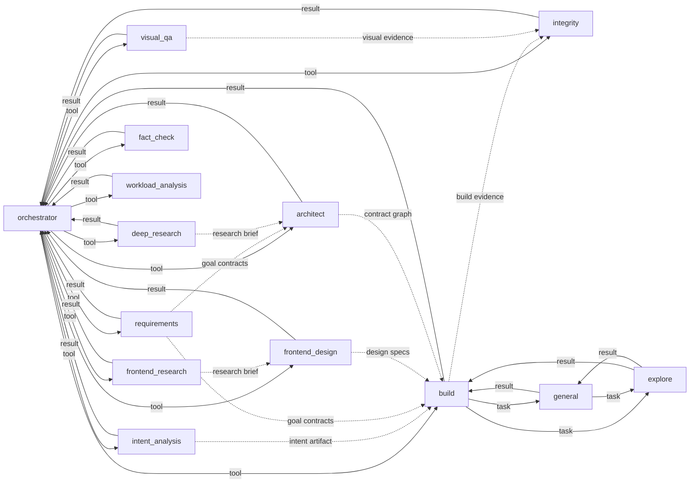

# 13 — Agent Communication Matrix

> 当前真源：`packages/opencorvus/src/orchestrator/tools.ts`、`packages/opencorvus/src/tool/request-orchestrator-decision.ts`、`packages/opencorvus/src/engine/agent-coordination.ts`、`packages/opencorvus/src/conversation/view.ts`、`packages/opencorvus/src/orchestrator/loop.ts`、`packages/opencorvus/src/build/agent.ts`、`packages/opencorvus/src/executor/registry.ts`、`packages/opencorvus/src/tool/task.ts`、`packages/opencorvus/src/agent/agent.ts`、`packages/opencorvus/src/control/message.ts`、`packages/opencorvus/src/channel/ingress.ts`。

This chapter describes the communication paths that exist in the current runtime. It is not a roadmap and does not describe retired planner, deliver, prosecutor, or acceptance-agent routes.

## Current Ingress

| Source                  | Runtime entry              | Handoff before task orchestration                                                                                                         |
| ----------------------- | -------------------------- | ----------------------------------------------------------------------------------------------------------------------------------------- |
| External channel        | `ChannelIngress.message()` | Replies to a pending interaction when one matches; otherwise calls `ControlMessage.handle()`.                                             |
| Overlay / local control | `ControlMessage.handle()`  | Emits a panel capability action that reaches `EngineService.createTask`, `taskMessage`, `replyInteraction`, or another task API boundary. |
| Existing task           | `runTaskLoop()`            | Wakes the task orchestrator and exposes orchestrator workflow tools.                                                                      |

If a message has not reached an engine task, debug the channel/control boundary before debugging agent-to-agent paths.

## Durable Coordination

Agent-to-Agent (A2A) scheduling is represented by durable artifacts, not hidden messages or direct child-session replies.

| Direction                     | Sole entry                                                         | Durable artifacts / events                                                               | Meaning                                                                                                           |
| ----------------------------- | ------------------------------------------------------------------ | ---------------------------------------------------------------------------------------- | ----------------------------------------------------------------------------------------------------------------- |
| Worker -> orchestrator        | `request_orchestrator_decision`                                    | `agent_coordination_request` and `agent.coordination.requested`                          | A worker asks the task orchestrator for scheduling, cancel, retry, or user-question handling.                     |
| Operator -> orchestrator      | `POST /task/:taskID/session/:sessionID/operator-steer`             | `agent_coordination_request(origin="operator_steer")` and `agent.coordination.requested` | The overlay records targeted operator intent for a specific live session.                                         |
| Orchestrator -> worker/action | `respond_agent_coordination`                                       | `agent_coordination_response`, `agent_coordination_action`, and responded/action events  | The orchestrator claims a pending request and records the chosen visible action.                                  |
| Observable projection         | task conversation, `conversation/events`, Server-Sent Events (SSE) | `protocol_event`, message parts, session status                                          | Coordination requests, responses, actions, continuations, and terminals rehydrate through one visible projection. |

The implementation contract for the current A2A repair is recorded in [2026-06-26-enterprise-a2a-protocol-root-repair.md](../../records/2026-06/2026-06-26-enterprise-a2a-protocol-root-repair.md).

## Node Keys

| Key  | Runtime role          | Notes                                                                           |
| ---- | --------------------- | ------------------------------------------------------------------------------- |
| `O`  | orchestrator          | The only task-level scheduler.                                                  |
| `R`  | requirements          | Requirements decomposition stage.                                               |
| `X`  | frontend-design       | Visual/source evidence and frontend design stage; tool ID is `frontend_design`. |
| `A`  | architect             | Contract graph and cross-goal architecture stage.                               |
| `B`  | build                 | Implementation worker.                                                          |
| `V`  | visual-qa             | Visual Quality Assurance stage.                                                 |
| `IT` | integrity             | Final review boundary and acceptance authority.                                 |
| `I`  | intent-analysis       | Intent artifact producer; tool ID is `analyze_intent`.                          |
| `G`  | general               | General subagent spawned through the `task` tool.                               |
| `E`  | explore               | Read-oriented exploration subagent.                                             |
| `FR` | frontend-research     | Frontend research brief producer.                                               |
| `DR` | deep-research         | Deep research brief producer.                                                   |
| `FC` | fact-check            | Claim verification stage.                                                       |
| `W`  | goal-workload-analyst | Goal sizing and workload analysis stage; tool ID is `workload_analysis`.        |

## Direct Runtime Calls

Legend: `tool` means an orchestrator workflow tool dispatch; `result` means the tool result returns to the calling session; `task` means the generic subagent task tool.

| From         | To   | Path                                                               |
| ------------ | ---- | ------------------------------------------------------------------ |
| `O`          | `R`  | `requirements` tool                                                |
| `O`          | `X`  | `frontend_design` tool                                             |
| `O`          | `A`  | `architect` tool                                                   |
| `O`          | `B`  | `build` tool -> `build/agent.ts` -> `executor/registry.ts`          |
| `O`          | `V`  | `visual_qa` tool                                                   |
| `O`          | `IT` | `integrity` tool                                                   |
| `O`          | `I`  | `analyze_intent` tool                                              |
| `O`          | `FR` | `frontend_research` tool                                           |
| `O`          | `DR` | `deep_research` tool                                               |
| `O`          | `FC` | `fact_check` tool                                                  |
| `O`          | `W`  | `workload_analysis` tool                                           |
| `B`          | `G`  | `task` tool                                                        |
| `B`          | `E`  | `task` tool                                                        |
| `G`          | `E`  | `task` tool                                                        |
| Worker roles | `O`  | tool result plus optional `request_orchestrator_decision` artifact |

`general -> general` is denied by permission policy. The removed planning package, old goal-pool modules, `deliver`, `publish_acceptance`, `prosecute`, and `prosecutor` are not runtime communication paths.

## Indirect Data Flow

| Producer    | Consumer          | Durable source                                                    |
| ----------- | ----------------- | ----------------------------------------------------------------- |
| `I`         | `O`, `B`, `IT`    | intent-analysis `engine_artifact` and decision-log entries        |
| `R`         | `A`, `B`          | requirements and goal contracts                                   |
| `FR` / `DR` | `X`, `A`, `B`     | research brief artifacts                                          |
| `X`         | `B`, `V`, `IT`    | `task.design_specs` and system artifacts                          |
| `A`         | `B`, `IT`         | architect contract graph and decision-log entries                 |
| `B`         | `IT`, `V`, `O`    | build report, build outcome, goal reports, changed-file artifacts |
| `V`         | `IT`, `O`         | visual QA report and effective acceptance records                 |
| `IT`        | `O`, next `B` run | integrity attempt artifact and review history                     |

These are persisted handoff surfaces. They are not direct peer-to-peer (P2P) messages.

## Current Topology

## Debug Order

1. Missing task creation: inspect `ChannelIngress.message()` and `ControlMessage.handle()`.
2. Missing orchestrator dispatch: inspect `runTaskLoop()` and `createOrchestratorTools(...)`.
3. Missing worker scheduling response: inspect `request_orchestrator_decision`, `agent_coordination_request`, and `respond_agent_coordination`.
4. Missing visible conversation state: inspect `conversation/view.ts` and protocol event projection.
5. Missing build/integrity context: inspect persisted artifacts listed in the indirect data-flow table.
