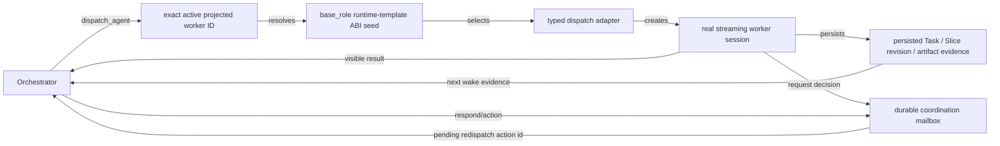

# 13 — Agent Communication Matrix

> 当前真源：`packages/opencorvus/src/orchestrator/tools.ts`、`packages/opencorvus/src/agent/runner.ts`、`packages/opencorvus/src/expert-squad/prompt-profile-resolver.ts`、`packages/opencorvus/src/engine/agent-coordination.ts`、`packages/opencorvus/src/engine/queue.ts`、`packages/opencorvus/src/conversation/view.ts`、`packages/opencorvus/src/orchestrator/loop.ts`、`packages/opencorvus/src/control/message.ts`、`packages/opencorvus/src/channel/ingress.ts`。
>
> 用途：把"规范里允许谁对谁发消息"、"当前代码里谁真正能触发/接收/间接拿到上下文"、以及 worker/operator-to-orchestrator durable coordination mailbox 真源并列出来，便于排查通信问题。

This chapter describes the communication paths that exist in the current runtime. It is not a team-topology definition: the active expert-squad package owns projected worker membership and collaboration guidance.

## Current Ingress

| Source                  | Runtime entry              | Handoff before task orchestration                                                                                                         |
| ----------------------- | -------------------------- | ----------------------------------------------------------------------------------------------------------------------------------------- |
| External channel        | `ChannelIngress.message()` | Replies to a pending interaction when one matches; otherwise calls `ControlMessage.handle()`.                                             |
| Overlay / local control | `ControlMessage.handle()`  | Emits a panel capability action that reaches `EngineService.createTask`, `taskMessage`, `replyInteraction`, or another task API boundary. |
| Existing task           | `runTaskLoop()`            | Wakes the task orchestrator and exposes `dispatch_agent` / `manage_task` plus supporting scheduler tools.                                 |

If a message has not reached an engine task, debug the channel/control boundary before debugging agent-to-agent paths.

## Current Calibration

- 当前 worker 入口统一为 active expert squad 的 `dispatch_agent` 动态投影；`ChannelIngress / ControlMessage / EngineService` 负责外部输入和任务生命周期，不构成第二套 agent 实例化协议。
- **worker/operator-to-orchestrator scheduling 的当前真源已切到 durable coordination mailbox**：worker 只能通过 `request_orchestrator_decision` 写入 `agent_coordination_request`，且 `requested_decision` 只能描述待判断的调度问题，不能填 `redispatch` / `redispatch_worker` action literal；overlay targeted operator steer 只能通过 `POST /task/:taskID/session/:sessionID/operator-steer` 写入 `origin="operator_steer"` 的 `agent_coordination_request`；orchestrator 只能通过 `respond_agent_coordination` 原子写入 `agent_coordination_response` / `agent_coordination_action` 并执行 visible action。不要再把 task-root message、direct reply、hidden note、generic same-kind redispatch 或历史 `steer_subagent` 当成调度协议。
- Typed worker coordination handoff settles the current prompt generation before its typed result leaves the runner; `respond_agent_coordination(decision="continue")` is the first repair path and starts the next generation in that same frozen Session when its process-local Runtime exists.
- 没有 coordination request 的 retry/replan/provider/process/reviewer repair 通过同一个 `dispatch_agent` 的 `dispatch.turn.kind="continuation"` 与 `dispatch.turn.authority.continuation_dispatch_id` 精确续接旧 dispatch lineage；Host 复用原 Session、logical workflow occurrence 和 work scope，只创建新 Turn，不创建替代 Session、Task 或第二个节点 occurrence。历史 terminal Session status 不阻止续跑。
- `POST /task/:taskID/message` 是 task-root operator input。它不接受 `target` session/build 字段；targeted sub-agent steer 必须走 operator-steer route 和 coordination artifacts。
- task-root operator input 在其 wake 中是可见用户要求。状态、诊断和解释请求不等价于继续执行；局部合同勘误追加同一 Delivery Slice logical identity 的新 immutable revision，并绑定精确 RequirementSet/ContractGraph refs。新的 Requirements 产物不会静默替换旧 Slice revision；冲突由 Orchestrator 可见判断。
- **A2A 当前实现合同**见 [2026-06-26-enterprise-a2a-protocol-root-repair.md](../../records/2026-06/2026-06-26-enterprise-a2a-protocol-root-repair.md)。本文件的 direct/indirect 矩阵描述的是非 A2A 普通 agent 调用和历史预期对照，不是 worker scheduling mailbox 的替代真源。
- `src/tool/planner.ts` 只提供 Session 级 Task tree，不拥有记忆、engine Task 或 Slice 调度。Session 连续性只有最新成功 compaction summary 这一真实消息事实，并按 `MEMORY.MD` 逻辑视图只读暴露；summary 已在压缩历史中投影，普通 model Turn 禁止再次注入。Project 语义记忆仍是独立的跨 Session 知识面。Task 是唯一 business lifecycle；产出或消费计划证据的 worker 必须是 active package 的精确动态投影。
- **`analyze_intent` 是 typed adapter ABI**：Orchestrator 通过 active package 的精确动态 Agent ID 调度，runtime template 选择该 adapter 并由 `IntentAnalysisAgent.analyze` 创建 `intent-analysis` SessionKind；adapter 与 SessionKind 都不替代动态身份。
- **`integrity` 是 IntegrityReview artifact adapter ABI，不是 Agent 身份或 lifecycle authority**：active package 可以把任意精确动态 Agent ID 投影到该 template/adapter，在单个流式 Session 中增量记录 review facts。缺失、冲突或非 pass 事实都由 Orchestrator 判断；最终完成 / 失败只能由 Orchestrator 的显式 Task 决策写入。
- Task Orchestrator 不拥有 engine Task 创建能力；repair、retry、replan、retest、review、provider/process recovery 和最终组装都续接原 Task。只有 Mission/control-plane 在真实 Squad、已接受外部 Task 证据、operator authority 或显式独立 lifecycle 边界上创建另一 Task。

Agent-to-Agent (A2A) scheduling is represented by durable artifacts, not hidden messages or direct child-session replies.

That sentence applies to engine task scheduling. Coding/Chat local delegation
is a separate non-scheduling path:

| Direction                  | Sole entry                   | Visible record                                                                                                   | Meaning                                                                                                                                           |
| -------------------------- | ---------------------------- | ---------------------------------------------------------------------------------------------------------------- | ------------------------------------------------------------------------------------------------------------------------------------------------- |
| Coding/Chat -> local child | `delegate_agent`             | standalone assistant child session with `parent_id`, real user/assistant/tool parts, and terminal session status | Bounded context isolation for the current interactive request; no task, goal, projected identity, expert squad, worktree, or scheduler lifecycle. |
| Local child -> Coding/Chat | `delegate_agent` tool result | compact evidence-backed handoff and `session:<id>` pointer; full transcript remains in the child session         | Parent synthesizes and independently verifies the result. The child cannot delegate again.                                                        |

`delegate_agent` and `dispatch_agent` are disjoint tool capabilities, not aliases
or compatibility routes. Local child replies therefore do not implement or
bypass the durable worker/operator-to-Orchestrator scheduling mailbox below.

| Direction                                   | Sole entry                                                         | Durable artifacts / events                                                                                              | Meaning                                                                                                                                                                                                                      |
| ------------------------------------------- | ------------------------------------------------------------------ | ----------------------------------------------------------------------------------------------------------------------- | ---------------------------------------------------------------------------------------------------------------------------------------------------------------------------------------------------------------------------- |
| Worker -> orchestrator                      | `request_orchestrator_decision`                                    | `agent_coordination_request` and `agent.coordination.requested`                                                         | A worker asks the task orchestrator for scheduling, cancel, retry, or user-question handling; it must not request the `redispatch` action literal directly.                                                                  |
| Worker -> operator / next orchestrator wake | `send_mailbox_message`                                             | `mailbox.message` in `protocol_event`                                                                                   | A projected worker reports activity or a notification. This is visible and durable but does not wake scheduling, require a response, change Task lifecycle, or write Goal acceptance or lifecycle. |
| Worker terminal -> Orchestrator tool result | ordinary `dispatch_agent` completion                               | real final assistant message locator or terminal error/tool-event locator, Session and dispatch-lineage IDs            | Physical terminal delivery for the exact dispatch. It is not a coordination request, synthetic message, Goal result, or business completion. |
| Operator -> orchestrator                    | `POST /task/:taskID/session/:sessionID/operator-steer`             | `agent_coordination_request(origin="operator_steer")` and `agent.coordination.requested`                                | The overlay records targeted operator intent for one exact Session and appends a Task-root wake.                                                                                                                              |
| Orchestrator -> action                      | `respond_agent_coordination`                                       | `agent_coordination_response`, pending `agent_coordination_action`, and responded/action events                         | The orchestrator claims a pending request and records the chosen visible action; redispatch does not execute an adapter here.                                                                                                |
| Orchestrator -> redispatched worker         | explicit `dispatch_agent(..., turn.authority.coordination_action_id=...)` | one immutable `dispatch_lineage`, the existing child Session identity, a new Turn descriptor, and terminal action event | The ordinary dispatch path validates and atomically binds the frozen action, then reopens the same Session; it is the only redispatch path.                                                                                    |
| Observable projection                       | task conversation, `conversation/events`, Server-Sent Events (SSE) | `protocol_event`, message parts, session status                                                                         | Coordination requests, responses, actions, continuations, and terminals rehydrate through one visible projection.                                                                                                            |

The implementation contract for the current A2A repair is recorded in [2026-06-26-enterprise-a2a-protocol-root-repair.md](../../records/2026-06/2026-06-26-enterprise-a2a-protocol-root-repair.md).

## Node Keys

| Key | Runtime boundary     | Notes                                                                                                             |
| --- | -------------------- | ----------------------------------------------------------------------------------------------------------------- |
| `O` | Orchestrator         | The only task-level scheduler and lifecycle decision maker.                                                       |
| `P` | Projected worker     | Exact `capability_projection.agents.<agentID>` identity from the active package.                                  |
| `B` | Platform Build       | Exact `universal-build` identity visible only in the scheduler dispatch inventory.                                |
| `T` | Runtime template     | `base_role` ABI seed for prompt, tools, session, permissions, and adapter; never the running identity.            |
| `D` | Dispatch adapter     | Code-owned typed input and physical streaming execution; domain artifacts remain separately readable facts.       |
| `C` | Coordination mailbox | Durable worker/operator request plus Orchestrator response/action artifacts.                                      |
| `M` | Notification Mailbox | Durable non-waking worker notifications plus canonical task-event projection and operator acknowledgement events. |

## Direct Runtime Calls

Legend: `dispatch_agent dispatch.target=...` means the scheduler's unified worker-dispatch tool invocation; `dispatch.target` is the exact dynamic agent ID declared by the active expert squad, `dispatch.turn.kind="initial"` owns the first node occurrence's workflow subject and adapter input, `dispatch.turn.kind="continuation"` owns one exact lineage authority plus incremental guidance/evidence, and `result` returns to the calling Orchestrator session.

| From | To                          | Path                                                                                                                                      |
| ---- | --------------------------- | ----------------------------------------------------------------------------------------------------------------------------------------- |
| `O`  | `P`                         | `dispatch_agent dispatch.target=<exact active projected agent ID>` with Task workflow node identity and optional exact Slice revision subjects. |
| `P`  | `T`                         | Resolver-bound `base_role`; resolution fails when the exact active projection or template is missing.                                     |
| `T`  | `D`                         | `RuntimeTemplateRegistry` selects one `DispatchAdapterContractRegistry` ABI.                                                              |
| `D`  | `P` session                 | Adapter validates typed input, creates the Session only for initial dispatch, reopens it for later Turns, streams execution, and returns physical Turn references. |
| `P`  | `O`                         | Visible tool result linked to the real final message/error plus optional durable decision request or non-waking Mailbox notification. |
| `O`  | `C`                         | `respond_agent_coordination` records the visible scheduling response/action.                                                              |
| `O`  | `P` after redispatch action | A later explicit `dispatch_agent` binds `dispatch.turn.authority.coordination_action_id`; `respond_agent_coordination` never invokes `D` directly.                |

Representative adapter IDs remain valid implementation names:

| Adapter ABI    | Code-owned implementation boundary                                           | Identity rule                                               |
| -------------- | ---------------------------------------------------------------------------- | ----------------------------------------------------------- |
| `requirements` | `orchestrator/requirements-stage.ts` plus RequirementSet artifact projection | Only the active package's exact projected ID is the actor.  |
| `architect`    | `architect/agent.ts` plus ContractGraph artifact projection                   | The template/adapter is not a fixed Architect identity.     |
| `build`        | `build/agent.ts` and the internal SessionLoop/AgentRunner                    | Task-level implementation keeps projected ID and dispatch lineage. |
| `integrity`    | `orchestrator/integrity-review-stage.ts` plus IntegrityReview persistence     | Review evidence does not decide lifecycle.                  |

## Indirect Data Flow

| Typed producer surface                 | Durable source                                                                    | Consumer rule                                                                                                                                                                                                                         |
| -------------------------------------- | --------------------------------------------------------------------------------- | ------------------------------------------------------------------------------------------------------------------------------------------------------------------------------------------------------------------------------------- |
| Intent-analysis adapter                | intent-analysis artifact and decision-log entries                                 | Orchestrator selects exact projected consumers declared by the active package.                                                                                                                                                        |
| Requirements adapter                   | immutable RequirementSet artifacts and visible final assistant message             | Consumers receive exact artifact refs; storage never selects a Task-current RequirementSet.                                                                                                                                            |
| Research adapters                      | frontend/deep research evidence                                                   | Package guidance and current evidence determine the next projected consumer.                                                                                                                                                          |
| Frontend-design adapter                | strict `frontend_design` artifact and referenced design-resource artifacts        | Partial and complete FrontendDesign facts use the same artifact family; materialized files are read-only projections.                                                                                                                 |
| Architect adapter                      | immutable Delivery Slice revisions plus exact ContractGraph artifact              | Task workflow dispatch may use explicit current Slice/artifact refs chosen by Orchestrator. |
| Build adapter                          | visible final message plus Host git, command, test, tool, and workspace observations | Package implementation identities and platform `universal-build` share the adapter while retaining distinct exact identities and ownership.                                                                                         |
| Visual QA / Integrity adapters         | VisualReview and IntegrityReview artifacts                                         | Partial and conflicting facts remain visible and never complete the Task automatically.                                                                                                                                               |
| Projected worker Mailbox notification  | `mailbox.message` protocol event                                                    | The scheduler receives a bounded recent projection on its next natural wake; prose never becomes lifecycle state.                                                                                                                      |

These are persisted handoff surfaces. They are not direct peer-to-peer (P2P) messages.

## Current Topology

## Debug Order

1. Missing Coding/Chat local child: inspect `delegate_agent`, the primary-assistant tool pool, child session lineage, and session prompt cancellation.
2. Missing task creation: inspect `ChannelIngress.message()` and `ControlMessage.handle()`.
3. Missing orchestrator dispatch: inspect `runTaskLoop()` and `createOrchestratorTools(...)`.
4. Missing worker scheduling response: inspect `request_orchestrator_decision`, `agent_coordination_request`, and `respond_agent_coordination`.
5. Missing worker Mailbox report: inspect `send_mailbox_message`, `mailbox.message`, task runtime identity, and the project `/mailbox` projection; do not substitute coordination artifacts.
6. Missing visible conversation state: inspect `conversation/view.ts` and protocol event projection.
7. Missing adapter context: inspect the projected worker descriptor, runtime template, typed adapter input, and persisted artifacts listed in the indirect data-flow table.
8. Cancellation 后仍出现新的 Orchestrator turn：检查 root Session 的
   `SessionPromptState` 唤醒队列、exact-controller settlement 和并发
   operator wake；不要从 Session 状态投影或最后一个工具结果反推当前执行。
