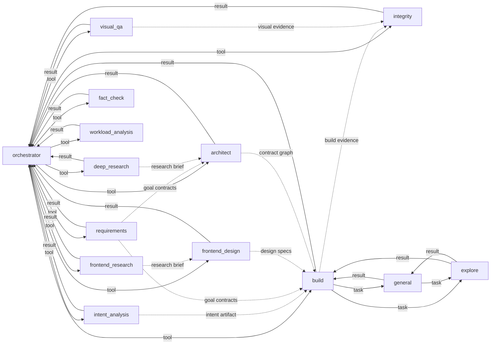

# 13 — Agent Communication Matrix

> 当前真源：`packages/opencorvus/src/orchestrator/tools.ts`、`packages/opencorvus/src/tool/request-orchestrator-decision.ts`、`packages/opencorvus/src/engine/agent-coordination.ts`、`packages/opencorvus/src/engine/queue.ts`、`packages/opencorvus/src/conversation/view.ts`、`packages/opencorvus/src/orchestrator/loop.ts`、`packages/opencorvus/src/goal/runner.ts`、`packages/opencorvus/src/build/agent.ts`、`packages/opencorvus/src/agent/sub-agent-protocol.ts`、`packages/opencorvus/src/tool/task.ts`、`packages/opencorvus/src/agent/agent.ts`、`packages/opencorvus/src/intent-analysis/agent.ts`、`packages/opencorvus/src/integrity/team-agent.ts`、`packages/opencorvus/src/requirements/agent.ts`、`packages/opencorvus/src/architect/agent.ts`、`packages/opencorvus/src/frontend-design/agent.ts`、`packages/opencorvus/src/control/message.ts`、`packages/opencorvus/src/channel/ingress.ts`。
>
> 用途：把"规范里允许谁对谁发消息"、"当前代码里谁真正能触发/接收/间接拿到上下文"、以及 worker/operator-to-orchestrator durable coordination mailbox 真源并列出来，便于排查通信问题。

This chapter describes the communication paths that exist in the current runtime. It is not a roadmap and does not describe retired planner, deliver, prosecutor, or acceptance-agent routes.

## Current Ingress

| Source                  | Runtime entry              | Handoff before task orchestration                                                                                                         |
| ----------------------- | -------------------------- | ----------------------------------------------------------------------------------------------------------------------------------------- |
| External channel        | `ChannelIngress.message()` | Replies to a pending interaction when one matches; otherwise calls `ControlMessage.handle()`.                                             |
| Overlay / local control | `ControlMessage.handle()`  | Emits a panel capability action that reaches `EngineService.createTask`, `taskMessage`, `replyInteraction`, or another task API boundary. |
| Existing task           | `runTaskLoop()`            | Wakes the task orchestrator and exposes `dispatch_agent` / `manage_task` plus supporting scheduler tools.                                 |

If a message has not reached an engine task, debug the channel/control boundary before debugging agent-to-agent paths.

## Current Calibration

- 当前运行时仍不是 [11-agent-oop-protocol.md](11-agent-oop-protocol.md) 里的对象协议；外部入口与普通 tool 调用仍是 `ChannelIngress / ControlMessage / EngineService / dispatch_agent / manage_task / task subagent` 的混合路径。
- **worker/operator-to-orchestrator scheduling 的当前真源已切到 durable coordination mailbox**：worker 只能通过 `request_orchestrator_decision` 写入 `agent_coordination_request`，且 `requested_decision` 只能描述待判断的调度问题，不能填 `redispatch` / `redispatch_worker` action literal；overlay targeted operator steer 只能通过 `POST /task/:taskID/session/:sessionID/operator-steer` 写入 `origin="operator_steer"` 的 `agent_coordination_request`；orchestrator 只能通过 `respond_agent_coordination` 原子写入 `agent_coordination_response` / `agent_coordination_action` 并执行 visible action。不要再把 task-root message、direct reply、hidden note、generic same-kind redispatch 或历史 `steer_subagent` 当成调度协议。
- `POST /task/:taskID/message` 是 task-root operator input。它不接受 `target` session/build 字段；targeted sub-agent steer 必须走 operator-steer route 和 coordination artifacts。
- **A2A 当前实现合同**见 [2026-06-26-enterprise-a2a-protocol-root-repair.md](../../records/2026-06/2026-06-26-enterprise-a2a-protocol-root-repair.md)。本文件的 direct/indirect 矩阵描述的是非 A2A 普通 agent 调用和历史预期对照，不是 worker scheduling mailbox 的替代真源。
- **Planning tool role 已删除**：the removed planning package 整目录、旧目标池模块、`planGoal()` 全部移除。Orchestrator 没有 `planner` tool；goal-scoped build 路径里 "per-goal 实现步骤" 现由 build agent 直接基于 architect contract + decision-log 推进。`src/tool/planner.ts` 是 session 级 working-memory 工具（task tree / scratchpad），**不是** planning tool role 的替代。
- **`intent-analysis` 已接线**：orchestrator 通过 `dispatch_agent target=analyze_intent` 调 `IntentAnalysisAgent.analyze`，落 `intent-analysis` SessionKind。13 号文档此前的"not wired yet"已过期。
- **`integrity` 是 review report tool，不是 lifecycle authority**：对应 Integrity reviewer team（动态 reviewer 计划、replay-aware context、severity discipline、build feedback），输出 pass / non-pass 报告供 Orchestrator 决策；最终完成 / 失败只能由 Orchestrator 的 `complete_task` / `fail_task` 写入。`prosecute` / `prosecutor` 已删除。
- `build -> general/explore`、`general -> explore` 是当前真实存在的 direct 子代理路径；acceptance direct 子代理路径已删除；`general -> general` 自递归被权限拒绝。
- `orchestrator -> EngineService.createTask` 只通过 `propose_task` 间接发生：默认按 `experimental.auto_confirm_proposed_tasks=true` 自动创建"完善上一个 request 的新任务"候选，只有该配置显式为 `false` 时才先询问用户；这不是 `panel` control-plane action，也不是 generic `task` subagent dispatch。
- [11-agent-oop-protocol.md](11-agent-oop-protocol.md) 的白名单表存在一个闭环不完整点：`explore.receiveWhitelist` 包含 `general`，但 `general.sendWhitelist` 没有 `explore`。按该文自己的"双向都要声明"规则，`general -> explore` 在 spec 文本上并不成立。

Agent-to-Agent (A2A) scheduling is represented by durable artifacts, not hidden messages or direct child-session replies.

| Direction | Sole entry | Durable artifacts / events | Meaning |
| --- | --- | --- | --- |
| Worker -> orchestrator | `request_orchestrator_decision` | `agent_coordination_request` and `agent.coordination.requested` | A worker asks the task orchestrator for scheduling, cancel, retry, or user-question handling; it must not request the `redispatch` action literal directly. |
| Operator -> orchestrator      | `POST /task/:taskID/session/:sessionID/operator-steer` | `agent_coordination_request(origin="operator_steer")` and `agent.coordination.requested` | The overlay records targeted operator intent for a specific live session. |
| Orchestrator -> worker/action | `respond_agent_coordination` | `agent_coordination_response`, `agent_coordination_action`, and responded/action events | The orchestrator claims a pending request and records the chosen visible action. |
| Observable projection | task conversation, `conversation/events`, Server-Sent Events (SSE) | `protocol_event`, message parts, session status | Coordination requests, responses, actions, continuations, and terminals rehydrate through one visible projection. |

The implementation contract for the current A2A repair is recorded in [2026-06-26-enterprise-a2a-protocol-root-repair.md](../../records/2026-06/2026-06-26-enterprise-a2a-protocol-root-repair.md).

## Node Keys

| Key  | Runtime role          | Notes                                                                           |
| ---- | --------------------- | ------------------------------------------------------------------------------- |
| `O`  | orchestrator          | The only task-level scheduler.                                                  |
| `R`  | requirements          | Requirements decomposition stage.                                               |
| `X`  | frontend-design       | Visual/source evidence and frontend design stage; tool ID is `frontend_design`. |
| `A`  | architect             | Contract graph and cross-goal architecture stage.                               |
| `B`  | build                 | Implementation worker.                                                          |
| `V`  | visual-qa             | Visual Quality Assurance stage.                                                 |
| `IT` | integrity             | Review report boundary; produces pass / non-pass evidence for Orchestrator.     |
| `I`  | intent-analysis       | Intent artifact producer; tool ID is `analyze_intent`.                          |
| `G`  | general               | General subagent spawned through the `task` tool.                               |
| `E`  | explore               | Read-oriented exploration subagent.                                             |
| `FR` | frontend-research     | Frontend research brief producer.                                               |
| `DR` | deep-research         | Deep research brief producer.                                                   |
| `FC` | fact-check            | Claim verification stage.                                                       |
| `W`  | goal-workload-analyst | Goal sizing and workload analysis stage; tool ID is `workload_analysis`.        |

## Direct Runtime Calls

Legend: `dispatch_agent target=...` means the scheduler's unified worker-dispatch tool invocation; `result` means the tool result returns to the calling session; `task` means the generic subagent task tool.

| From         | To   | Path                                                               |
| ------------ | ---- | ------------------------------------------------------------------ |
| `O`          | `R`  | `dispatch_agent target=requirements`                               |
| `O`          | `X`  | `dispatch_agent target=frontend_design`                            |
| `O`          | `A`  | `dispatch_agent target=architect`                                  |
| `O`          | `B`  | `dispatch_agent target=build` -> `build/agent.ts` -> `executor/registry.ts` |
| `O`          | `V`  | `dispatch_agent target=visual_qa`                                  |
| `O`          | `IT` | `dispatch_agent target=integrity`                                  |
| `O`          | `I`  | `dispatch_agent target=analyze_intent`                             |
| `O`          | `FR` | `dispatch_agent target=frontend_research`                          |
| `O`          | `DR` | `dispatch_agent target=deep_research`                              |
| `O`          | `FC` | `dispatch_agent target=fact_check`                                 |
| `O`          | `W`  | `dispatch_agent target=workload_analysis`                          |
| `B`          | `G`  | `task` tool                                                        |
| `B`          | `E`  | `task` tool                                                        |
| `G`          | `E`  | `task` tool                                                        |
| Worker roles | `O`  | tool result plus optional `request_orchestrator_decision` artifact |

`general -> general` is denied by permission policy. The removed planning package, old goal-pool modules, `deliver`, `publish_acceptance`, `prosecute`, and `prosecutor` are not runtime communication paths.

## Indirect Data Flow

| Producer    | Consumer          | Durable source                                                    |
| ----------- | ----------------- | ----------------------------------------------------------------- |
| `I`         | `O`, `B`, `IT`    | intent-analysis `engine_artifact` and decision-log entries        |
| `R`         | `A`, `B`          | requirements and goal contracts                                   |
| `FR` / `DR` | `X`, `A`, `B`     | research brief artifacts                                          |
| `X`         | `B`, `V`, `IT`    | `task.design_specs` and system artifacts                          |
| `A`         | `B`, `IT`         | architect contract graph and decision-log entries                 |
| `B`         | `IT`, `V`, `O`    | build report, build outcome, goal reports, changed-file artifacts |
| `V`         | `IT`, `O`         | visual QA report and effective acceptance records                 |
| `IT`        | `O`, next `B` run | integrity attempt artifact and review history                     |

These are persisted handoff surfaces. They are not direct peer-to-peer (P2P) messages.

## Current Topology

## Debug Order

1. Missing task creation: inspect `ChannelIngress.message()` and `ControlMessage.handle()`.
2. Missing orchestrator dispatch: inspect `runTaskLoop()` and `createOrchestratorTools(...)`.
3. Missing worker scheduling response: inspect `request_orchestrator_decision`, `agent_coordination_request`, and `respond_agent_coordination`.
4. Missing visible conversation state: inspect `conversation/view.ts` and protocol event projection.
5. Missing build/integrity context: inspect persisted artifacts listed in the indirect data-flow table.
