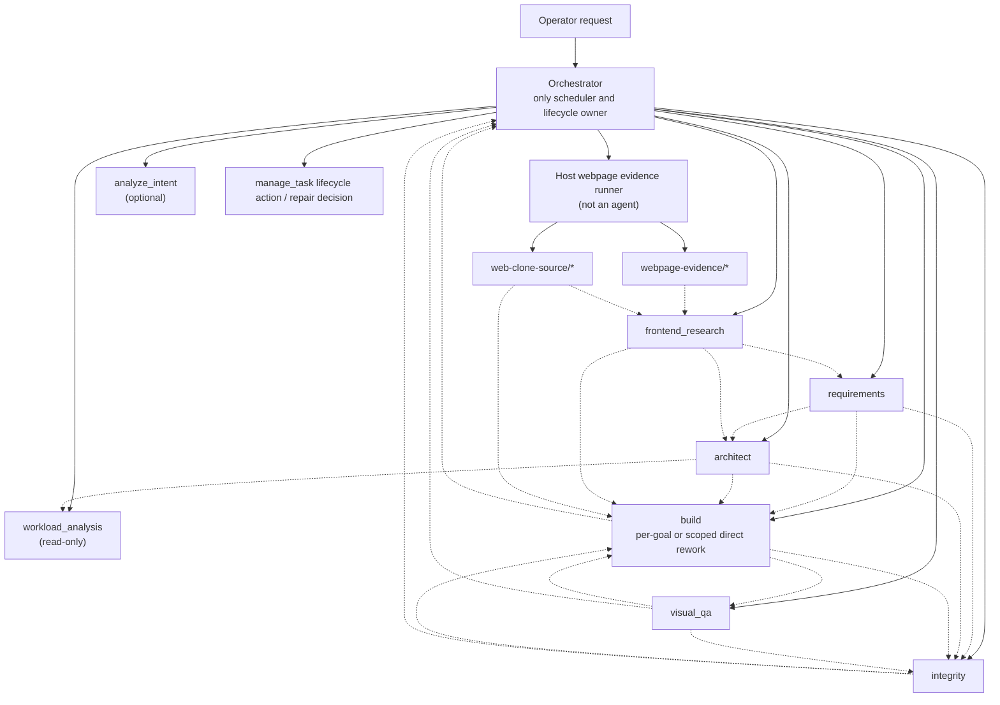
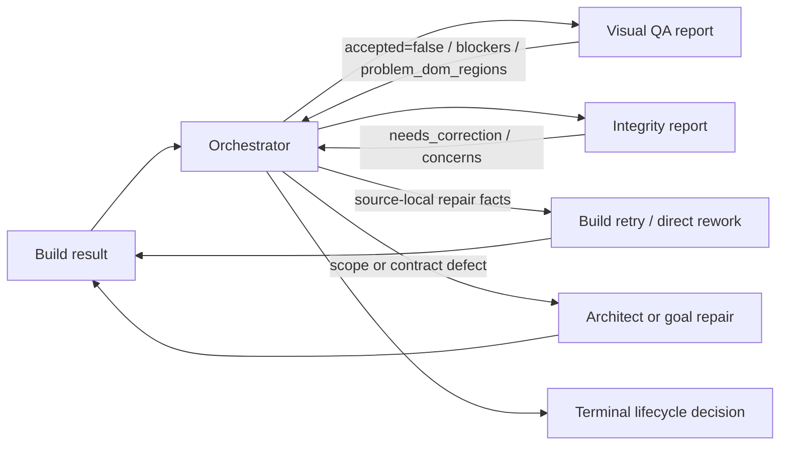

# 18 — Webpage Replica Agent Workflow

> Current authority: `packages/opencorvus/src/engine/workflow.ts`,
> `packages/opencorvus/src/orchestrator/tools.ts`,
> `packages/opencorvus/src/orchestrator/webpage-evidence.ts`,
> `packages/opencorvus/src/frontend-research/agent.ts`,
> `packages/opencorvus/src/build/prompt-context.ts`,
> `packages/opencorvus/src/visual-qa/agent.ts`,
> `packages/opencorvus/src/integrity/team-agent.ts`, and
> [13-agent-communication-matrix.md](13-agent-communication-matrix.md).
>
> Scope: this chapter extracts the webpage replica / clone topology from the
> generic agent matrix. It does not introduce a new scheduler or gate.

## Recall

User request:

- `把网页复刻workflow的多个agent 关系梳理出来`.

Acceptance criteria:

- Explain the webpage replica workflow as agent relationships, not a flat list.
- Distinguish direct orchestrator tool calls from durable artifact handoff.
- Include webpage-specific evidence producers such as task-scoped webpage
  evidence and `web-clone-source`.
- Clarify Visual Quality Assurance (QA, 质量保证) and Integrity boundaries:
  they produce review evidence; Orchestrator owns lifecycle completion.
- Preserve the current no-fallback, no-gate, no-dual-source constraints.

Hard constraints:

- Do not touch unrelated dirty files. `git status --short` already showed an
  unrelated modification in `packages/opencorvus/src/provider/models-snapshot.ts`.
- Do not create a new worktree or restart OpenCorvus / overlay processes.
- Keep specs in the root `specs/` tree and index new architecture docs.

Sources read:

- `AGENTS.md`
- `specs/README.md`
- `specs/current/architecture/README.md`
- `specs/current/architecture/01-agents.md`
- `specs/current/architecture/09-verification-evidence.md`
- `specs/current/architecture/13-agent-communication-matrix.md`
- `specs/records/2026-07/README.md`
- `specs/records/2026-07/2026-07-01-integrity-report-only-completion-boundary.md`
- `specs/records/2026-07/2026-07-01-visual-qa-feedback-consumption-chain.md`
- `specs/records/2026-07/2026-07-01-review-item-registration-tools.md`
- `specs/records/2026-07/2026-07-01-visual-qa-multi-viewport-alignment.md`
- `specs/artifacts/tc_clone_prompt.md`
- `packages/opencorvus/src/engine/workflow.ts`
- `packages/opencorvus/src/orchestrator/tools.ts`
- `packages/opencorvus/src/orchestrator/webpage-evidence.ts`
- `packages/opencorvus/src/frontend-research/agent.ts`
- `packages/opencorvus/src/frontend-design/agent.ts`
- `packages/opencorvus/src/frontend-design/skeleton-project-tool.ts`
- `packages/opencorvus/src/web-clone/context.ts`
- `packages/opencorvus/src/web-clone/handoff.ts`
- `packages/opencorvus/src/build/prompt-context.ts`
- `packages/opencorvus/src/visual-qa/agent.ts`

Whole-repository search evidence:

- `rg -n "网页复刻|webpage|clone|replicat|parity|frontend_research|frontend_design|visual_qa|integrity|build agent|agent" specs AGENTS.md package.json packages script -g "!node_modules"`
- `rg --files packages/opencorvus/src packages/opencorvus/test specs/records/2026-07 specs/current/architecture specs/artifacts | rg "(orchestrator|workflow|requirements|frontend-research|frontend-design|architect|build|visual-qa|integrity|agent|tools|tc_clone|clone|parity)"`
- `rg -n "frontend_research|frontend_design|visual_qa|integrity|requirements|architect|build|report_build_result|complete_task|workflow" packages/opencorvus/src/orchestrator packages/opencorvus/src/engine packages/opencorvus/src/goal packages/opencorvus/src/build packages/opencorvus/src/visual-qa packages/opencorvus/src/integrity packages/opencorvus/src/frontend-design packages/opencorvus/src/frontend-research packages/opencorvus/src/requirements packages/opencorvus/src/architect packages/opencorvus/test/orchestrator packages/opencorvus/test/engine packages/opencorvus/test/build-agent packages/opencorvus/test/visual-qa packages/opencorvus/test/integrity -g "*.ts"`
- `rg -n "frontend_research|frontend_design|requirements|architect|build|visual_qa|integrity|analyze_intent|composeLatestVisualQaFeedbackForBuild|composeLatestAcceptanceFeedbackForBuild|renderIntegrityFeedback|createOrchestratorTools|webpage" packages/opencorvus/src/orchestrator/tools.ts`
- `rg -n "Workflow|frontend_design|frontend_research|visual_qa|integrity|requirements|architect|build|Pipeline|review report|webpage" packages/opencorvus/src/engine/workflow.ts packages/opencorvus/test/engine/workflow-integrity-step.test.ts packages/opencorvus/test/agent/frontend-replica-desktop-only.test.ts`

Independent agent feedback:

- None spawned. The request is a focused current-architecture extraction; this
  chapter records main-agent evidence instead of inventing delegation.

## Vocabulary

- URL means Uniform Resource Locator, a web address.
- HTML means HyperText Markup Language, the document markup extracted or
  produced for visual surfaces.
- CSS means Cascading Style Sheets, the style source for visual layout.
- DOM means Document Object Model, the browser's structured page tree.
- IR means Intermediate Representation, the normalized source evidence under
  `source-ir/*`.
- PRD means Product Requirements Document, the evidence-derived product
  requirement view.
- GUI means Graphical User Interface, the visible app screen and controls.
- QA means Quality Assurance, a review activity with explicit evidence.
- API means Application Programming Interface.
- LLM means Large Language Model.
- A2A means Agent-to-Agent coordination through durable coordination artifacts.

## Relationship Summary

Webpage replica work is a `pipeline` workflow with a webpage-specific evidence
front-end:

Solid arrows are `dispatch_agent target=...` scheduler dispatches. Dotted arrows are durable
handoff surfaces: `engine_artifact`, `decision_log`, requirement rows,
contract graphs, build reports, browser preview evidence, and task-runtime
files. Agents do not secretly message each other.

## Direct Runtime Calls

| Caller       | Callee                       | Runtime path                                                                     | Webpage replica role                                                                                                                                                                                               |
| ------------ | ---------------------------- | -------------------------------------------------------------------------------- | ------------------------------------------------------------------------------------------------------------------------------------------------------------------------------------------------------------------ |
| Orchestrator | host webpage evidence runner | `ensureLiveWebpageEvidence()` before frontend stages when a live URL is provided | Materializes task runtime, extracts rendered page evidence, compiles/analyzes it, captures runtime states, and creates `web-clone-source`. This is infrastructure, not an agent.                                   |
| Orchestrator | `frontend_research`          | `dispatch_agent target=frontend_research`                                        | Publishes source-backed investigation packets from host-prepared webpage evidence. It does not create the implementation template, requirements, goals, or next-route plan.                                        |
| Orchestrator | `analyze_intent`             | `dispatch_agent target=analyze_intent`                                           | Optional clarification / complexity analysis, usually after webpage evidence when the scope is ambiguous.                                                                                                          |
| Orchestrator | `requirements`               | `dispatch_agent target=requirements`                                             | Registers `REQ-N` rows and foundational decisions from user request plus evidence. It does not produce goals.                                                                                                      |
| Orchestrator | `architect`                  | `dispatch_agent target=architect`                                                | Decomposes requirements into ordered goals, acceptance specs, traceability, source-reference coverage, and cross-goal contracts.                                                                                   |
| Orchestrator | `workload_analysis`          | `dispatch_agent target=workload_analysis`                                        | Read-only goal sizing review. It can produce concerns, but it does not modify goals and is not a gate.                                                                                                             |
| Orchestrator | `build`                      | `dispatch_agent target=build`                                                    | Runs implementation in a managed build session/worktree. For normal pipeline work it is goal-scoped; after review feedback it may be task-level scoped direct rework with active requirements and review feedback. |
| Orchestrator | `visual_qa`                  | `dispatch_agent target=visual_qa`                                                | Runs frontend GUI/product review near task completion after blocking builds are terminal. It can repair in-scope defects, but its report is evidence for Orchestrator, not lifecycle authority.                    |
| Orchestrator | `integrity`                  | `dispatch_agent target=integrity`                                                | Runs system completeness review after blocking build evidence is available. It returns pass / non-pass report evidence; Orchestrator decides completion, repair, follow-up, question, or failure.                  |
| Build        | `general` / `explore`        | `task` sub-agent tool                                                            | Optional worker-side help for scoped implementation exploration. This is not the main webpage workflow and must obey task-specific no-subtask constraints when present.                                            |

## Durable Handoff Surfaces

| Producer                                   | Handoff                                                                                                                                                                                                                         | Consumers                                                                     | Notes                                                                                                                                                                                                                                                                               |
| ------------------------------------------ | ------------------------------------------------------------------------------------------------------------------------------------------------------------------------------------------------------------------------------- | ----------------------------------------------------------------------------- | ----------------------------------------------------------------------------------------------------------------------------------------------------------------------------------------------------------------------------------------------------------------------------------- |
| Host webpage evidence runner               | `.opencorvus/r/t/<task>/fd/webpage-evidence/*` including `reference.png`, `capture.html`, `prd-evidence-summary.md`, `source-ir/*`, `source-skeleton/*`, interaction screenshots, and visual candidates                         | `frontend_research`, Build, Visual QA                                         | The rendered source evidence is the source of truth for page structure, pixels, style, layout, content, and interaction states.                                                                                                                                                     |
| Host source package creation               | `.opencorvus/r/t/<task>/fd/web-clone-source/*` including `implementation-blueprint.md`, `web-clone-context.md`, `web-clone-implementation-contract.json`, source IR, source skeleton, CSS sidecars, assets, and `reference.png` | Build                                                                         | This is mandatory source-backed implementation input. It is not copied as an app deliverable.                                                                                                                                                                                       |
| `frontend_research`                        | `frontend_research_brief` and compact projections                                                                                                                                                                               | `requirements`, `architect`, Build                                            | It is a coverage index for components, evidence IDs, interaction states, data questions, and fidelity risks.                                                                                                                                                                        |
| Existing/custom `frontend_design` evidence | `decision_log phase=frontend_design`, `task.design_specs`, public report, frontend project role, visual evidence, source manifest, VisualRegionBinding crop manifest with `reference_region_key` rows                           | `requirements`, `architect`, Build, Visual QA, Integrity when already present | The frontend-design implementation is retained for explicit custom workflows and historical handoff consumption, but it is not dispatched by the normal frontend-replica pipeline.                                                                                                  |
| `requirements`                             | Active requirement spec snapshot and `REQ-N` rows                                                                                                                                                                               | `architect`, Build, Integrity, workflow prompt                                | Build direct rework after review feedback must still receive active requirements.                                                                                                                                                                                                   |
| `architect`                                | Goal graph, acceptance specs, source coverage, optional `reference_coverage.reference_regions`, contract graph, decision-log entries                                                                                            | `workload_analysis`, Build, Integrity                                         | The webpage clone goal graph should derive from source IR and cover component source, data/API/state adapters, interactions, and runtime visual verification. Architect binds declared source/reference evidence to goals and preserves existing crop rows when they already exist. |
| `workload_analysis`                        | Goal workload brief and concerns                                                                                                                                                                                                | Orchestrator, Build, possibly Architect rerun                                 | Advisory, not a gate.                                                                                                                                                                                                                                                               |
| Build                                      | `build_session_contract`, BuildResult from `report_build_result`, changed-file facts, verification/browser evidence                                                                                                             | Orchestrator, Visual QA, Integrity, future Build retry                        | Passed Build evidence is implementation evidence, not task completion.                                                                                                                                                                                                              |
| Visual QA                                  | Structured VisualQaReport, acceptance semantics, `decision_log phase=visual_qa` report records, problem DOM regions                                                                                                             | Orchestrator, Build, Integrity, workflow projection                           | Failed Visual QA becomes first-class `visualQaFeedback` for Build, not hidden acceptance feedback.                                                                                                                                                                                  |
| Integrity                                  | `engine_artifact kind=integrity_attempt`, markdown report, required repairs                                                                                                                                                     | Orchestrator, Build, workflow projection                                      | Integrity non-pass is completed review evidence, not a failed lifecycle gate.                                                                                                                                                                                                       |
| Orchestrator                               | Lifecycle tool call and visible task events                                                                                                                                                                                     | User, task board, next workflow turn                                          | `complete_task` / `fail_task` are explicit Orchestrator decisions.                                                                                                                                                                                                                  |

## Webpage-Specific Stage Boundaries

### Host Evidence Is Not An Agent

The host prepares webpage evidence before the agent sessions that need it. The
evidence runner:

1. materializes task runtime paths;
2. extracts the live URL into `webpage-evidence`;
3. compiles and analyzes the source IR;
4. captures runtime-state screenshots;
5. checks the complete primary evidence set;
6. creates the visible `web-clone-source` package.

If this layer fails, downstream agents should report the missing concrete files
or evidence phase. They should not invent page facts from memory or use a
second source of truth.

### Frontend Research And Source Evidence

`frontend_research` answers "what is on this source page, where are the risks,
and what must later agents inspect?" It produces work packets and compact
pointers.

Normal frontend-replica workflow no longer dispatches `frontend_design`.
Requirements, Architect, Build, Visual Quality Assurance, and Integrity consume
host-prepared webpage evidence, `web-clone-source`, and `frontend_research`
compact projections directly. If a custom workflow or older task already
produced `frontend_design` handoff artifacts, downstream agents may consume
those artifacts as existing evidence; they must not require a fresh
frontend-design run.

### Goal-Bound Reference Crops

Full-page reference screenshot ownership is expressed through the active source
and reference evidence contract. Architect is the goal binding source. It
registers source coverage and, when the evidence contract already declares
crop rows, `reference_coverage.reference_regions` for the goals that own the
corresponding visible source regions.

The crop manifest, when present, records physical evidence only: each crop row
carries a stable `reference_region_key` in `region_id@viewport_id` form, a
`source_reference_artifact` PNG path, the source bbox, crop intent, and the
manifest path. It does not carry goal ids.

Orchestrator filters declared reference rows for the active Build goal, stores
the referenced crop PNGs through AttachmentStore, and injects them as
goal-scoped Build Evidence Pack target references. For every goal-scoped Build
dispatch, task-level images or the full-page reference are not mixed into the
target contract as substitutes. If the current goal declares crop rows and the
rows cannot be resolved, Build must surface the missing `reference_region_key`
crop as a blocker. Goal-scoped Build context may keep source/component
pointers, but it must not expand whole-page reference images as substitutes for
declared goal-bound rows.

### Requirements And Architect Own Scope Shape

`requirements` turns the user request plus evidence into explicit requirement
rows and foundational decisions. `architect` turns those rows into goals and
acceptance specs. In a webpage clone, the Architect must not collapse the whole
page into one all-in-one goal; it should preserve source-reference coverage and
split work along real source regions, data contracts, interaction surfaces, and
runtime visual verification.

### Build Owns Implementation, Not Evidence Discovery

Build consumes the upstream handoff through explicit prompt overlays:

- Frontend Research Build Pointers
- Existing/custom Frontend Design Handoff when already present
- Webpage Clone Source-Baseline Overlay
- Visual Reference Overlay
- Integrity Rework Overlay
- Visual QA Repair Overlay
- Acceptance Repair Overlay

For webpage clones, the source-baseline overlay requires Build to resolve
`web-clone-source/...` under the task-runtime frontend evidence root, inspect
source IR and style profiles before CSS repair, and fail with a concrete
blocker if required source files are missing. Build must not replace
source-backed repair with a blank-page rebuild or screenshot wrapper.

### Visual QA And Integrity Are Peer Review Surfaces

Visual QA owns visible GUI/product review. It must test the real rendered
surface, use screenshots and per-region comparison evidence for clone parity,
and register item-level checks before submitting the final report.

Integrity owns adversarial system completeness review. It checks requirement
coverage, architecture contracts, delivered behavior, and review evidence. It
also registers item-level checks.

Neither agent completes the task. Their reports feed Orchestrator. Orchestrator
then chooses one visible action: re-run Build, modify goals, re-run Architect,
ask the user, propose a follow-up task, fail, or complete.

## Rework Loops

The loop is LLM-orchestrated, not a host state machine. The important invariant
is that failed Visual QA and non-pass Integrity are preserved as explicit Build
context channels; they are not hidden inside acceptance text and they do not
mechanically block `complete_task`.

## Task-Specific Web Clone Constraints

The current global frontend replica rule is desktop-only by default. Tablet,
mobile, responsive, or multi-end validation is in scope only when the current
operator instruction explicitly asks for it or Visual QA actually inspects more
than one viewport. A prompt artifact such as `specs/artifacts/tc_clone_prompt.md`
can add stricter task-local constraints, for example a single round with no
repeated pre-Architect agents. In that case, Orchestrator should consume the
already persisted `frontend_research` evidence and any existing custom
`frontend_design` handoff during repair instead of re-running stages as a
convenience loop.

## Debug Checklist

1. Missing source evidence: inspect `ensureLiveWebpageEvidence()` progress,
   `webpage-evidence-failure.json`, and the primary artifact set.
2. Missing source/research context: inspect `frontend_research_brief`,
   `web-clone-source`, and any existing custom `decision_log phase=frontend_design`
   handoff.
3. Build ignored source evidence: inspect Build prompt overlay IDs and verify
   that `webpage-clone-source-baseline` rendered.
4. Visual repair did not happen: inspect `decision_log phase=visual_qa` full
   report, `problem_dom_regions`, and `visualQaFeedback` rendered in Build
   context.
5. Integrity appears to block completion: inspect whether the UI is projecting a
   review report as lifecycle authority. Current contract says Orchestrator
   alone calls `complete_task` or `fail_task`.
