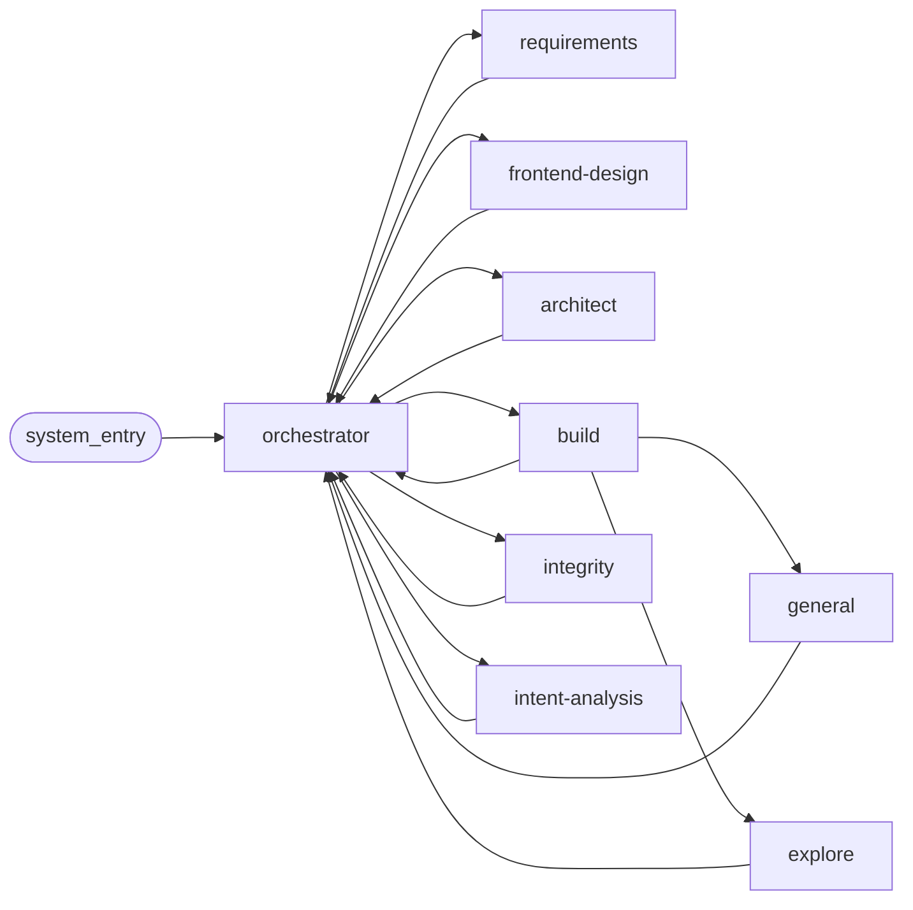
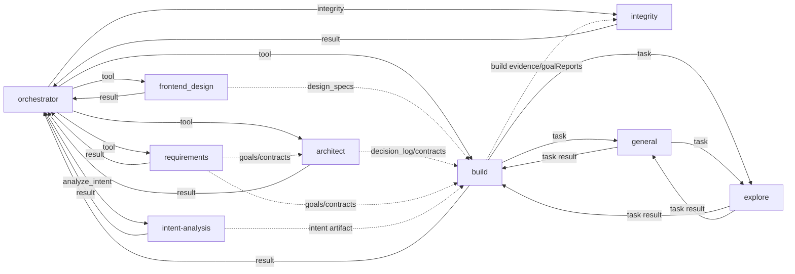

# 13 — Agent 通信矩阵（预期 vs 实际）

> 对应代码（2026-06-17 真源）：`src/orchestrator/tools.ts` · `src/orchestrator/loop.ts` ·
> `src/goal/runner.ts`（build tool 的 worktree+executor 执行体） ·
> `src/build/agent.ts`（build agent；独立包 `agent.ts` / `index.ts` / `report.ts` / `types.ts`） ·
> `src/agent/sub-agent-protocol.ts`（共享 sub-agent 协议） ·
> `src/tool/task.ts` · `src/agent/agent.ts` ·
> `src/intent-analysis/agent.ts` · `src/integrity/team-agent.ts` ·
> `src/requirements/agent.ts` · `src/architect/agent.ts` · `src/frontend-design/agent.ts` ·
> `src/control/message.ts` · `src/channel/ingress.ts`
>
> 用途：把"规范里允许谁对谁发消息"和"当前代码里谁真正能触发/接收/间接拿到上下文"并列出来，便于排查通信问题。

## 先看结论

- 当前运行时的真源不是 [11-agent-oop-protocol.md](11-agent-oop-protocol.md) 里的 mailbox/registry 协议，而是 `ChannelIngress / ControlMessage / EngineService / Orchestrator tools / build tool / task subagent` 的混合路径。
- **Planning tool role 已删除**：the removed planning package 整目录、`src/engine/goal-pool.ts`、`planGoal()` 全部移除。Orchestrator 没有 `planner` tool；pipeline build 路径里 "per-goal 实现步骤" 现由 build agent 直接基于 architect contract + decision-log 推进。`src/tool/planner.ts` 是 session 级 working-memory 工具（task tree / scratchpad），**不是** planning tool role 的替代。
- **`intent-analysis` 已接线**：orchestrator 通过 `analyze_intent` tool 调 `IntentAnalysisAgent.analyze`，落 `intent-analysis` SessionKind。13 号文档此前的"not wired yet"已过期。
- **`integrity` 是最终 review / acceptance tool**：对应 Integrity reviewer team（动态 reviewer 计划、replay-aware context、severity discipline、build feedback），并吸收旧固定维度 review 与旧对抗性复核职责。`prosecute` / `prosecutor` 已删除。
- `build -> general/explore`、`general -> explore` 是当前真实存在的 direct 子代理路径；acceptance direct 子代理路径已删除；`general -> general` 自递归被权限拒绝。
- `orchestrator -> EngineService.createTask` 只通过 `propose_task` 间接发生：先向用户展示"完善上一个 request 的新任务"候选，用户确认后才创建新 task；这不是 `panel` control-plane action，也不是 generic `task` subagent dispatch。
- [11-agent-oop-protocol.md](11-agent-oop-protocol.md) 的白名单表存在一个闭环不完整点：`explore.receiveWhitelist` 包含 `general`，但 `general.sendWhitelist` 没有 `explore`。按该文自己的"双向都要声明"规则，`general -> explore` 在 spec 文本上并不成立。

## 节点缩写

| 缩写  | 节点              | 说明                                                                              |
| ----- | ----------------- | --------------------------------------------------------------------------------- |
| `SYS` | `system_entry`    | 未来协议里的虚拟外部入口                                                          |
| `O`   | `orchestrator`    | 任务唯一决策者                                                                    |
| `R`   | `requirements`    | 需求分解                                                                          |
| `X`   | `frontend-design` | 视觉分析；代码里的 tool 名是 `frontend_design`                                    |
| `A`   | `architect`       | 跨目标契约                                                                        |
| `B`   | `build`           | 实际写代码的执行 agent（自己读 contract，不再有外置 planning tool role）          |
| `IT`  | `integrity`       | 多维 integrity review（orchestrator tool: `integrity`），也是最终 acceptance gate |
| `G`   | `general`         | 通用 subagent                                                                     |
| `E`   | `explore`         | 只读探索 subagent                                                                 |
| `I`   | `intent-analysis` | 已接线（orchestrator tool: `analyze_intent`）                                     |

> 历史草稿曾保留 `P = planner`、`D = acceptance/deliver`、`PR = prosecutor` 节点；当前 runtime 已无这些独立 agent/tool，相关行被整列移除（不是"代码里没接"，是 agent/tool 本身不存在）。

## 入口层（不算 agent，但经常是故障起点）

| 来源             | 当前入口                     | 进入 agent team 之前的真实路径                                                                                      |
| ---------------- | ---------------------------- | ------------------------------------------------------------------------------------------------------------------- |
| 外部渠道         | `ChannelIngress.message()`   | 命中 binding 且 task 有 pending interaction 时，直接 `replyInteraction`；否则委托 `ControlMessage.handle()`         |
| 本地 panel / TUI | `ControlMessage.handle()`    | 用默认 agent + panel capability 产出 action，再走 `EngineService.createTask / taskMessage / replyInteraction / ...` |
| task 创建后      | `EngineService.createTask()` | 启动 `runTaskLoop()`，这时才进入 `orchestrator` 的决策面                                                            |

这意味着“agent 通信异常”如果发生在任务还没创建出来之前，先查 [03-control.md](03-control.md)，不要直接查 agent 内部。

## 预期矩阵（来自 11 号协议，direct whitelist）

> 矩阵列已对齐当前 agent 集（删除 `P` / `D` / `PR`，保留 `IT`）。`SYS -> O = D`。

图例：`D` = spec 允许 direct send。空白 = spec 未声明。

| from\\to | O   | R   | X   | A   | B   | IT  | G   | E   | I   |
| -------- | --- | --- | --- | --- | --- | --- | --- | --- | --- |
| O        | -   | D   | D   | D   | D   | D   | -   | -   | D   |
| R        | D   | -   | -   | -   | -   | -   | -   | -   | -   |
| X        | D   | -   | -   | -   | -   | -   | -   | -   | -   |
| A        | D   | -   | -   | -   | -   | -   | -   | -   | -   |
| B        | D   | -   | -   | -   | -   | -   | D   | D   | -   |
| IT       | D   | -   | -   | -   | -   | -   | -   | -   | -   |
| G        | D   | -   | -   | -   | -   | -   | -   | -   | -   |
| E        | D   | -   | -   | -   | -   | -   | -   | -   | -   |
| I        | D   | -   | -   | -   | -   | -   | -   | -   | -   |

### 预期拓扑图

实线表示 spec 允许的 direct P2P send。

## 实际矩阵一：当前代码里的 direct 调用/回传

图例：

- `T` = direct Orchestrator tool 调用
- `RT` = tool result 直接回到调用方上下文
- `Q` = direct `task` subagent 调用
- `RQ` = `task` subagent 结果回到调用方上下文
- `Q/RQ` = 同一个节点既能发起也能接收该类 direct 子任务

| from\\to | O   | R   | X   | A   | B   | IT  | G   | E   | I   |
| -------- | --- | --- | --- | --- | --- | --- | --- | --- | --- |
| O        | -   | T   | T   | T   | T   | T   | -   | -   | T   |
| R        | RT  | -   | -   | -   | -   | -   | -   | -   | -   |
| X        | RT  | -   | -   | -   | -   | -   | -   | -   | -   |
| A        | RT  | -   | -   | -   | -   | -   | -   | -   | -   |
| B        | RT  | -   | -   | -   | -   | -   | Q   | Q   | -   |
| IT       | RT  | -   | -   | -   | -   | -   | -   | -   | -   |
| G        | -   | -   | -   | -   | RQ  | -   | -   | Q   | -   |
| E        | -   | -   | -   | -   | RQ  | -   | RQ  | -   | -   |
| I        | RT  | -   | -   | -   | -   | -   | -   | -   | -   |

说明：

- `O -> I` (intent-analysis) 现在已是 direct tool（`analyze_intent`）；`I -> O` 由 tool result 回写到 orchestrator session。
- `O -> IT` (`integrity`) 是最终 review / acceptance 路径。
- Acceptance direct tool surface is removed; post-build semantic review enters through `O -> IT`.
- `G -> G` 被显式拒绝，避免 `general` 自递归；`general -> explore` 仍是当前实现真实存在的二级探索路径。
- Planner 节点已从代码与本矩阵双向删除；旧的 "build 里通过 plan_node.brief 收到 planner 输出" 这条间接路径不再存在。

## 实际矩阵二：当前代码里的间接传递（只列高信号链路）

这张表不是做全闭包，而是只列"排障时最容易误判成 direct P2P，实际却是通过持久化状态/下一轮 loop 传递"的链路。

图例：

- `DL` = `decision_log` / goal contract / intent bundle（intent-analysis 结果也走这条路径）
- `DS` = `task.design_specs` / `system_artifacts`
- `BE` = build evidence / goal report / changed-file artifact
- `IRH` = integrity review history

| from\\to | O   | A   | B   | IT  |
| -------- | --- | --- | --- | --- |
| O        | -   | -   | -   | -   |
| I        | DL  | -   | DL  | DL  |
| R        | -   | DL  | DL  | -   |
| X        | -   | -   | DS  | DS  |
| A        | -   | -   | DL  | -   |
| B        | BE  | -   | -   | BE  |
| IT       | IRH | -   | IRH | -   |

> 删除了 `O -> GP -> P -> B` 这条 pipeline 链路：`goal-pool` 与 `planner` 都已下线。
> 当前 pipeline build 路径是 `O --build tool--> goal/runner.ts --> Executor`，
> 其中 build agent 直接读 `decision_log` + architect contract + design specs。

## 实际拓扑图

实线表示 direct 调用/回传；虚线表示当前实现里的间接传递。

## 用这张表排障

1. 看不到独立 "planner" session / agent 时，结论应该是 **"planner 已下线"**，而不是 "在 pipeline 里隐式起着"。the removed planning package 目录、`engine/goal-pool.ts`、`planGoal()` 全部不存在；旧文档里的 "O -> GP -> P -> B" 链路已失效。
2. `intent-analysis` 没有任何消息时，先查 orchestrator 是否调了 `analyze_intent` tool（`engine_artifact` kind=`intent-analysis`），再查 `IntentAnalysisAgent.analyze` 的 session 是否成功建出。**不要**再援引"not wired yet"。
3. `frontend-design` 的结果如果 `build` / `integrity` 看不到，先查 `task.design_specs` 和 `system_artifacts` 是否都已写入，而不是查 agent prompt。
4. `integrity` 非 pass 后没有进入回修时，先查 review result 是否返回了 actionable findings，以及下一轮 Orchestrator 是否真的再次调了 `build` / `modify_goal` / `architect`。
5. integrity 结果没出现时，确认 orchestrator 是否真的调了 `integrity` tool；它是 review 路径，不会被 build 自动触发。
6. 如果未来切到 [11-agent-oop-protocol.md](11-agent-oop-protocol.md) 的 mailbox 协议，`general -> explore` 这条当前真实可用的链路会先卡在 whitelist 定义不闭合的问题上。

## 真源文件索引

- `src/channel/ingress.ts`：外部入站是否直接回填 interaction，还是委托 control 层
- `src/control/message.ts`：panel/control 入口，任务真正创建前的 LLM 路由
- `src/orchestrator/tools.ts`：orchestrator tools（含 `requirements / frontend_design / architect / build / analyze_intent / integrity / visual_qa / workload_analysis / propose_task / steer_subagent / cancel_subagent / refine` 等）
- `src/orchestrator/loop.ts`：`runTaskLoop` 决策入口
- `src/goal/runner.ts`：build tool 落到 worktree + executor 的执行体
- `src/build/agent.ts`：build agent 入口（`build/` 独立包：`agent.ts` / `index.ts` / `report.ts` / `types.ts`）
- `src/agent/sub-agent-protocol.ts`：共享 sub-agent 协议（不在 `build/`）
- `src/tool/task.ts`：`general / explore` subagent 的 direct 调用边界
- `src/agent/agent.ts`：哪些 agent 是 `primary`，哪些是 `subagent`
- `src/intent-analysis/agent.ts`：`IntentAnalysisAgent.analyze`（已接线，对应 orchestrator tool `analyze_intent`）
- `src/integrity/team-agent.ts`：integrity reviewer team 入口（动态 adversarial review）
