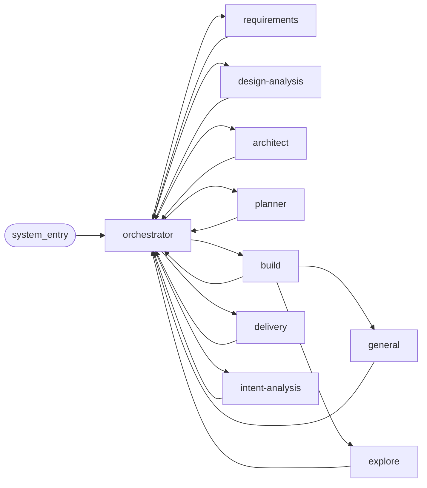
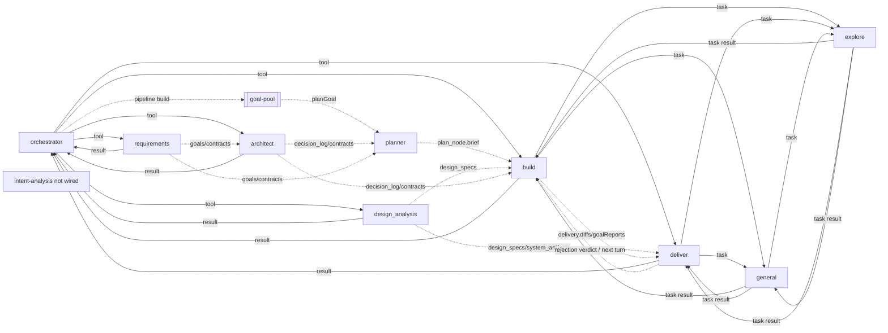

# 13 — Agent 通信矩阵（预期 vs 实际）

> 对应代码：`src/orchestrator/tools.ts` · `src/engine/goal-pool.ts` · `src/planner/agent.ts` ·
> `src/delivery/agent.ts` · `src/tool/task.ts` · `src/agent/agent.ts` ·
> `src/intent-analysis/agent.ts` · `src/control/message.ts` · `src/channel/ingress.ts`
>
> 用途：把“规范里允许谁对谁发消息”和“当前代码里谁真正能触发/接收/间接拿到上下文”并列出来，便于排查通信问题。

## 先看结论

- 当前运行时的真源不是 [11-agent-oop-protocol.md](11-agent-oop-protocol.md) 里的 mailbox/registry 协议，而是 `ChannelIngress / ControlMessage / EngineService / Orchestrator tools / GoalPool / task subagent` 的混合路径。
- `planner` 当前不是 Orchestrator 的显式 tool 目标；它在 pipeline build 路径里由 `engine/goal-pool.ts` 调用 `planGoal()`。
- `intent-analysis` 已有 agent 实现，但源码明确写着“not wired yet”；当前 runtime 里没有接线。
- `build -> general/explore`、`deliver -> general/explore`、`general -> explore` 是当前真实存在的 direct 子代理路径；`general -> general` 自递归被权限拒绝。
- [11-agent-oop-protocol.md](11-agent-oop-protocol.md) 的白名单表存在一个闭环不完整点：`explore.receiveWhitelist` 包含 `general`，但 `general.sendWhitelist` 没有 `explore`。按该文自己的“双向都要声明”规则，`general -> explore` 在 spec 文本上并不成立。

## 节点缩写

| 缩写 | 节点 | 说明 |
| --- | --- | --- |
| `SYS` | `system_entry` | 未来协议里的虚拟外部入口 |
| `O` | `orchestrator` | 任务唯一决策者 |
| `R` | `requirements` | 需求分解 |
| `X` | `design-analysis` | 视觉分析；代码里的 tool 名是 `design_analysis` |
| `A` | `architect` | 跨目标契约 |
| `P` | `planner` | per-goal 计划 |
| `B` | `build` | 实际写代码的执行 agent |
| `D` | `delivery` | 交付验收；代码里的 tool 名是 `deliver` |
| `G` | `general` | 通用 subagent |
| `E` | `explore` | 只读探索 subagent |
| `I` | `intent-analysis` | 已实现但当前未接线 |

## 入口层（不算 agent，但经常是故障起点）

| 来源 | 当前入口 | 进入 agent team 之前的真实路径 |
| --- | --- | --- |
| 外部渠道 | `ChannelIngress.message()` | 命中 binding 且 task 有 pending interaction 时，直接 `replyInteraction`；否则委托 `ControlMessage.handle()` |
| 本地 panel / TUI | `ControlMessage.handle()` | 用默认 agent + panel capability 产出 action，再走 `EngineService.createTask / taskMessage / replyInteraction / ...` |
| task 创建后 | `EngineService.createTask()` | 启动 `runTaskLoop()`，这时才进入 `orchestrator` 的决策面 |

这意味着“agent 通信异常”如果发生在任务还没创建出来之前，先查 [03-control.md](03-control.md)，不要直接查 agent 内部。

## 预期矩阵（来自 11 号协议，direct whitelist）

图例：`D` = spec 允许 direct send。空白 = spec 未声明。

`SYS -> O = D`。

| from\\to | O | R | X | A | P | B | D | G | E | I |
| --- | --- | --- | --- | --- | --- | --- | --- | --- | --- | --- |
| O | - | D | D | D | D | D | D | - | - | D |
| R | D | - | - | - | - | - | - | - | - | - |
| X | D | - | - | - | - | - | - | - | - | - |
| A | D | - | - | - | - | - | - | - | - | - |
| P | D | - | - | - | - | - | - | - | - | - |
| B | D | - | - | - | - | - | - | D | D | - |
| D | D | - | - | - | - | - | - | - | - | - |
| G | D | - | - | - | - | - | - | - | - | - |
| E | D | - | - | - | - | - | - | - | - | - |
| I | D | - | - | - | - | - | - | - | - | - |

### 预期拓扑图

实线表示 spec 允许的 direct P2P send。

## 实际矩阵一：当前代码里的 direct 调用/回传

图例：

- `T` = direct Orchestrator tool 调用
- `RT` = tool result 直接回到调用方上下文
- `Q` = direct `task` subagent 调用
- `RQ` = `task` subagent 结果回到调用方上下文
- `Q/RQ` = 同一个节点既能发起也能接收该类 direct 子任务

| from\\to | O | R | X | A | P | B | D | G | E | I |
| --- | --- | --- | --- | --- | --- | --- | --- | --- | --- | --- |
| O | - | T | T | T | - | T | T | - | - | - |
| R | RT | - | - | - | - | - | - | - | - | - |
| X | RT | - | - | - | - | - | - | - | - | - |
| A | RT | - | - | - | - | - | - | - | - | - |
| P | - | - | - | - | - | - | - | - | - | - |
| B | RT | - | - | - | - | - | - | Q | Q | - |
| D | RT | - | - | - | - | - | - | Q | Q | - |
| G | - | - | - | - | - | RQ | RQ | - | Q | - |
| E | - | - | - | - | - | RQ | RQ | RQ | - | - |
| I | - | - | - | - | - | - | - | - | - | - |

说明：

- `O -> P` 在当前实现里不是 direct tool，所以这一格刻意留空。
- `I` 整行整列为空，不是“没画”，而是“当前 runtime 确实没接线”。
- `G -> G` 被显式拒绝，避免 `general` 自递归；`general -> explore` 仍是当前实现真实存在的二级探索路径。

## 实际矩阵二：当前代码里的间接传递（只列高信号链路）

这张表不是做全闭包，而是只列“排障时最容易误判成 direct P2P，实际却是通过持久化状态/下一轮 loop 传递”的链路。

图例：

- `GP` = `goal-pool` 调 `planGoal()`
- `DL` = `decision_log` / goal contract / intent bundle
- `DS` = `task.design_specs` / `system_artifacts`
- `PL` = `plan_node.brief`
- `DV` = aggregated delivery diff / goal report / verdict artifact
- `RB` = delivery rejection 打开新 attempt，等待下一轮 Orchestrator 再进 build

| from\\to | O | A | P | B | D |
| --- | --- | --- | --- | --- | --- |
| O | - | - | GP | - | - |
| R | - | DL | DL | DL | - |
| X | - | - | - | DS | DS |
| A | - | - | DL | DL | - |
| P | - | - | - | PL | - |
| B | - | - | - | - | DV |
| D | - | - | - | RB | - |

## 实际拓扑图

实线表示 direct 调用/回传；虚线表示当前实现里的间接传递。

## 用这张表排障

1. 看不到 `planner` session 时，先确认 task 是否真的走了 pipeline build；当前不是 `O -> P` 直呼，direct workflow 根本不会起 `planner`。
2. `intent-analysis` 没有任何消息时，优先结论不是“模型没调起来”，而是“当前 runtime 未接线”。
3. `design-analysis` 的结果如果 `build` 看得到、`delivery` 看不到，先查 `task.design_specs` 和 `system_artifacts` 是否都已写入，而不是查 agent prompt。
4. `delivery` 拒绝后没有进入回修时，先查 `deliver` 是否写出了 `affected_goal_ids`，以及 reopen attempt 后下一轮 Orchestrator 是否真的再次调了 `build`。
5. 如果未来切到 [11-agent-oop-protocol.md](11-agent-oop-protocol.md) 的 mailbox 协议，`general -> explore` 这条当前真实可用的链路会先卡在 whitelist 定义不闭合的问题上。

## 真源文件索引

- `src/channel/ingress.ts`：外部入站是否直接回填 interaction，还是委托 control 层
- `src/control/message.ts`：panel/control 入口，任务真正创建前的 LLM 路由
- `src/orchestrator/tools.ts`：`requirements / design_analysis / architect / build / deliver`
- `src/engine/goal-pool.ts`：pipeline 路径里实际拉起 `planner`
- `src/planner/agent.ts`：`planGoal()` 的真实 planner 入口
- `src/tool/task.ts`：`general / explore` subagent 的 direct 调用边界
- `src/agent/agent.ts`：哪些 agent 是 `primary`，哪些是 `subagent`
- `src/delivery/agent.ts`：delivery 如何并行派发 `general / explore`
- `src/intent-analysis/agent.ts`：明确标注了当前“not wired yet”
