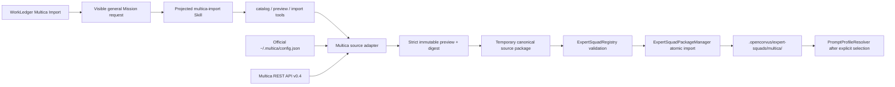

# Multica expert-squad import

## Recall

### Original request

Research existing work and tools for importing the open-source Multica agent-team data, design a correct OpenCorvus integration, implement automated import of data such as agent-team definitions, and expose the feature in the Overlay's upper-left function menu.

### Requirement correction

The user supplied a screenshot and clarified the exact ownership boundary: Multica is a top-level action in the left `OpenCorvus Workspace` shortcut group, alongside `New chat`, `Expert Squads`, and `Channel`. It must appear immediately after `Expert Squads` and before `Channel`. It is not a titlebar `File / Edit / View / Help` menu.

The user also clarified that the import must be Agent-led and backed by a preset skill so the Agent can investigate source variation, explain blockers, ask for decisions, and complete the import. The earlier fixed Overlay dialog is therefore superseded. The single product flow is left shortcut -> visible Mission request -> projected `multica-import` skill -> fine-grained Multica tools -> strict adapter/Registry/Manager.

### Acceptance criteria

1. Use a documented Multica-owned structured interface; do not scrape UI or parse its PostgreSQL database.
2. Discover Multica squads automatically from the official local Multica configuration, preview the exact source evidence, and import one selected squad without sending its personal access token to the Overlay.
3. Convert an importable Multica squad into exactly one canonical project package under `.opencorvus/expert-squads/multica/<manifest-id>/`, validate it through `ExpertSquadRegistry`, and install it only through `ExpertSquadPackageManager`.
4. Preserve stable source identity from Multica universally unique identifiers (UUIDs), agent instructions, member roles, and single-file Agent Skills. Never derive runtime identity from display names.
5. Reject semantic loss before writing: human members, missing/dangling leader or agent references, missing instructions needed by the target package, redacted or non-portable runtime data presented as portable, and Agent Skills with supporting files that the current canonical package schema cannot represent.
6. Re-import requires an exact preview digest and an explicit replace choice. An import never changes `prompt_profile.active` and never creates a remote shadow source or continuous synchronization.
7. Add a `Multica Import` top-level action to the existing `WorkLedger` left shortcut group immediately after `Expert Squads` and before `Channel`. Remove every Multica titlebar-menu entry and the superseded direct-import dialog.
8. Clicking the left action starts a real Mission with a visible user-role import request under the built-in `general` prompt profile. Its Orchestrator must load the preset `multica-import` skill and use the projected `multica_catalog`, `multica_preview`, and `multica_import` tools; ordinary Coding Assistant Chat receives no parallel skill/tool path.
9. Cover strict source schemas, authenticated HTTP requests, malicious skill paths, blocker cases, digest drift, zero-write failure, Registry/Manager/Resolver isolation, Skill/Tool projection, Mission launch, left-sidebar ownership/order, project-scoped routes, and real rendered desktop interaction.
10. Frontend acceptance must use an isolated real Overlay page, Node-launched Playwright/browser sidecar, task-scoped screenshots, and a manual second visual review. The currently running OpenCorvus/Overlay process must not be restarted, refreshed, or stopped.
11. Commit subjects use the `dsw-33987` prefix and delivery pushes the current main worktree branch to `legacy-remote` without bypassing hooks.

### Hard constraints

- No fallback, compatibility alias, dual source, silent merge, partial import, keyword-based role mapping, gate, state machine, hidden message, or auto-activation.
- The launcher creates a normal visible user-role Mission message. It does not synthesize a model-only instruction, auto-switch global `prompt_profile.active`, or expose the preset skill to native Chat through a second projection path.
- The Multica remote is read only during preview/import. After successful import, the project package is the sole OpenCorvus source.
- `prompt_profile.active` remains the only active expert-squad selection source and `PromptProfileResolver` remains the only runtime projection owner.
- Multica runtime/model/status/concurrency/environment/MCP (Model Context Protocol) configuration, Composio configuration, tasks, issues, comments, and autopilots are not equivalent to expert-squad capability declarations and are never guessed into target runtime fields.
- A Multica human member is not an OpenCorvus agent. Any such member blocks the import instead of being dropped or converted.
- Multica Agent Skills supporting files currently conflict with the landed OpenCorvus package invariant that only `SKILL.md` is accepted. They block this import. Extending canonical skill mounting is a separate architecture task.
- All implementation edits stay in the Windows host main worktree. No worktree, reset, stash, or destructive recovery.

### Landed material read before implementation

- `AGENTS.md`
- `specs/README.md`
- `specs/current/architecture/04-extensions.md`
- `specs/records/2026-07/README.md`
- `specs/records/2026-07/2026-07-03-dynamic-expert-squad-loading.md`
- `specs/records/2026-07/2026-07-05-overlay-expert-squad-settings-redesign.md`
- `specs/records/2026-07/2026-07-06-left-extension-activity-consolidation.md`
- `specs/records/2026-07/2026-07-06-namespaced-expert-squad-source-layout.md`
- `specs/records/2026-07/2026-07-08-expert-squad-release-schema-audit.md`
- `specs/records/2026-07/2026-07-11-overlay-left-rail-density-and-run-menu.md`
- `specs/records/2026-07/2026-07-13-expert-squad-integration-guide.md`
- `opencorvus-expert-squad-creator` skill and its complete validation checklist
- `benchmark-debug-template` skill
- `browser:control-in-app-browser` skill
- `skill-creator` skill
- `packages/opencorvus/src/skill/skill.ts`, `required-tools.ts`, and built-in `research-report.md`
- `packages/opencorvus/src/orchestrator/tools.ts`, Session runtime projection, and Agent tool-pool projection files
- `packages/opencorvus/src/chat/session.ts` and SessionLoop skill-surface finalization
- `packages/overlay/src/components/WorkLedger.tsx`, `packages/overlay/src/main.tsx`, Mission launcher service, and composer-draft ownership

### Full-repository call-point inventory

Before this plan was written, full-repository `rg` inventories covered `ExpertSquadRegistry`, `ExpertSquadPackageManager`, `PromptProfileResolver`, `expert-squad.jsonc`, `prompt_profile.active`, package imports/exports, payload release, skill projections, server route mounting, Overlay catalog consumers, upper-left menus, dialog primitives, transport directory injection, OpenAPI generation, and all associated tests.

| Call-point cluster                                                          | Disposition                                                                                                                                     |
| --------------------------------------------------------------------------- | ----------------------------------------------------------------------------------------------------------------------------------------------- |
| `packages/opencorvus/src/expert-squad/registry.ts`                          | Retain as the strict package/schema authority; generated source packages must pass `loadSourcePackage`. Do not add Multica scanning.            |
| `packages/opencorvus/src/expert-squad/manager.ts`                           | Retain as the only installer; the adapter calls `importDirectory` after full preview validation.                                                |
| `packages/opencorvus/src/expert-squad/prompt-profile-resolver.ts`           | Retain unchanged as the only active projection owner; test inactive isolation and explicit later activation.                                    |
| `packages/opencorvus/src/server/routes/expert-squad.ts` and `routes/app.ts` | Retain the project-scoped REST contract as the documented programmatic interface; both REST and Agent tools call the same strict adapter.      |
| `packages/opencorvus/src/skill/skill.ts` and `src/skill/builtin/**`          | Add one bundled `multica-import` skill; its instructions own discovery, preview interpretation, user decisions, import, and post-import report. |
| `packages/opencorvus/src/orchestrator/{tools,multica-import-tools}.ts`      | Add three fine-grained Orchestrator tools backed directly by the adapter and scoped to `Instance.directory`; no global Registry duplicate, host workflow, or state machine. |
| `packages/opencorvus/src/agent/tool-pool-data.ts`                           | Make the three tools projectable by an Orchestrator package but not part of every scheduler's inherited base tools.                             |
| `packages/opencorvus/src/expert-squad/builtin/general/expert-squad.jsonc`   | Explicitly project the preset skill and three tools to the `general` Orchestrator used by the launcher.                                          |
| `packages/overlay/src/components/WorkLedger.tsx`                            | Own the left-sidebar `Multica Import` action immediately after `Expert Squads`; use the existing Button and icon system.                         |
| `packages/overlay/src/main.tsx` and `services/mission.ts`                   | Launch one visible Mission request with prompt profile `general`, then open the real Mission conversation.                                      |
| `packages/overlay/src/components/titlebar/TitlebarMenubar.tsx`              | Retain the canonical `File / Edit / View / Help` order with no Multica entry.                                                                    |
| `packages/overlay/src/components/MulticaImportDialog.tsx` and direct service calls | Delete the superseded fixed UI workflow so there is one Agent-led product path.                                                           |
| `packages/overlay/src/components/settings/ExpertSquadPanel.tsx`             | Retain as the installed-package inspection/activation surface; do not merge Multica remote state into it.                                       |
| `packages/overlay/src/main.tsx`, `SkillMarketPanel.tsx`, `ChatComposer.tsx` | Retain their common expert-squad catalog consumption; stale invalidation makes the new package visible.                                         |
| `packages/transport-protocol/src/index.ts`                                  | Explicitly classify new routes as project-scoped if the existing path-family rule is insufficient; add the path table to contract tests.        |
| `packages/sdk/openapi.json`, generated SDK, web API docs                    | Regenerate only after routes are stable, preserving unrelated staged changes and verifying the generated diff.                                  |
| Existing expert-squad/Overlay/server/browser tests                          | Extend focused owners; do not replace existing package lifecycle coverage with Multica-only fixtures.                                           |

### Independent agent feedback

Three independent read-only agents investigated official Multica contracts, backend expert-squad architecture, and Overlay ownership. Consensus:

- Multica is a database-backed managed-agent platform, not a stable YAML/TOML team-manifest ecosystem. Squad means a leader plus agent/human members and routing instructions, not a portable workflow runtime.
- No existing Multica-to-agent-team migration tool was found. A dedicated source adapter is required.
- Agent Skills is the one directly reusable portability standard. Oracle Open Agent Specification offers a useful versioned adapter/serializer precedent; A2A Agent Cards and AGNTCY OASF address discovery/capability metadata, not full squad topology.
- The adapter must generate a canonical project package and then use Registry -> Manager -> Resolver. It must not scan Multica from Resolver, create a second active field, or import a Multica squad through ordinary Skill import.
- The earlier Kobalte-menubar conclusion was invalidated by the user's screenshot. The correct owner is the `WorkLedger` left shortcut group; installed results remain visible in the existing Expert Squads settings surface and common catalog.
- Native right-sidebar Chat has a native-agent runtime and does not own the projected production Skill surface. The Mission Orchestrator is the correct existing Agent runtime for the preset skill and exact expert-squad capability projection.
- Supporting skill files, human members, remote runtime configuration, and Multica leader issue-routing are real semantic incompatibilities and must be shown rather than silently approximated.

### Baseline/toolchain evidence

- On 2026-07-14, the official `multica` CLI and `~/.multica/config.json` were absent on this host, so a real authenticated user-workspace pull cannot be claimed from this machine.
- `git fetch legacy-remote v0.0.3beta` proved the local branch was three existing commits ahead and zero behind.
- The required pre-change push reached the repository hook but was rejected by pre-existing uncommitted `ProjectRuntimePaths.frontendDesignPaths` contract changes: removed `webpageEvidence*`/`sourcePackage*` fields still have many callers. This task did not create those errors and will not roll back or overwrite the existing work.

## External research decision

| Candidate                       | What it provides                                                                                                   | Decision                                                                                                                       |
| ------------------------------- | ------------------------------------------------------------------------------------------------------------------ | ------------------------------------------------------------------------------------------------------------------------------ |
| Multica REST API                | Official squad/member/agent/full-skill data with Bearer token and workspace header                                 | Sole source interface for v1. Read the official default local config server-side; never expose the token to Overlay.           |
| Multica CLI JSON                | Official structured command output, but requires a separately installed CLI and still omits a team export artifact | Not a second connection mode in v1. Supporting both CLI and REST would create two acquisition sources.                         |
| Agent Skills                    | `SKILL.md` plus optional supporting files                                                                          | Preserve `SKILL.md` exactly. Block supporting files until the canonical OpenCorvus skill package/runtime protocol is upgraded. |
| Oracle Open Agent Specification | Versioned schemas and framework adapters for agents/flows/teams                                                    | Design reference only; adding its intermediate representation would add an unnecessary second target model.                    |
| A2A Agent Card                  | Remote agent discovery/capability/service metadata                                                                 | Not a team import format.                                                                                                      |
| AGNTCY OASF                     | Agent capability metadata and validation/translation                                                               | Not a squad topology or local prompt package format.                                                                           |

The source contract is named `multica-api/v0.4`. Strict response parsing, stable source IDs, snapshot digesting, and explicit incompatibility reporting isolate 0.x schema drift without compatibility aliases.

## Target data flow

## Mapping contract

| Multica source              | OpenCorvus target                       | Rule                                                                                    |
| --------------------------- | --------------------------------------- | --------------------------------------------------------------------------------------- |
| squad UUID                  | manifest `id`                           | `multica-` plus lowercase UUID hex; never display-name-derived                          |
| squad name/description      | label/description and selector evidence | Exact text; required target text missing is a blocker                                   |
| squad instructions          | README and scheduler append             | Exact source instructions wrapped only with explicit provenance/routing-limit text      |
| agent UUID                  | projected agent ID                      | `multica-agent-` plus lowercase UUID hex                                                |
| agent instructions          | `agents/<id>/system.md`                 | Exact instructions plus exact squad role/leader provenance                              |
| member role                 | README and agent prompt                 | Exact string; never keyword-map to a base role                                          |
| agent capability            | `base_role: delegated-worker`           | The only generic target runtime contract; source runtime/model is non-portable evidence |
| skill UUID/content          | owner-scoped package skill `SKILL.md`   | Stable UUID-derived path and exact content; any supporting file blocks import           |
| human member                | none                                    | Block import and display the member evidence                                            |
| runtime/model/env/MCP/tasks | none                                    | Display as non-portable evidence; never persist secrets or fabricate equivalents        |

## API and UI contract

- `GET /expert-squad/multica/squads?directory=<project>` reads official default Multica configuration and returns a strict squad catalog without credentials.
- `POST /expert-squad/multica/preview?directory=<project>` with `{ squadID }` fetches the complete referenced graph and returns the stable target ID, digest, roster, skills, blockers, and non-portable evidence.
- `POST /expert-squad/multica/import?directory=<project>` with `{ squadID, sourceDigest, replace }` refetches and proves the digest, then performs one Manager-owned import. Drift rejects before writing.
- `multica_catalog` lists available squads, `multica_preview` returns exact digest/blocker/evidence data for one squad, and `multica_import` imports only the previewed digest into `Instance.directory`. The tools contain no fixed workflow; the Agent chooses calls according to the skill and visible conversation.
- The left `Multica Import` action starts a fresh Mission using prompt profile `general` and a normal visible user message that explicitly asks the Orchestrator to load `multica-import`. It does not inject a hidden/synthetic message and does not mutate project-global active squad selection.
- The skill instructs the Agent to discover source state, preview every candidate needed to make a decision, surface semantic blockers, ask only for unresolved squad/replace decisions, import with the exact digest, and report the installed inactive package. It never auto-activates the result.
- The titlebar remains `File / Edit / View / Help`. The direct Overlay dialog and its direct REST client are removed.

## Benchmark definition

### Input and environment

- Input: an authenticated Multica v0.4-compatible HTTP endpoint, default local config, one selected agent-only squad with a leader, two agents, roles, and at least one single-file skill.
- Target: a temporary OpenCorvus project directory plus an isolated Overlay browser fixture.
- External HTTP fixture tests use the actual network stack and exact Authorization/`X-Workspace-ID` headers; they are contract/integration tests, not mislabeled as a live Multica end-to-end run.
- A live authenticated Multica run is a separate acceptance row and remains explicitly unverified on this host unless credentials/workspace evidence becomes available.

### Activity timeout

Each external fetch has a bounded request timeout owned by the adapter. The full benchmark runner uses a real inactivity timeout reset by stdout/stderr progress, not a mechanical timer from process launch.

### Acceptance metrics

1. All strict source-schema and adversarial importer tests pass.
2. Every failure before Manager installation leaves no target package; drift and collision errors are exact.
3. Generated packages pass Registry and Manager integration. Catalog visibility does not imply active projection; Resolver projects resources only after explicit selection.
4. New project-scoped route, transport, OpenAPI, SDK, service, and i18n contracts pass focused tests.
5. The left shortcut group renders `Expert Squads / Multica Import / Channel` in that exact order, the button uses the existing primitive/icon system, and no Multica titlebar item or direct dialog remains.
6. Clicking the action sends one real Mission wake with the visible preset request and `promptProfile: "general"`; the built-in general scheduler projection exposes exactly the preset skill and three Multica tools, while native Chat and other expert squads do not gain a parallel path.
7. Skill/tool integration tests execute catalog -> preview -> import through the real adapter and prove exact project-directory binding, blockers, digest drift, non-activation, and installed catalog visibility.
8. Node-launched rendered browser checks produce goal-scoped screenshots of the left entry and launched Mission state with no viewport clipping or hand-built overlay behavior.
9. Focused tests, package typechecks/builds, docs health, `api:routes-check`, `git diff --check`, and the repository pre-push hook pass, or any unrelated pre-existing blocker is reported with exact evidence under rule 28b rather than hidden.
10. After benchmark success, code/package/UI screenshots receive a separate manual review.

## Implementation sequence

1. Implement strict Multica config/API schemas, authenticated client, complete snapshot/digest, blockers, and deterministic canonical package generation.
2. Add project-scoped catalog/preview/import routes and focused network/atomic Manager tests.
3. Add the bundled `multica-import` skill, three projected Orchestrator tools, and explicit `general` Orchestrator projection; cover resolver, SkillTool, and tool execution.
4. Replace the superseded titlebar/dialog path with the `WorkLedger` shortcut and real Mission launcher; delete direct Overlay importer code and tests.
5. Keep generated REST/OpenAPI/SDK/docs surfaces synchronized with the retained programmatic API.
6. Run the focused benchmark loop, repair causes, then run rendered browser acceptance and manually inspect screenshots.
7. Perform a second diff/package/runtime review, commit with `dsw-33987`, and push `HEAD:refs/heads/v0.0.3beta` to `legacy-remote` without bypassing hooks.

## Implementation and verification record

Implemented on 2026-07-14:

- A strict `multica-api/v0.4` adapter reads the official default config, including the documented optional `watched_workspaces` entries, uses the official REST paths and authentication headers, fetches the complete selected squad graph, and enforces real per-read inactivity timeouts and response/resource limits.
- Snapshot validation rejects endpoint identity substitution, duplicate member identities, human members, dangling graph references, archived or incomplete entities, unsafe/supporting skill files, and canonical package validation failures before project writes.
- Preview produces a stable SHA-256 digest and validates a generated temporary package through `ExpertSquadRegistry`. Import refetches the graph, proves the digest, and installs only through `ExpertSquadPackageManager`; it never changes `prompt_profile.active`.
- Project-scoped catalog, preview, and import routes were added to the existing expert-squad route owner and regenerated into OpenAPI, SDK, and public API docs.
- The first Overlay implementation placed Multica in the titlebar and used a fixed Kobalte dialog. The user's screenshot proved that ownership and interaction model were wrong. Those results and screenshots are obsolete and are not accepted as the final delivery.

Focused verification:

| Surface                                 | Evidence                                                                                                                                                                                                                                                                                                                                                |
| --------------------------------------- | ------------------------------------------------------------------------------------------------------------------------------------------------------------------------------------------------------------------------------------------------------------------------------------------------------------------------------------------------------- |
| Multica network/import adapter          | 12 tests passed, 38 assertions; includes exact auth headers, Registry/Manager import, the Agent tool catalog -> preview -> import chain bound to `Instance.directory`, zero-write blocker/drift failures, endpoint identity substitution, duplicate members, unsafe skill paths, token redaction, and missing config.                                      |
| Registry / Manager / Resolver lifecycle | 109 tests passed, 1 skipped pre-existing isolated case, 654 assertions. Inactive package resources remained isolated until explicit selection.                                                                                                                                                                                                          |
| Project route contract                  | 1 isolated real App route test passed with 8 assertions across catalog, preview, import, strict bodies, and project ownership.                                                                                                                                                                                                                          |
| Skill / capability projection           | 3 focused tests passed, 28 assertions. The preset Skill and three tools project to the built-in `general` Orchestrator; its ordinary worker receives neither the Skill nor the tools.                                                                                                                                                                    |
| Overlay / transport contracts           | 25 focused unit tests passed, 276 assertions; exact left shortcut order, primitive ownership, visible `general` Mission launch, absence of direct UI import, titlebar ownership, and lifecycle service boundaries are covered. Overlay typecheck and i18n checks passed.                                                                                     |
| Generated surfaces                      | Overlay typecheck and i18n checks pass. The repository pre-push hook also passed the full workspace typecheck, 30-file route inventory, generated OpenAPI/SDK consistency, 256-operation API documentation check, i18n check, and tracked-source secret scan for the final UI batch.                                                                                 |
| Historical docs                         | `historical-docs-links.test.ts` passed 20 tests and 69 assertions.                                                                                                                                                                                                                                                                                      |
| Rendered desktop browser                | 1 visible Node-launched browser regression passed. It proves exact WorkLedger order, no titlebar Multica item, keyboard activation, failed-wake layout continuity, successful project-scoped `/mission/wake` with `promptProfile: "general"`, visible user-message hydration, normal right-Dock reset, and no direct Multica REST request or active-profile mutation. Both task-scoped screenshots were manually reviewed. |
| Formatting                              | `git diff --check` passed.                                                                                                                                                                                                                                                                                                                              |

Accepted replacement visual evidence:

- `.scratch/multica-left-sidebar-entry.png`
- `.scratch/mission-launch-directory-and-dock-continuity.png`

Manual review confirmed that the first screenshot matches the user's requested left-side ownership and `New chat -> Expert Squads -> Multica Import -> Channel` order. The second shows the selected shortcut, the canonical `File / Edit / View / Help` titlebar, `Builtin/General`, and the visible preset-skill Mission request without clipping.

The previous titlebar/dialog evidence is obsolete because it proves the wrong product surface. It cannot be reused for acceptance.

## Incremental delivery progress

- Batch 1 was committed as `62cb63d5f0` (`dsw-33987 add strict Multica import adapter`) and pushed to
  `legacy-remote/v0.0.3beta` on 2026-07-14.
- Batch 1 contains only the strict REST adapter, atomic Registry/Manager import, fine-grained Agent tool module,
  and their 12-test / 38-assertion regression suite. Existing staged files and unrelated parallel work were excluded.
- Batch 2 is delivered under the commit subject `dsw-33987 project Multica preset through General`. It contains only
  the bundled `multica-import` Skill, the General scheduler's explicit three-tool/one-skill projection, Orchestrator
  tool registration, and focused source/package regressions. The final pre-commit rerun passed 14 tests with 48
  assertions across the strict adapter, General projection/worker isolation, tool registration, and Skill contract.
  It was committed as `503f895c8d` and pushed to `legacy-remote/v0.0.3beta`.
- Batch 3 was committed as `a72cdb02b8` (`dsw-33987 expose project-scoped Multica import API`) and pushed to
  `legacy-remote/v0.0.3beta`. It contains
  only the three strict project-scoped routes, their isolated real-App regression, and matching OpenAPI, JavaScript
  SDK, English API reference, and Chinese API reference projections. The route regression passed with 8 assertions;
  generated route, documentation, and SDK checks passed before commit.
- Batch 4 was committed as `4ceb490f0a` (`dsw-33987 launch Multica import from Work Ledger`) and pushed to
  `legacy-remote/v0.0.3beta`. It contains only the Work Ledger shortcut, visible General Mission launcher, English/Chinese
  copy, source-level ownership regressions, and the Node-launched rendered-browser regression. The focused UI rerun
  passed 20 tests with 257 assertions; the browser regression passed and both screenshots were manually reviewed.
- The final whole-chain review reran the adapter/General projection (13 tests, 44 assertions), Skill contract (1 test,
  4 assertions), isolated real-App route contract (1 test, 8 assertions), historical docs contract (20 tests,
  69 assertions), Overlay typecheck, i18n, and the complete pre-push hook. No implementation batch remains.

## Remaining external verification boundary

All four implementation batches are committed and pushed, and the full repository pre-push hook is green. The remaining
boundary is external: this host has no Multica CLI or `~/.multica/config.json`, so a live authenticated Multica workspace
pull could not be executed here. The real HTTP-stack fixture verifies the documented v0.4 contract, authentication,
graph loading, failure behavior, and atomic package import, but it is deliberately not described as live E2E.

## 2026-07-14 agentTeamTest live retest

### Recall

- The user requested a real OpenCorvus client test against the installed and authenticated Multica client, covering
  Agent Squads, runtimes, Skills, and every other source resource that the import contract can represent.
- The user corrected the target project to `D:\yerui\code\agentTeamTest` and explicitly requested that discovered
  product defects be repaired before the test is rerun.
- The live Multica workspace contains the existing `Agent Squad` and `前端小组`, one Codex Agent with the
  multi-file `openmirror` Skill, and three online local runtimes. The original squads are correctly blocked because
  Agent/Squad instructions are empty and `openmirror` has 25 supporting files that the current canonical single-file
  expert-squad Skill contract cannot preserve.
- A dedicated live fixture was created in Multica: `OpenCorvus Import Probe Squad`, one instructed Codex Agent, and
  one valid single-file Agent Skill. Preview reported zero blockers and explicitly reported `runtime_mode=local` and
  `model=gpt-5.5` as non-portable evidence.
- The exact preview digest `717aebd558213fc715a4be4b87d5b9910efaa29ead8392945e05d36e5f663a71`
  imported atomically into `agentTeamTest/.opencorvus/expert-squads/multica/multica-f88e6bba41d74350bcb026b323989536`.
  Registry discovery found the package inactive; a temporary explicit activation projected the imported Agent and
  `opencorvus-import-probe` Skill, and restoring the project returned the effective profile to `general`.
- The earlier accidental import into the OpenCorvus source project was removed file-for-file before the correct
  project import. No unrelated source-worktree files were overwritten.
- Focused adapter tests passed 12/12 and the source-level Overlay ownership tests passed 4/4. The Node-rendered browser
  regression reached and captured the correct left entry, then timed out while opening the right Dock because of
  unrelated in-progress right-Dock changes already present in the dirty worktree; this is not accepted as a current
  whole-browser pass.
- A real visible Mission was started in `agentTeamTest` through `/mission/wake`. The user message was persisted, but
  no Agent/tool/result message appeared. One focused log read proved the direct trigger:
  `SessionWake.wake` starts `SessionPrompt.loop` as a fire-and-forget child that inherits the request's Instance cache
  lease; once the route callback closes, the child fails with `Cannot provide an instance through a closing instance
  cache lease`. The Mission remains falsely `running`/`pending` with zero tasks.
- Full-repository grep covered `SessionWake.wake`, every `SessionPrompt.loop` caller, `Instance.provide`,
  `runOutsideInstanceContext`, task-queue wake execution, Mission routes, wake tests, route tests, and Instance cache
  closed-lease regressions. Existing wake unit tests mock `SessionPrompt.loop`, so they cannot observe this lifecycle
  failure.

### Repair and live retest result

The repair preserved the closed-lease invariant and corrected three ownership boundaries instead of adding a route
gate or fallback:

1. `SessionWake.wake` now leaves the request `Instance` context, acquires an independent project owner, starts the
   streaming prompt loop, and retains that owner through `SessionPrompt.waitForFinish`. The first version acquired a
   fresh owner only until `SessionPrompt.loop` returned; live evidence showed that the internal streaming loop then
   continued into standby after its lease closed. Retaining the owner through terminal/standby settlement fixes the
   actual lifecycle.
2. Mission wake propagates the validated `panel` capability surface. Without this, the live Mission could stream but
   could not call `panel.create_task` because its prompt context had no surface.
3. The Work Ledger Mission request now instructs Mission to create exactly one ordinary task with
   `panel.create_task`, `queue: false`, and the complete import request. The child task Orchestrator is the existing
   runtime that owns the General scheduler's projected Multica Skill/tools; Mission does not receive a second import
   projection.
4. Root-message overlay metadata no longer equates message author with target Agent. A real task reply is correctly
   persisted as `role=user`, `author=user`, `agent=orchestrator`, `resolvedRole=user`, `channel=main`. This removes the
   observed 500 while preserving the natural participant message and its actual destination.

The target `D:\yerui\code\agentTeamTest` initially was not a Git repository, so normal task creation correctly
refused it. The official project Git initialization path created the repository and baseline commits before the live
task retest; no source-repository worktree or running user process was used as a substitute.

Live evidence after repair, using an isolated source sidecar on port 7879 and the same authenticated Multica/runtime
database while leaving the user's port-7878 process untouched:

- Exact unattended task `tsk_f5fe2197f0010WalBuO36rgRKi` completed a real
  `multica_catalog -> multica_preview -> multica_import` replacement. The preview had one Agent, one single-file Skill,
  zero blockers, and explicit non-portable local runtime/model evidence. Import used digest
  `717aebd558213fc715a4be4b87d5b9910efaa29ead8392945e05d36e5f663a71`, `replace: true`, and returned the expected
  inactive package root under `agentTeamTest`.
- The original generic task `tsk_f5fdf1e68001P0JPiQqefuKnCP` first failed only because three catalog squads required
  a user selection. After the message-protocol repair, posting the chosen squad returned HTTP 200 and wake status
  `started`; the subsequent real Question reply selected `Replace`, and the same task reached `completed`. This proves
  the interactive catalog-selection path, not only the exact-ID path.
- The existing source `Agent Squad` remains correctly non-importable: empty required Agent/Squad instructions and the
  `openmirror` Skill's 25 supporting files are blockers, with zero writes. Source runtime/model remains evidence only;
  it is not fabricated into an OpenCorvus runtime. The probe proves the portable Agent and single-file Skill mapping.
- Focused strict adapter tests pass 12/12 (38 assertions), Resolver tests pass 12/12 (57 assertions), Overlay Multica
  surface tests pass 4/4 (36 assertions), and OpenCorvus typecheck passes. Message-protocol assertions pass 11/11 and
  the new wake/route assertions execute successfully, but those three DB-backed test processes still fail during the
  shared Windows SQLite teardown with `database is locked`/`EBUSY`; an unrelated existing DB-backed test reproduces
  the same cleanup failure, so the live source-sidecar completion is the stronger lifecycle evidence.
- The Node-launched visible browser run captured and manually reviewed the current
  `.scratch/multica-left-sidebar-entry.png`, proving the requested shortcut order and layout. It then timed out at the
  right-Dock-open assertion affected by the unrelated in-progress right-Dock batch in the dirty worktree, so this
  rerun is not mislabeled as a complete browser pass.

This live run supersedes the earlier “no authenticated Multica workspace” external boundary. The remaining explicit
portability boundary is product behavior: runtimes/models and multi-file Skill resources are reported, not imported;
support for them requires a separate canonical expert-squad/runtime schema decision.
