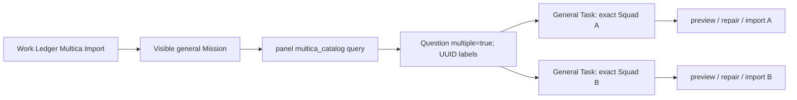

# Multica Mission multi-squad parallel import

## Recall

### User requirement

> 改造multica import的流程，应该让mission读取有哪些agent squad，然后给一个多选框，并行启动task进行导入。现在是task负责找squad多选一导入，不合理。

### Acceptance criteria

1. The `Multica Import` launcher starts one visible `general` Mission; the Mission, not an import Task, reads the current project's not-yet-installed Multica Squad catalog.
2. The Mission asks one visible `question` with `multiple: true` and `custom: false`. Every option is keyed by the exact Squad universally unique identifier (UUID); display name, description, member count, and member preview are descriptive evidence only.
3. The Mission creates one independent `opencorvus` Task per selected Squad with `queue: false` and `promptProfile: "general"`. The tasks therefore start in parallel and receive the Multica Skill/tool projection even when the project's active expert squad is not `general`.
4. Every Task request fixes one exact Squad UUID and carries the catalog evidence needed to construct its mapping. The Task may validate that exact candidate but must not ask the user to choose a Squad.
5. Zero catalog rows or a rejected/empty selection creates no Task and is reported visibly. Each created Task ID is tracked and reconciled; success and failure remain independently observable.
6. Import semantics remain unchanged: preview and import use the strict adapter, Registry, and Manager; installed identities are excluded; imports do not replace or activate packages.
7. Focused backend and Overlay tests prove the Mission catalog action, exact-ID multi-select contract, Mission provenance, `promptProfile` forwarding, and two independent immediate Task creations for two exact selected IDs. A Node-launched browser fixture and screenshot review prove the existing checkbox interaction surface without claiming that fixture is a live Mission/Multica end-to-end run.

### Hard constraints

- No fallback, compatibility alias, bulk-import endpoint, second Multica source, Overlay credential access, hidden message, auto-activation, replacement, gate, workflow engine, or dedicated Multica dialog.
- `MulticaExpertSquadImport.catalog()` remains the catalog authority. The Mission reaches it through its existing bounded `panel` coordination tool; Overlay does not call Multica routes directly.
- `prompt_profile.active` remains the active expert-squad source. Per-Task `promptProfile: "general"` is an explicit root-session projection selection for the import Task, not a project-active mutation.
- `InteractionCard` and `Question` remain the sole multi-select interaction primitives. No duplicate checkbox component or selection store is introduced.
- Multica domain instructions stay in the launcher request and Multica Skill; the generic `mission-core.txt` is not modified.
- Existing user/concurrent dirty changes are preserved. In particular, do not overwrite dirty Mission core, Orchestrator, Resolver, or generated built-in Skill payload files.
- No running OpenCorvus/Overlay process is restarted, refreshed, stopped, or reused as a mutable test target.

### Sources read before implementation

- `AGENTS.md`
- `specs/README.md`
- `specs/current/architecture/04-extensions.md`
- `specs/records/2026-07/README.md`
- `specs/records/2026-07/2026-07-14-multica-expert-squad-import.md`
- `specs/records/2026-07/2026-07-15-multica-import-agent-responsibility-and-installed-skill-action.md`
- `opencorvus-expert-squad-creator` Skill and its complete checklist
- `browser:control-in-app-browser` Skill
- Current Mission registry/tool pool/core prompt, panel capability/tool, Question and InteractionCard implementations, Multica adapter/tools/routes/Skill/General projection, Overlay launcher, Mission service, Work Ledger, and focused tests

### Whole-repository search evidence

- `rg -n -i "multica" packages specs --glob '!**/node_modules/**' --glob '!**/dist/**'`
- `rg -n -i "multica|mission\\.wake|promptProfile|prompt_profile|expert.?squad" packages/overlay/src packages/overlay/test`
- `rg -n "multi.?select|checkbox|request_user_input|ask.*user|panel\\.(ask|select|create_task)|create_task" packages/opencorvus/src packages/overlay/src packages/opencorvus/test packages/overlay/test`
- `rg -n "PanelActionSchema|Question\\.ask|multiple|options|MissionPanelCapabilityActions|panelActionSetForActor" packages/opencorvus/src packages/opencorvus/test packages/overlay/src packages/overlay/test`
- `rg -n "promptProfile" packages/opencorvus/src/engine/model.ts packages/opencorvus/src/task-api/index.ts packages/opencorvus/src/tool packages/opencorvus/test`
- `rg -n "MulticaExpertSquadImport.catalog|multica_catalog|/multica/squads|createMulticaImportTools" packages/opencorvus/src packages/opencorvus/test packages/overlay/src packages/overlay/test`

### Independent-agent feedback

Three read-only agents independently audited backend, Overlay, and landed records without modifying files or delegating further.

- Consensus: the current behavior is hard-coded twice. Overlay launcher copy orders Mission to create exactly one Task, while the Multica Skill orders that Task to catalog and choose a Squad.
- Mission already has `question` with `multiple: true` and may create several independent `queue: false` tasks in one wake, but it has no executable Multica catalog surface.
- The smallest safe executable surface is a Mission-whitelisted, panel-only `multica_catalog` query that delegates directly to `MulticaExpertSquadImport.catalog({ projectDirectory: Instance.directory })`.
- The existing Question answer is label-based, so option labels must be exact UUIDs; duplicate display names cannot own identity.
- The launcher currently selects `general` only for the Mission. `panel.create_task` does not expose/forward the already-supported `CreateTaskInput.promptProfile`, so child import Tasks are not guaranteed to receive the Multica Skill/tools. This must be repaired atomically.
- The existing `InteractionCard` already renders `multiple: true` questions as checkboxes and the Work Ledger already shows multiple Mission children. Those surfaces should be reused.

## Root-cause chain

Observed behavior: one Task discovers several Squads and asks the user to choose one. Direct trigger: `multica_import.mission_request` explicitly requires exactly one Task and delegates discovery to it. Deeper cause: Mission cannot execute the catalog because the catalog exists only in the Task Orchestrator's projected tools. A separate projection gap then means even that Task is not guaranteed to use `general`, because panel task creation drops `promptProfile`. The previous flow therefore placed both selection and import in one Task and relied on ambient project profile state.

## Single target flow

## Call-point disposition

| Call point                                                        | Disposition                                                                                                                                                                                  |
| ----------------------------------------------------------------- | -------------------------------------------------------------------------------------------------------------------------------------------------------------------------------------------- |
| `packages/opencorvus/src/expert-squad/multica-import.ts`          | Retain as the sole catalog/preview/import backend and exact installed-ID filter.                                                                                                             |
| `packages/opencorvus/src/panel/capability.ts`                     | Add panel-only `multica_catalog` and grant it to Mission; add validated optional `promptProfile` to `create_task`.                                                                           |
| `packages/opencorvus/src/tool/panel.ts`                           | Execute Mission catalog through `Instance.directory`; forward `promptProfile` unchanged to `EngineService.createTask`.                                                                       |
| `packages/opencorvus/src/task-api/index.ts` and `engine/model.ts` | Retain existing prompt-profile validation and root-session persistence; no second implementation.                                                                                            |
| `packages/overlay/src/i18n/{en-US,zh-CN}.json`                    | Atomically replace the one-Task instruction with Mission catalog, exact-UUID multi-select, one Task per selection, `queue: false`, `promptProfile: "general"`, and aggregate reconciliation. |
| `packages/overlay/src/main.tsx`                                   | Retain the one visible Mission launch; no direct import or catalog request.                                                                                                                  |
| `packages/opencorvus/src/skill/builtin/multica-import.md`         | Retain strict single-Squad preview/repair/import procedure. Its existing exact-request branch means a Task receiving one UUID does not choose among candidates.                              |
| `packages/overlay/src/components/InteractionCard.tsx`             | Retain the mature checkbox implementation; verify it visually rather than duplicating it.                                                                                                    |
| `packages/overlay/src/components/WorkLedger.tsx`                  | Retain existing Mission child-Task projection and status display.                                                                                                                            |
| `packages/opencorvus/src/prompt/core/mission-core.txt`            | Do not modify; Multica is launcher-domain guidance, not generic Mission policy.                                                                                                              |
| Multica REST routes, SDK, Registry, Manager, Resolver             | Retain unchanged. No bulk route, second source, activation, or replacement path.                                                                                                             |

## Supersession

This record supersedes only the earlier Multica launcher topology that said Mission creates exactly one Task and that the Task owns Squad selection. The 2026-07-14 and 2026-07-15 records remain authoritative for strict acquisition, mapping, preview/import, supporting-file preservation, installed-ID exclusion, no replacement, and no activation.

## Verification plan

1. Panel capability/actor tests: Mission receives the panel catalog query in its bounded coordination set; its schema remains read-only and panel-scoped.
2. Panel execution tests: catalog binds to the exact `Instance.directory`, returns no configuration/token, and `create_task.promptProfile` reaches the Task root session.
3. Overlay source tests: launcher copy rejects the old exactly-one-Task contract and requires catalog, UUID-keyed multi-select, per-selection Task, General profile, immediate parallel start, and batch reconciliation.
4. Existing Multica adapter and General projection suites: prove the strict Task import path remains intact.
5. Node-launched browser test: render the real multiple-question interaction, select at least two UUID options, inspect checkbox/focus behavior and capture a task-scoped screenshot for manual review.
6. Typechecks, historical/document-health tests, formatting, and `git diff --check`; then independent final diff review before commit/push.

## Verification results

- Focused panel capability, Mission actor-whitelist, panel execution, Overlay launcher-source, Multica adapter, General projection, and Multica Skill suites pass.
- The OpenCorvus and Overlay package typechecks pass.
- The built-in tool schema snapshot was updated from the live schema and passes.
- The Node-launched browser fixture passes against the real Overlay bundle. It restores the project through `applyDirectory`, launches the visible General Mission, then uses a task-scoped fixture interaction to render the native `InteractionCard` question with two exact UUID checkbox options and no custom answer and selects both options through the keyboard focus path. This is UI visual evidence, not a live Mission/Multica end-to-end claim.
- Manual review of `.scratch/multica-squad-multi-select.png` and `.scratch/mission-launch-directory-and-dock-continuity.png` confirms the Multica question is visible, the UUID and descriptive evidence remain legible, both selected states and second-option focus are visible, and the earlier rejected-wake notification is dismissed before the successful Mission surface is captured.
- `document-health.test.ts` has one unrelated dirty-worktree failure: the concurrently added `2026-07-15-session-background-execution-ownership.md` monthly-index target is still untracked. The Multica record itself is tracked as part of this delivery before final document-health recheck; no unrelated record is staged or committed.

## Unverified live-chain boundary

The current project has no `.opencorvus/multica.jsonc` or `.opencorvus/multica.json`, so a real Multica catalog cannot be queried from an isolated Mission benchmark in this worktree. Consequently, this delivery does **not** claim a live external end-to-end run from Mission model decision through real Multica catalog, user answer, and completed imported packages. What is verified is the executable catalog adapter binding, Mission actor/provenance path, exact per-Task UUID requests, two independent `queue: false` / General Task creations, launcher contract, and real rendered multi-select interaction. A live-chain acceptance run still requires valid project-scoped Multica configuration and a reachable upstream workspace; mocked catalog data is not presented as a substitute.

## Codex review feedback

The independent final reviewer initially found that the browser fixture proved only the native checkbox surface, not a live Mission catalog-to-dispatch chain, and that the first profile-forwarding test used a generic panel actor. The implementation record and browser test were corrected to label that evidence as UI-only, the panel execution test now creates a real Mission session and verifies two exact-UUID Task creations with Mission provenance, General projection, `queue: false`, and distinct Task IDs, and the missing live Multica configuration is recorded above. The reviewer rechecked the revised diff and reported no remaining P0, P1, or P2 findings.
