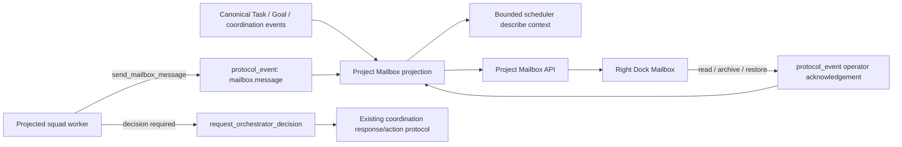

# Squad Mailbox And Right Dock

## Recall

### User requirement

- Reference Multica and the current OpenCorvus design language to implement a
  Mailbox in the right Dock.
- Give every active expert-squad worker a tool that can send execution
  progress, status reports, and notifications to the Mailbox.
- Make the Mailbox useful to the scheduler without creating a second scheduler
  or hiding messages from the visible conversation/evidence flow.
- Investigate the complete impact surface, implement carefully, and finish with
  a real desktop GUI test and screenshot review.

### Acceptance criteria

1. Every active projected task worker receives one core
   `send_mailbox_message` tool. The model supplies only message content and
   presentation metadata; task, session, agent, expert-squad, Goal, Goal-run,
   source, target, and invocation identities are derived from the immutable
   runtime contract.
2. The tool accepts `progress`, `status`, and `notification` messages, optional
   attention/evidence metadata, and optional normalized progress. A replay of
   one tool invocation returns the existing event instead of duplicating it.
3. A normal Mailbox message is an append-only visible fact. It does not wake
   the Orchestrator, modify canonical Task/Goal/Run lifecycle, create a pending
   decision, or block a worker. Immediate scheduling decisions continue to use
   `request_orchestrator_decision` and `respond_agent_coordination`.
4. `protocol_event` is the only Mailbox history source. The dormant
   `protocol_inbox` lease/delivery table is not activated. No mailbox artifact,
   local-storage copy, synthetic message, hidden message, fallback history, or
   second Server-Sent Events (SSE) payload store is introduced.
5. The scheduler task description contains a bounded recent-Mailbox projection
   on its next natural wake. It clearly distinguishes reports from pending
   coordination requests and does not infer lifecycle state from agent prose.
6. The project-scoped Mailbox API pages the same protocol events used for live
   updates. Its rows cover agent Mailbox messages plus selected canonical
   Task/Goal/interaction/coordination events, and carry stable event identity,
   source agent/session/squad, task/Goal context, evidence, category, attention,
   progress, timestamp, and canonical task navigation metadata.
7. Read, archive, and restore are operator events in the same append-only
   protocol history. Refresh and reconnect preserve them without enabling the
   dormant delivery state machine. Selecting a row marks only that row read.
8. The right Dock `notifications` history panel is replaced by one `mailbox`
   panel. Local diagnostic and operating-system toasts remain transient, but
   they are not a second durable Mailbox and retain no hidden history after the
   old panel is removed.
9. The Dock shows a compact Multica-informed list: sender avatar, unread dot,
   restrained status/category icon, title, summary, relative time, optional
   progress, hover/focus archive action, Active/Archived views, and server-owned
   unread/active/archive counts. At the normal 360-pixel Dock width it stays
   list-first and opens the existing Task surface instead of forcing a
   master-detail split.
10. Focused backend/Overlay tests, OpenAPI/SDK generation, typechecks, i18n,
    build, documentation health, Node-started Playwright interaction, light and
    dark task-scoped screenshots, console-error checks, and a second review all
    pass. This is desktop-only; tablet/mobile/responsive delivery is not added.

### Hard constraints

- Preserve `prompt_profile.active` and `PromptProfileResolver` as the only
  expert-squad selection/projection source. Inactive packages never contribute
  the tool or messages.
- Preserve the Orchestrator as the only Task scheduler and lifecycle authority.
  The Mailbox is natural agent-to-Orchestrator/operator communication, not a
  workflow engine, gate, state machine, automatic transition system, or direct
  worker-to-worker dispatch path.
- Do not reuse `task_report`: it is the external-channel turn report contract.
  Do not reuse `agent_coordination_request`: it is a pending scheduling-decision
  contract with a required Orchestrator response/action lifecycle.
- Do not activate `protocol_inbox`; its `pending / leased / delivered /
  dead_letter` model is an unused delivery state machine. Deleting that prior
  dead code requires separate user approval under the repository deletion rule
  and is not required for this feature.
- Do not create a second right panel, duplicate notification store, new virtual
  list dependency, temporary iframe, local signal/query preview override, or
  hand-written interaction primitive. Reuse Solid, Kobalte, and the central
  Icon / Avatar / Button / SegmentedControl components. Use the existing
  `virtua/solid` only when the bounded page size actually requires
  virtualization.
- Do not restart, refresh, stop, or otherwise alter the user's running
  OpenCorvus/Overlay. Visual acceptance uses an isolated server/browser target;
  Playwright is started with Node on Windows.
- Work only in the current main worktree, preserve concurrent user changes, do
  not create a worktree, do not use Git reset, and do not bypass hooks. Commit
  subjects use the `dsw-33987` prefix and delivery goes to `legacy-remote`.

### Sources read before implementation

- Root `AGENTS.md` and Browser control Skill.
- `specs/current/architecture/{01-agents,07-panel,07-panel-reactivity,08-agent-tool-adapter,11-agent-oop-protocol,13-agent-communication-matrix,15-agent-context-packet}.md`.
- `2026-07-04-communication-protocol-expert-squad-{audit,systemic-repair}.md`.
- `2026-07-11-multi-agent-message-panel-redesign.md`.
- `2026-07-14-right-dock-panel-ownership-and-browser-draft.md`.
- `2026-07-15-{right-dock-embedded-terminal,multica-mission-multi-squad-parallel-import,codex-settings-multica-expert-squad-unification}.md`.
- Current protocol schema/store, engine event/coordination/describe code,
  runtime tool pools/registries, active expert-squad Resolver, server route/SSE
  composition, Overlay RightDock/main/event/notification stores/components,
  design primitives, styles, i18n, and focused tests.
- Multica official [Inbox documentation](https://multica.ai/docs/inbox),
  [Agents documentation](https://multica.ai/docs/agents),
  [Squads documentation](https://multica.ai/docs/squads), and
  [Tasks documentation](https://multica.ai/docs/tasks).
- Multica v0.4.3 source at `ad7b23896d266b4a6119d46aa85f8ddbd3d3d6ac`:
  [Inbox page](https://github.com/multica-ai/multica/blob/ad7b23896d266b4a6119d46aa85f8ddbd3d3d6ac/packages/views/inbox/components/inbox-page.tsx),
  [list](https://github.com/multica-ai/multica/blob/ad7b23896d266b4a6119d46aa85f8ddbd3d3d6ac/packages/views/inbox/components/inbox-list.tsx),
  [row](https://github.com/multica-ai/multica/blob/ad7b23896d266b4a6119d46aa85f8ddbd3d3d6ac/packages/views/inbox/components/inbox-list-item.tsx),
  [types](https://github.com/multica-ai/multica/blob/ad7b23896d266b4a6119d46aa85f8ddbd3d3d6ac/packages/core/types/inbox.ts), and
  [notification listeners](https://github.com/multica-ai/multica/blob/ad7b23896d266b4a6119d46aa85f8ddbd3d3d6ac/server/cmd/server/notification_listeners.go).

### Whole-repository search evidence

Commands:

- `rg -n "mailbox|inbox|notification|agent_coordination|task.report" packages specs/current specs/records/2026-07`
- `rg -n "RightDock|right-dock|NotificationCenter|notification-state" packages/overlay packages/opencorvus/test`
- `rg -n "request_orchestrator_decision|respond_agent_coordination|dispatch_agent|TaskMessage" packages/opencorvus/src packages/opencorvus/test`
- `rg -n "ProtocolInboxTable|protocol_inbox|ProtocolEventTable|appendEvent|subscribeEvents" packages/opencorvus/src packages/opencorvus/test`
- `rg -n "GLOBAL_TOOL_IDS|runtimeTemplateAssignments|createAgentCoordinationRuntimeTools|UTILITY_TOOL_IDS|inherit_base_tools" packages/opencorvus/src packages/opencorvus/test`
- `rg -n "task/events|TaskListEvent|routeSSEEvent|handleTaskListNotification|openStream" packages/opencorvus/src/server packages/overlay/src`
- `rg -n "Avatar|SegmentedControl|SearchField|virtua/solid|format.*time|status-mapping" packages/overlay/src packages/overlay/test`

Findings and call-site disposition:

| Owner / call site | Current evidence | Decision |
| --- | --- | --- |
| `protocol/schema.ts` / `protocol.sql.ts` | `protocol_inbox` defines an unused lease/delivery state machine; production has no readers or writers. | Do not activate or present it. Keep deletion outside this task pending user approval. |
| `protocol/store.ts` / `engine/protocol.ts` | `protocol_event` already owns durable task history, replay, ordering, subscriptions, and task deletion cascade. | Add idempotent `mailbox.message` and operator acknowledgement events here; every API and UI projection reads them. |
| `engine/agent-coordination.ts` | Existing durable scheduling requests, responses, and actions already form the decision mailbox. | Preserve unchanged as the only immediate worker/operator scheduling-decision path; include its visible events in the Mailbox read projection. |
| `tool/request-orchestrator-decision.ts` | Validates projected worker identity and wakes the Orchestrator for a pending decision. | Reuse its runtime-identity derivation pattern, not its wake/response semantics. |
| tool catalog/loaders/pools/static agents | The worker communication tool is named in global catalog, control-plane lazy loading, runtime-template pools, custom Frontend Design/Visual QA utility surfaces, and exact runtime materialization tests. | Add one shared worker-communication tool set and test every base/custom worker surface, inactive-squad isolation, and explicit non-inherited projections. |
| `engine/describe.ts` | Scheduler currently renders only pending coordination requests. | Add a bounded recent report section with event/source/Goal/evidence facts; keep pending decisions separate and authoritative. |
| server Engine routes / task SSE | Selected-task SSE already replays every task protocol event, while `/task/events` is intentionally only a task-list invalidation stream. | Add project-scoped paginated Mailbox routes and a small project Mailbox change stream; do not overload task-list SSE or add a second message history. |
| `notification-state.ts` / `NotificationCenter.tsx` | The panel is a volatile 100-item client store; only warning/error enter history by default. | Retain transient toast delivery only and remove its obsolete panel/history path when Mailbox replaces the Dock entry. |
| `RightDock.tsx` / `main.tsx` | These are the sole Dock panel catalog, order, mount, close, overflow, and persistent-width owners. | Replace `notifications` with `mailbox`, add unread badge input, and mount one MailboxPanel in the existing Dock body. |
| Overlay design primitives / virtual lists | Central Avatar/Icon/Button/SegmentedControl/time/status primitives and `virtua/solid` already exist. | Reuse the UI primitives; retain a plain keyed Solid list for the server-bounded 40-row page instead of adding unnecessary virtualization or a new dependency. |

### Independent-agent feedback

Three one-level read-only agents audited backend protocol/tool projection,
Overlay Dock/GUI surfaces, and Multica primary sources. None modified files or
delegated further.

- Backend consensus: use append-only `protocol_event`, derive sender/scope from
  the frozen runtime contract, keep ordinary reports non-waking, and never
  activate `protocol_inbox`, reuse `task_report`, or manufacture coordination
  requests.
- Overlay consensus: replace the existing volatile Notifications Dock panel;
  keep toasts transient; provide project-scoped hydrate/live convergence,
  unread/archive persistence, exact Task navigation, and use existing Dock and
  `virtua/solid` primitives.
- Multica consensus: its Inbox is a human interruption queue, not an agent
  mailbox; agents never receive Inbox notifications and Squads coordinate by
  leader `@mention`. OpenCorvus therefore borrows the compact visual hierarchy,
  unread/archive treatment, and latest-first triage language, but explicitly
  defines new agent-to-scheduler/operator report semantics.

## Root-cause chain

Observed state: workers can produce visible transcript/tool evidence and can
open a pending scheduling decision, while the right Dock retains only volatile
client diagnostics. There is no durable, compact place for a worker's concise
progress/status/notification report.

Direct trigger: `request_orchestrator_decision` is deliberately too strong for
ordinary updates because it wakes the Orchestrator and requires a response; the
Notification Center is deliberately too weak because refresh discards it and
it has no sender/session/squad identity.

Deeper cause: communication and presentation were split between canonical
protocol evidence and a UI-only notification history. Activating the dormant
delivery inbox or adding another artifact table would preserve that split.

Root repair: append one natural report event to the existing protocol history,
project it into both bounded scheduler context and a durable right-Dock read
model, and express read/archive actions as events in the same log. Existing
Task/Goal/coordination events are joined by the server projection rather than
copied into mailbox records.

## Single target architecture

## Implementation plan

1. Add the Mailbox event/payload/projection module, invocation idempotency,
   operator acknowledgement events, project isolation, pagination, bounded
   scheduler rendering, and focused protocol/projection tests.
2. Add `send_mailbox_message` through the canonical tool catalog, lazy loader,
   shared worker tool pool, custom typed worker utilities, runtime contract,
   General/inactive expert-squad projection, and tests.
3. Add project Mailbox list/action/change-stream routes, focused namespace/SSE
   tests, and regenerate OpenAPI/SDK/docs.
4. Replace the Dock Notifications panel with MailboxPanel; remove obsolete
   panel-history ownership while retaining transient/desktop toasts; add
   service/store, unread badge, active/archive controls, list rows, Task
   navigation, errors/loading/empty states, bilingual strings, and styles.
5. Run focused backend/Overlay tests, typechecks, i18n, Vite build, route/docs
   checks, historical/document health, and `git diff --check`.
6. Start the isolated Overlay fixture with Node, exercise hydrate/live/replay,
   one-idempotent progress update, attention/status/failure rows, read,
   Task navigation, archive/restore, keyboard focus, 280/360-pixel Dock at the
   desktop fixture viewport,
   light/dark screenshots, and console/page-error checks. Inspect every capture
   and iterate until the desktop visual contract is met.
7. Re-read this Recall, complete a second code/data/visual review, update current
   architecture and verification evidence, commit only task-owned files, run
   the full pre-push hook, and push the branch to `legacy-remote`.

## Progress

- [x] Multica, backend protocol/tool, Overlay Dock, historical decisions, and test tooling investigated.
- [x] Whole-repository call sites and independent-agent feedback recorded.
- [x] Protocol event, tool, projection, scheduler context, API, and SSE implemented.
- [x] Right Dock Mailbox and transient-toast ownership convergence implemented.
- [x] Focused tests, generated contracts, typechecks, i18n, build, and docs checks passed.
- [x] Real desktop browser hydrate, archive/restore interactions, and 360px light / 280px dark screenshots accepted.
- [x] Second review, scoped commit, pre-push hook, and legacy remote delivery completed.

## Implementation revision

The Dock tab does not keep a second unread-count signal. The canonical server
projection is rendered inside the Mailbox header and Active/Archived controls;
this preserves one count owner across hydration, reconnect, and project
switching. Visual acceptance uses the normal 1280-pixel desktop fixture with
360- and 280-pixel Dock widths. A 960-pixel Dock is not a product width and was
removed from the test plan rather than widening the desktop feature into an
unsolicited responsive deliverable.

## Verification evidence

- Backend Mailbox/tool/route/runtime projection: 14 tests passed; Frontend
  Design and Visual QA custom worker surfaces: 5 tests passed.
- Overlay Mailbox/Dock/notification ownership/CSS structure: 118 tests passed;
  repository typecheck: 10 package tasks passed.
- Route inventory: 6 rules across 31 route files; generated API documentation:
  264 operations across 24 groups; Overlay panel i18n revision:
  `1399ade75015b6f8`.
- Historical links, document health, and product-doc single source: 80 tests
  passed; `git diff --check` passed.
- Node-started Playwright built 2,462 modules and passed both full browser
  scenarios. The Mailbox scenario hydrated three mixed rows, verified two
  unread rows, captured 360-pixel light and 280-pixel dark Dock screenshots,
  archived/restored the attention row, and completed with no unexpected page,
  console, response, or request failures.
- Second review found that the reactive directory projection initially opened
  the same Mailbox change stream twice. The repair now retains the live stream
  when its explicit project directory is unchanged; the final browser rerun
  proves that the prior `ERR_ABORTED` diagnostics are gone without an error
  allow-list.
- Implementation commit `8858182fa` (`dsw-33987 add squad mailbox and right
  dock`) was pushed to `legacy-remote/work-v0.0.7beta-yr-0716`. The pre-push hook
  passed repository typechecks, route inventory, generated API docs, Overlay
  i18n, and the tracked-source secret scan.
