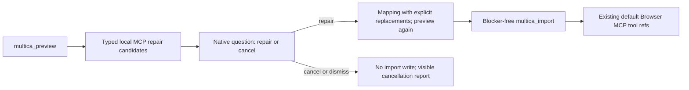

# Multica import repair-or-cancel dialog

## Recall

### User requirement

> 导入multica 报错了，这种能在opencorvus中导入流程中添加一个对话，让用户选择是否修复后导入或者取消导入吗

The supplied screenshot shows a real preview failure: five Multica members bind a local `stdio` MCP server named `playwright`, while the Multica adapter accepts only portable remote MCP declarations. The Task reports the blocker and fails without asking for a user decision.

### Acceptance criteria

1. A Multica Task that previews structurally safe local `stdio` MCP declarations exposes typed repair candidates rather than only prose blockers.
2. The built-in `multica-import` Skill asks one visible native `question` when all remaining blockers can be repaired by replacing those local browser-automation declarations with OpenCorvus's existing built-in Browser MCP projection.
3. The question offers exactly `Repair and import (Recommended)` and `Cancel import`, uses stable values, disables custom answers, explains the exact affected agents/servers and does not imply lossless source parity.
4. Repair selection rebuilds the same declarative mapping with explicit MCP replacements, re-runs preview, and imports only after the new preview is blocker-free. Cancel selection or dialog dismissal never calls `multica_import` and reports that no package was written.
5. The generated package grants the existing OpenCorvus Browser MCP tool refs to exactly the source agents named by the accepted replacement. It does not import or execute the Multica command, copy environment/credentials, create a package-local process, or omit an unknown MCP silently.
6. Redacted, credential-bearing, malformed, remote-unreachable, human-member, Skill, graph, and unknown local-MCP cases keep their strict blocker behavior. A replacement that names an unknown agent/server or a non-local source fails validation.
7. Source and mapping digests bind the source MCP declaration and accepted target replacement so source or target-capability drift requires another preview.
8. Focused backend, Skill, tool-contract, generated-payload, Overlay interaction, and real rendered browser tests pass; visual evidence shows the repair/cancel dialog with both pointer and keyboard paths.

### Hard constraints

- Reuse `Question` and Overlay `InteractionCard`; do not add a dedicated Multica modal, selection store, hidden message, or synthetic interaction.
- Reuse `default/mcp/browser/tool/**` through the existing `PromptProfileResolver`; do not create a second browser server, package MCP wrapper, local process, or runtime bypass.
- `MulticaExpertSquadImport` remains the only catalog/preview/import backend. The repair is part of the existing explicit mapping and digest contract, not a second importer or retry route.
- No generic ignore/drop-blocker option, fallback, automatic repair, replacement without user approval, package activation, or installed-package overwrite.
- The Agent owns semantic judgment and the user decision. Host code validates declared identities and data shape; it does not infer browser meaning through command-name keywords or a workflow state machine.
- No running OpenCorvus/Overlay process is restarted, refreshed, stopped, or used as a mutable test target. Playwright browser tests run with Node, not Bun.
- Existing unrelated worktree changes, if any appear during implementation, are preserved and excluded from this delivery.

### Sources read before implementation

- `AGENTS.md`
- `specs/current/architecture/04-extensions.md`
- `specs/records/2026-07/2026-07-14-multica-expert-squad-import.md`
- `specs/records/2026-07/2026-07-15-multica-import-agent-responsibility-and-installed-skill-action.md`
- `specs/records/2026-07/2026-07-15-multica-mission-multi-squad-parallel-import.md`
- `specs/records/2026-07/2026-07-16-multica-remote-mcp-import.md`
- `specs/records/2026-07/2026-07-17-multica-global-expert-squad-storage.md`
- Current Multica adapter, Orchestrator tools, Skill, generated Skill payload, General projection, Mission launcher, Question service/tool, Overlay InteractionCard, Browser MCP config, Registry MCP schema, Resolver, and focused tests
- `browser:control-in-app-browser` Skill for the required rendered-page validation

### Whole-repository search evidence

- `rg -n --hidden "multica_import|MulticaExpertSquadImport|multica-import|multica import" packages specs`
- `rg -n "MulticaOpenCorvusMappingSchema|MulticaOpenCorvusMapping|agent_goal_concurrency|virtual_workflows" packages/opencorvus/src packages/opencorvus/test packages/overlay/src packages/overlay/test`
- `rg -n "mcpServers|blockers|nonPortable|sourceDigest|mappingDigest" packages/opencorvus/src/expert-squad/multica-import.ts packages/opencorvus/src/orchestrator/multica-import-tools.ts packages/opencorvus/test/expert-squad/multica-import.test.ts packages/opencorvus/test/skill/multica-import-skill.test.ts`
- `rg -n "default/mcp/browser/tool/|BrowserMCPBuiltin" packages/opencorvus/src packages/opencorvus/test .opencorvus/expert-squads --glob '!**/payload.ts'`
- `rg -n "question" packages/opencorvus/src/panel packages/opencorvus/src/tool packages/overlay/src/components/InteractionCard.tsx packages/opencorvus/src/prompt/core`
- `rg -n "multica-import.md|builtin-payload|generate-builtin-skill" packages/opencorvus/src packages/opencorvus/script packages/opencorvus/test`

### Independent-agent feedback

No sub-agent was used. The user did not request delegation, and the active collaboration constraint prohibits spawning sub-agents unless explicitly requested. The primary Agent owns the required second review.

## Root-cause chain

Observable behavior: preview reports five local `stdio playwright` MCP blockers and the Task immediately records failure.

Direct trigger: `analyzePortableMcp()` turns every declaration with `command` or `type: "stdio"` into an unconditional blocker. `multica_import` correctly rejects any preview with blockers.

Deeper cause: the Multica Skill simultaneously says that the Agent owns repair and that local MCP declarations may never be omitted, rewritten, or approximated. The contract has no typed way to express a user-approved replacement with an already available OpenCorvus default capability. The Agent therefore has neither permission nor a digest-bound data path for the requested repair, even though the existing expert-squad protocol can project OpenCorvus's built-in Browser MCP tools.

Why the prior path did not root-fix it: prior work correctly made package MCP declarations remote-only and lossless, then delegated repair policy entirely to prose. That preserved security but left local browser MCP conversion outside the adapter contract. Reporting the blocker was therefore the only behavior consistent with both the backend schema and the Skill.

## Single target flow

## Contract design

`MulticaOpenCorvusMappingSchema` gains one required `mcp_replacements` array. Each entry declares the exact source agent UUID, exact source server name, and the sole supported target identity `opencorvus-browser`. The array is canonical, unique, and digest-bound. There is no optional legacy shape.

Preview returns two explicit evidence arrays:

- `mcpRepairCandidates`: safe local `stdio` declarations that still block because no accepted mapping entry exists;
- `mcpReplacements`: exact accepted replacements and the default Browser MCP tool refs they will project.

A local declaration is a candidate only when it is structurally inspectable without execution and contains no environment, header, OAuth, helper, or unknown-field material. The host does not infer browser semantics from a command or server-name keyword. The Skill compares source roster/instructions/Skill evidence, explains the replacement, and asks the user. Unsupported or ambiguous declarations remain blockers.

## Call-point disposition

| Call point | Disposition |
| --- | --- |
| `packages/opencorvus/src/expert-squad/multica-import.ts` mapping/preview schemas | Add required replacement declarations and typed candidate/applied evidence; keep one source/mapping digest contract. |
| `analyzePortableMcp()` | Preserve strict remote discovery; classify only secret-free structured local declarations as decision candidates and validate exact accepted replacements. |
| `previewForSnapshot()` / `packageFiles()` | Bind replacement evidence into digests, README/non-portable evidence, and exact agent `default_mcp_tool_refs`; never write local commands. |
| `packages/opencorvus/src/mcp/browser/builtin.ts` | Export the canonical importable Browser MCP tool-ref set beside the existing built-in server identity/config. |
| `packages/opencorvus/src/orchestrator/multica-import-tools.ts` | Update mapping descriptions so the Agent supplies explicit replacement decisions through the existing preview/import tools. |
| `packages/opencorvus/src/skill/builtin/multica-import.md` | Require the visible repair-or-cancel Question, exact option values, re-preview, cancellation behavior, and truthful final replacement report. |
| `packages/opencorvus/src/skill/builtin-payload.ts` | Regenerate from the canonical Skill source; never edit by hand. |
| Multica adapter/Skill/tool/server tests | Update the strict mapping shape and cover candidate, accepted replacement, invalid replacement, digest drift, cancel copy, and unchanged blockers. |
| `packages/overlay/src/components/InteractionCard.tsx` | Reuse unchanged; its existing Question primitive is the sole dialog renderer. |
| `packages/overlay/test/browser/multica-import-browser.test.ts` | Add task-scoped rendered evidence for repair/cancel options, pointer selection, keyboard focus, dismissal/cancel semantics, and screenshot review. |
| Mission launcher/catalog selection flow | Retain unchanged; Mission still selects Squads and creates one General Task per selected UUID. Repair is owned by each exact-Squad Task after preview. |
| Registry / Resolver / package MCP schema | Retain remote-only package MCP declarations; accepted repairs project existing default Browser MCP tools rather than weakening Registry. |

## Verification plan

1. Run focused Multica adapter tests for remote MCP, local candidate, accepted replacement, wrong agent/server/target, secret-bearing local config, digest drift, package manifest refs, Registry load, and Resolver materialization.
2. Run Skill/tool-schema/generated-payload tests proving the exact repair/cancel Question contract and no generic blocker omission.
3. Run existing Mission/Overlay Multica source tests to prove catalog selection and Task dispatch remain unchanged.
4. Run the Node-launched Multica browser fixture and inspect a task-scoped screenshot of the real `InteractionCard` repair/cancel question. Then use the in-app browser connection for independent rendered visual inspection without touching a running OpenCorvus process.
5. Run OpenCorvus/Overlay typechecks, API route schema checks if the exported contract changes, historical-doc links, document health, generated-artifact freshness, `git diff --check`, and focused lint/format checks.
6. Perform a second complete diff/call-point review, record any correction in this file, commit with the `dsw-33987` prefix, and push the current main delivery branch to `legacy-remote`.

## Verification results

Implemented and accepted locally.

### Delivered contract

- Preview now returns exact `mcpRepairCandidates` and `mcpReplacements` evidence. The required
  `mapping.mcp_replacements` array is canonical, unique, strict, and has only the
  `opencorvus-browser` target.
- No local command is executed or written. An accepted replacement projects the existing canonical
  Browser MCP tool refs to exactly the named source Agent, changes both source and mapping digests,
  and is recorded explicitly in generated package README evidence.
- The built-in Skill owns semantic judgment and uses the existing native Question with exactly the
  repair/cancel values. Cancel, empty answer, custom answer, or dismissal prohibits `multica_import`;
  repair always re-previews and uses only the new digests.
- Remote MCP discovery remains strict. Redacted, secret-bearing, malformed, unreachable, duplicate,
  empty, or pagination-invalid sources remain blockers. A structurally safe but semantically unknown
  local process also remains blocked unless the visible evidence establishes browser automation and
  the user explicitly accepts replacement.
- OpenAPI and the generated JavaScript/TypeScript SDK contract include the required mapping field and
  both preview evidence arrays.

### Codex second-review corrections

1. Replaced mixed locale/binary replacement sorting with one canonical identity comparator and a
   collision-free tuple key, so multi-candidate mapping validation and preview ordering cannot drift.
2. Added per-Agent/per-server approved replacement rows to generated package README evidence rather
   than relying on one generic portability sentence.
3. Centralized the Browser MCP tool-ref list in `BrowserMCPBuiltin` and changed the existing General
   package projection test to compare against that source instead of retaining another hand-written list.
4. Corrected the browser fixture to model Mission selection and the exact-Squad import Task as separate
   real conversation/board sources. Removed an extra Task-row click that hit the non-modal backdrop and
   dismissed the already-open Question. Restored the pre-existing Mission dock/screenshot assertions to
   the Mission page before opening the repair Task.
5. The remote merge had moved authoring packages to top-level `expert-squads/**`, while the repository
   projection test still asked runtime discovery to scan the repository root. It now reuses the payload
   generator for authoring discovery, installs those packages into a temporary project's canonical
   `.opencorvus/expert-squads/**` runtime surface, and calls the real Resolver there.
6. The shared Dialog lifecycle browser test incorrectly fixed the number of historical ResizeObserver
   instances. It now verifies the actual resource invariant: exactly one active observer while the dialog
   is open, every retired observer disconnected once, and all observers disconnected after close.

### Commands and evidence

- `bun test packages/opencorvus/test/expert-squad/multica-import.test.ts packages/opencorvus/test/skill/multica-import-skill.test.ts --timeout 90000`
  — 25 passed, 0 failed, 192 assertions.
- Focused Multica route test with `OPENCORVUS_EXPERT_SQUAD_ROUTES_ISOLATED_CASES=1` — 1 passed,
  0 failed; the route mock carries both new preview arrays and the required mapping field.
- `bun test packages/opencorvus/test/expert-squad/repository-dynamic-agent-packages.test.ts --timeout 90000`
  — 10 passed, 0 failed, 928 assertions through real Registry / Resolver / provider preparation paths.
- `bun test packages/opencorvus/test/expert-squad/payload-generation.test.ts ...` — 8 payload tests
  passed; built-in Multica Skill source equals its regenerated payload.
- `node packages/overlay/test/browser-runner.mjs packages/overlay/test/browser/multica-import-browser.test.ts`
  — passed in a headed Node-launched browser. It covers Mission multi-selection, a task-scoped repair
  Question, pointer repair selection, keyboard cancel selection, exact stable reply values, and no
  custom input.
- Final rendered evidence: `.scratch/multica-import-repair-dialog.png`. Manual visual review confirmed
  Chinese Question chrome/copy, readable repair consequences, recommended repair label, cancel label,
  keyboard focus/selection, and the existing shared Dialog layout.
- `node packages/overlay/test/browser-runner.mjs packages/overlay/test/browser/interaction-card-textarea-browser.test.ts`
  — passed; shared Dialog observer lifecycle has no active-resource leak.
- OpenCorvus, Overlay, and SDK typechecks passed. `api:routes-check` passed across 31 route files;
  `docs:check` passed for 281 operations in 23 groups.
- Historical links and document health: 82 passed, 0 failed, 1,352 assertions. `git diff --check` passed.

The adapter tests use a real local HTTP source and real Registry/package/Resolver paths; the visual test
uses a deterministic local route fixture and is not described as a live external Multica end-to-end run.
The in-app Browser correctly refused a direct `file:` replay of the PNG under its URL security policy;
the same final artifact was inspected with the workspace image viewer instead. No running OpenCorvus or
Overlay process was restarted, refreshed, or used as a mutable test target.
