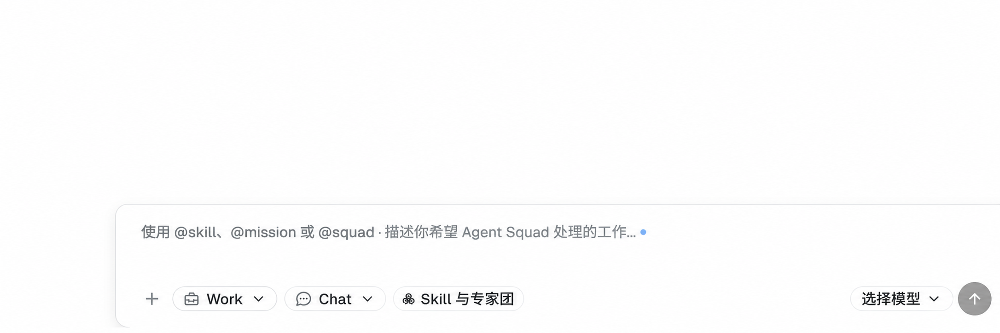

# Composer Product and Conversation Selects Plan

## Recall

### User requirement

- Replace the Composer's joined `Code | Work` pill with a dropdown selector.
- Add a second dropdown selector for `Chat | Mission`.
- Default the two selectors to `Work` and `Chat` respectively.
- Change the submission workflow so the two choices have real runtime meaning.
- Deliver a modification plan and a User Interface (UI) mockup only; do not modify product code in this task.

### Acceptance criteria for this plan

1. The resting Composer shows two compact dropdowns in the order `Work` then `Chat`.
2. The proposal distinguishes the product pillar (`Code | Work`) from the conversation target (`Chat | Mission`) instead of encoding both in one `ComposerMode` enum.
3. All four combinations have one explicit creation and persistence contract.
4. A direct Mission inherits the selected product pillar through every Mission-owned Task; the first selector is never decorative or ignored.
5. Existing draft, attachment, reference, model, streaming, transcript, Work Ledger, and explicit `@mission` / `@squad` behavior remain on their canonical owners.
6. The implementation plan names the affected UI, transport, Mission, Task, Expert Squad, database, generated-contract, verification, and visual-acceptance surfaces.

### Hard constraints

- This record and its mockup are the only repository changes in the planning task.
- Reuse the existing Kobalte-backed `SelectControl` and current Composer design tokens; do not hand-build dropdown behavior.
- Do not add a host keyword router, workflow gate, hidden message, synthetic message, fallback identity, compatibility alias, second Mission engine, or client-only Mission mode.
- `prompt_profile.active` remains the only active Expert Squad identity. The product pillar is applicability and provenance, not another active Squad selector.
- Existing UI automation tests are not modified or run. Implementation-time UI acceptance uses a real isolated page, Node-started Playwright interaction, screenshots, and manual visual review without creating a reusable UI test.
- The current desktop Composer is the only delivery target; mobile and tablet work are out of scope.
- If the Task table gains the planned product-pillar column, the current Data Definition Language (DDL) is replaced directly. Existing non-matching databases fail with `SCHEMA_RESET_REQUIRED`; no migration, copy, fallback reader, or automatic reset is allowed.

### Sources read

- The user-provided Composer screenshot.
- `AGENTS.md`.
- `specs/current/architecture/07-panel.md`.
- `specs/current/architecture/17-code-work-agent-platform.md`.
- `specs/records/2026-07/2026-07-28-work-conversation-experience.md`.
- `specs/records/2026-07/2026-07-29-chat-automatic-work-routing-removal.md`.
- `specs/records/2026-07/2026-07-29-code-work-composer-and-grouped-references.md`.
- `specs/records/2026-07/2026-07-29-global-composer-mission-reference-routing.md`.
- `specs/records/2026-08/2026-08-03-composer-mode-pill-height-convergence.md`.
- `packages/overlay/src/components/ChatComposer.tsx`.
- `packages/overlay/src/components/ui/SelectControl.tsx`.
- `packages/overlay/src/main.tsx`.
- `packages/overlay/src/services/composer-submit-route.ts`.
- `packages/overlay/src/services/mission.ts`.
- `packages/opencorvus/src/chat/{identity,session}.ts`.
- `packages/opencorvus/src/mission/session.ts`.
- `packages/opencorvus/src/server/routes/mission.ts`.
- `packages/opencorvus/src/tool/panel.ts`.

### Whole-repository search result

| Surface | Current evidence | Plan consequence |
| --- | --- | --- |
| Composer state | `ComposerMode = "expert-squad" | "chat" | "work"` mixes a Mission target with Chat/Work conversation experience. The initial signal is `chat`. | Replace it outright with `productPillar: "code" | "work"` and `conversationTarget: "chat" | "mission"`; define the one new-request default as `{ productPillar: "work", conversationTarget: "chat" }`. |
| Visible control | `ChatComposer` maps `chat` to the visible label `Code` and renders `Code | Work` through `SegmentedControl`. | Replace only this local control with two `SelectControl` instances using the existing `composer` variant. Remove the retired local segmented-mode styles and copy. |
| Direct conversation | Persisted right-sidebar experience is `chat | work`; Code currently maps to `chat`, while Work maps to `work`. | Keep the shared conversation runtime. For a Chat target, map pillar `code -> chat` and `work -> work` at one resolver. |
| Direct Mission | `POST /mission/wake` accepts text, attachments, model, Mission identity, and visible Squad IDs, but no Code/Work product fact. | Add one required product-pillar input for new Mission creation, persist it as immutable Mission provenance, and verify the same value on resume. |
| Mission-owned Tasks | Current Mission task creation selects a fixed `promptProfile`, but no implemented Task product-pillar field was found. | Complete the current architecture contract: persist the Mission pillar on each created Task, validate the selected Squad's applicability, and give the resolver the same pillar. Do not let Mission silently discard the first dropdown. |
| Explicit references | `@mission` and `@squad` already resolve before conversation creation and route to Mission. | Preserve that ordering. An explicit Mission reference upgrades only `conversationTarget` to Mission and retains the operator-selected product pillar. |
| Product catalog | The capability catalog already understands optional Code/Work metadata, while full Expert Squad and Task enforcement remains proposed architecture. | Make the Expert Squad manifest field required and complete Registry, catalog, resolver, authoring template, built-in package, route, and generated Software Development Kit (SDK) convergence in the implementation task. |
| Active source | A selected Chat, Work, Mission, or Task hydrates its persisted source and the editable selector is replaced by context badges. | Keep this behavior. New selectors edit only a new request; active sources show immutable persisted `Code/Work` and `Chat/Mission` badges. |

### Independent-agent feedback

- No sub-agent was requested or used.

## UI proposal



The mockup is a design proposal generated from the supplied screenshot, not evidence of an implemented page.

### Resting layout

```text
+  [ Work  v ]  [ Chat  v ]  [ Skill 与专家团 ]                     [ 选择模型 v ]  [ Send ]
```

- Control order is fixed: attachment action, product selector, target selector, reference selector, flexible spacer, model selector, send/stop action.
- Both new triggers use the existing 24-pixel Composer chip height, compact icon, value, and chevron recipe. The gap between peer controls remains the canonical Composer gap.
- Product options are `Work` and `Code`; target options are `Chat` and `Mission`.
- The trigger label is the selected value, not a second persistent field label. Each menu row carries a concise description so the distinction is still discoverable:
  - `Work`: longer research, office, production, and finished deliverables.
  - `Code`: repository-aware coding and software work.
  - `Chat`: one direct streaming assistant conversation.
  - `Mission`: durable orchestration through Tasks, Goals, evidence, and Artifacts.
- The product menu uses the existing Work and terminal icons. The target menu uses the existing Chat and Mission icons. No new icon family is introduced.
- Hover, focus, checked indicator, keyboard navigation, viewport flipping, and Portal ownership remain with Kobalte `SelectControl`.
- While a request is submitting or stoppable, both selectors are disabled together with the current Composer mutation controls. After a source exists, editable selectors become read-only context badges derived from persisted identity.

## Workflow proposal

### Canonical intent

Replace the overloaded enum with one value object:

```ts
type ComposerIntent = {
  productPillar: "code" | "work"
  conversationTarget: "chat" | "mission"
}

const DEFAULT_COMPOSER_INTENT = {
  productPillar: "work",
  conversationTarget: "chat",
} as const
```

The default belongs to one shared intent module. It is not copied into UI markup, route handlers, Settings, or session hydration. Opening a new request creates this default; selecting an existing source always projects persisted identity instead of overwriting it with the default.

### Combination matrix

| Product selector | Target selector | Submission result | Persisted runtime meaning |
| --- | --- | --- | --- |
| Code | Chat | Create the existing right-sidebar conversation with experience `chat`. | Direct Code assistant conversation. |
| Work | Chat | Create the existing right-sidebar conversation with experience `work`. | Direct Work assistant conversation. |
| Code | Mission | Create or wake Mission with product pillar `code`. | Mission may create only Code-compatible, pillar-preserving Tasks. |
| Work | Mission | Create or wake Mission with product pillar `work`. | Mission may create only Work-compatible, pillar-preserving Tasks. |

This is a dispatch resolver, not a state machine. The operator's two explicit values and exact visible reference directives determine one route at submit time.

### Submission order

1. Resolve visible `@skill`, `@mission`, and `@squad` directives through the existing canonical parser and scope-keyed catalog.
2. Compute the effective target: an exact Mission Skill or Agent Squad directive selects `mission`; otherwise use the target dropdown.
3. Preserve the selected product pillar unchanged. A directive never infers or rewrites Code versus Work.
4. For `chat`, map `code -> chat` and `work -> work`, then use the existing project/global conversation creation and canonical `panelMessage` stream.
5. For `mission`, call the existing `wakeMission` path with text, attachments, model, exact Squad references, and required product pillar. Do not create a Chat/Work Session first.
6. Open the returned Mission Session, hydrate it, and refresh the Work Ledger through the existing selection lifecycle.

Changing either dropdown before submission preserves the shared draft, attachments, selected model, and inserted references. It does not create a Project, Session, Mission, or database row. Direct Dock launch commands become initial intent projections only: a New Mission entry sets target `mission`; a Code or Work entry sets the corresponding pillar; the shared Composer remains editable until submission.

### Mission and Task propagation

- Add required `productPillar` to the Mission wake contract for new Mission creation. Persist it in canonical Mission metadata and expose it in Mission projection and debug evidence.
- Resuming a Mission reuses its persisted pillar. A caller cannot mutate a Mission from Code to Work or Work to Code after creation.
- Add required `productPillar` to the Task creation contract and physical Task row. Every Mission-created Task inherits the Mission value; Mission prompts and tools do not choose another value per Task.
- Require every Expert Squad manifest to declare non-empty `product_pillars`. Registry/catalog filtering, Mission recommendation, `panel.create_task`, and `PromptProfileResolver` all validate the same exact field.
- `prompt_profile.active` continues to select the one Task-local Squad. `productPillar` only proves that the chosen package is applicable to the product contract.
- Work Ledger Mission and Task projections include the pillar so the active header can render `Code + Mission` or `Work + Mission` without title inference.
- The schema change updates only the current `SCHEMA_DDL`. Temporary development and verification databases are created fresh. Existing user databases are never automatically reset or migrated.

## Planned implementation surfaces

### UI and local state

1. `ChatComposer.tsx`: replace the Composer-local `SegmentedControl` with two `SelectControl` instances; split props into intent fields and callbacks; preserve active-source badges and reference selector placement.
2. `main.tsx`: replace `composerMode` with one `ComposerIntent` owner; update direct launchers, titles, placeholders, data attributes, source hydration, submit routing, and draft-preserving intent changes.
3. Add a small pure intent resolver beside the existing submit-route resolver so UI labels never decide routes.
4. `composer.css`: delete retired pill-only geometry and add only the two-select row widths and peer spacing; reuse primitive tokens.
5. `zh-CN.json` and `en-US.json`: add exact product/target accessible names and option descriptions; remove retired segmented-control-only copy.

### Runtime, persistence, and generated contracts

1. Add shared `ProductPillar` and Composer-target schemas in the transport boundary used by Overlay and server inputs.
2. Extend Mission wake input, Mission metadata/projection, and Overlay Mission service with required product pillar.
3. Extend Task DDL, Task creation input/projection, Mission `panel.create_task`, and resolver context with immutable product pillar.
4. Make Expert Squad `product_pillars` required across manifest v1, embedded packages, authoring template, Registry, catalog, manager/import/export, and generated SDK/OpenAPI documentation.
5. Regenerate SDK, OpenAPI, and API documentation from source. Do not hand-edit generated files.
6. Remove the replaced `ComposerMode` implementation and obsolete local styles in the same change; do not retain aliases or compatibility branches.

## Verification plan

### Non-UI contracts

- Positive pure resolver cases assert the complete four-row intent matrix and explicit Mission-directive routing.
- Positive conversation creation contracts assert Code maps to persisted `chat` and Work maps to persisted `work`.
- Positive Mission wake and resume contracts assert one exact persisted pillar.
- Positive Mission-to-Task contracts assert every created Task carries the Mission pillar, resolves a compatible package, and projects the expected complete runtime capability set.
- Positive Registry/catalog contracts assert required pillar metadata and exact Code/Work recommendation results.
- Fresh temporary-database tests assert the new current DDL and complete Task/Mission projection.
- Run focused tests, package typechecks, Overlay build, route inventory, SDK generation checks, internationalization checks, documentation health, and `git diff --check`.

### Manual UI acceptance

1. Start an isolated real server and Vite page; use Node.js to drive Playwright interactively without creating or running a UI test file.
2. Inspect the desktop default state: `Work` and `Chat`, control alignment, text clipping, focus rings, hover, and model/send coexistence.
3. Open and inspect both dropdown menus, including keyboard selection and portaled placement above the bottom Composer.
4. Submit and inspect all four combinations against fresh isolated data. Verify source headers, Work Ledger rows, persisted identities, streamed messages, and active-source read-only badges.
5. Submit exact `@mission` and `@squad` directives from both pillars and verify Mission opens directly with the selected pillar and no intermediate conversation.
6. Capture fresh goal-bound screenshots for the resting default, each open menu, and the four hydrated source identities; manually review and correct the page until it matches the approved design.
7. Perform a second code, schema, workflow, and visual review before commit and normal-hook push to `myhexin`.

## Delivery boundary

This planning task does not authorize product-code implementation, database reset, or operation of the user's running OpenCorvus process. Implementation should begin only after this plan is accepted. The implementation is not complete if it ships only the two dropdowns: end-to-end Mission/Task product-pillar propagation and real-page visual acceptance are part of the same delivery.
