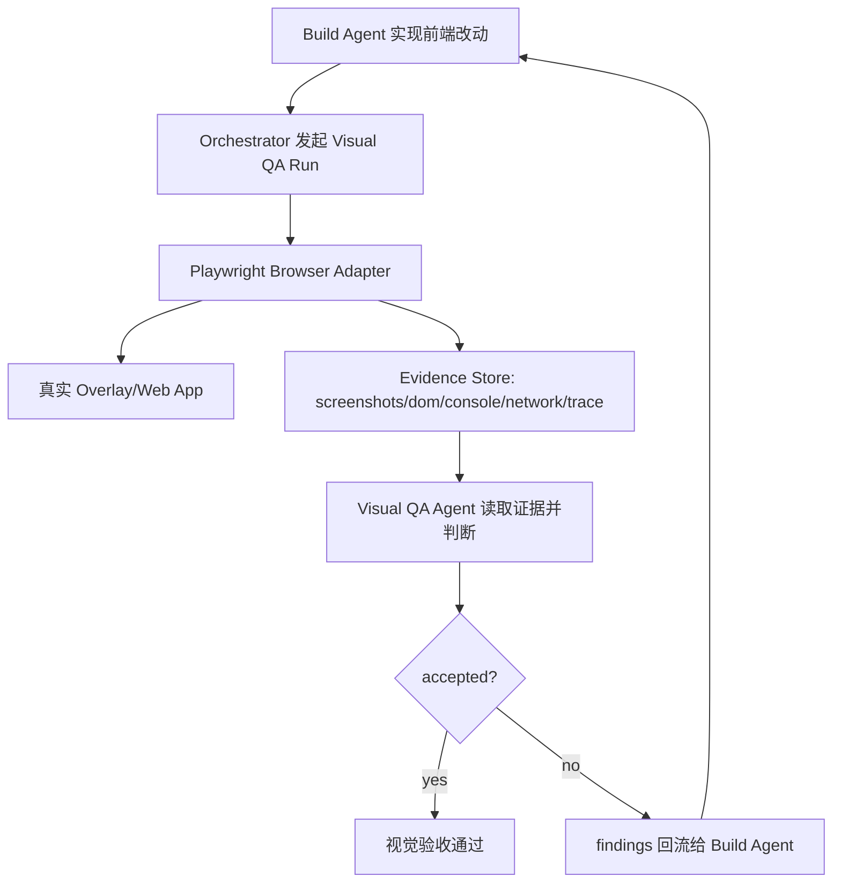

# 基于 Playwright 的 Dedicated Visual QA Agent 方案

日期：2026-05-28

## 1. 背景

本次调查结论不是“前端没有视觉测试”，而是“已有视觉能力没有形成 dedicated agent 驱动的视觉验收闭环”。

当前仓库已有三类相关基础：

1. `packages/overlay/test` 有大量前端测试，覆盖 DOM、CSS、设计 token、i18n、布局规则、组件行为。
2. `packages/overlay/test/gateway-visual-loop.ts` 已能打开真实 overlay、mock sidecar API、驱动 Gateway 多状态并截图。
3. `packages/opencorvus/src/mirror/tools` 和 `packages/opencorvus/src/delivery/checks` 已有网页渲染、截图、视觉评分、vision judge 等能力。

缺口不是更多固定截图 baseline，而是一个独立的 `visual-qa` agent：它使用 Playwright 操作真实界面，看实际像素、交互状态、断点、主题和错误态，输出带证据的视觉缺陷，并把缺陷回流给 build agent 修复。

## 2. 调查结论

### 2.1 overlay 测试数量多，但主要不是“视觉 reviewer”

`packages/overlay/package.json` 现有脚本：

- `test`: `bun test --timeout 120000`
- `dev:vite`: `vite --config vite.config.ts`
- `build:vite`: `vite build --config vite.config.ts`

`packages/overlay/test` 中已有很多设计纪律测试，例如：

- `css-structural-validity.test.ts`
- `flat-redesign-color-literal-coverage.test.ts`
- `flat-redesign-radius-coverage.test.ts`
- `theme-palette-intent.test.ts`
- `font-size-hierarchy.test.ts`
- `workspace-composer-density.test.ts`

这些测试有价值，但它们主要验证源码、CSS 结构、DOM 约束和设计 token 纪律。它们无法替代一个真实 reviewer 对页面进行视觉判断，例如：

- 窄屏按钮是否挤压输入区；
- 错误态 banner 是否遮挡主内容；
- 文本是否在中文/英文下溢出；
- 操作按钮的视觉优先级是否错误；
- loading/error/empty/content 状态是否密度一致；
- dark/light theme 是否有层级和对比问题。

### 2.2 CI 当前没有把 overlay 前端测试纳入主门禁

`.github/workflows/test.yml` 当前主测试门禁运行：

- `bunx turbo run test --filter=opencorvus`
- overlay `cargo check`

它没有运行 `bun run --cwd packages/overlay test`，也没有运行 overlay browser visual pass。结果是 overlay 的大量前端测试和已有视觉脚本更多停留在本地工具层，而不是稳定验收闭环。

### 2.3 `gateway-visual-loop.ts` 是很好的基础，但还是固定脚本

`packages/overlay/test/gateway-visual-loop.ts` 已经做了很多正确的基础设施工作：

- 打开真实浏览器；
- 使用真实 overlay Vite 页面；
- mock `:7878` sidecar 请求；
- 覆盖 Gateway 多个状态；
- 输出 PNG 截图和 `summary.json`；
- 支持宽屏、窄屏、错误态、composer、proposal 等状态。

但它目前仍是“固定路径截图脚本”：

- 需要人工先启动 Vite；
- 每次固定跑同一组状态；
- 只说明 capture 成功，不负责视觉判断；
- 不能根据本次 diff 动态决定重点检查面；
- 没有作为 agent 工具层暴露。

它应该被拆成 reusable Playwright fixture/provider，而不是继续膨胀为固定测试脚本。

### 2.4 mirror 工具已经证明了“render -> judge -> 修复 -> rerun”的形态

`packages/opencorvus/src/mirror/tools` 已有：

- `webpage_render`：渲染 URL 并输出 PNG；
- `webpage_evaluate`：产生 SSIM/pixel diff 数值证据；
- `webpage_vision_judge`：用 vision model 对比截图并输出结构化视觉差异。

这个方向是对的，但它更偏“网页复刻/参考图还原”。overlay 的视觉 QA 需要更广：它不是只比较 reference/rendered 两张图，而是探索真实产品状态，判断视觉问题并推动修复。

## 3. 目标

建立一个基于 Playwright 的 dedicated `visual-qa` agent。

这个 agent 必须：

1. 独立于 build agent。
2. 打开真实运行的前端界面。
3. 根据任务目标、diff、设计材料和历史问题动态选择检查路径。
4. 使用 Playwright 采集真实证据：截图、DOM 摘要、console error、network failure、可访问性树、trace。
5. 输出结构化视觉 findings。
6. 对修复后的版本执行 targeted re-review。
7. 只有视觉 agent 明确 `accepted=true`，视觉验收才算通过。

核心原则：固定工具协议和证据格式，不固定视觉检查路径。

## 4. 非目标

本方案不做以下事情：

1. 不把 `toHaveScreenshot()` 作为主验收机制。
2. 不为整个 overlay 建立大量 golden baseline。
3. 不让 CI 对主观视觉质量做最终裁决。
4. 不让 build agent 自证视觉质量。
5. 不把视觉 agent 降级成固定截图脚本。

允许保留少量确定性检查作为基础证据：

- 页面能打开；
- root 已 hydrate；
- 截图不是空白；
- 没有 blocking console/page error；
- 关键 selector 存在；
- 交互动作不崩溃；
- artifact 成功落盘。

这些是证据有效性检查，不是视觉质量判断。

## 5. 总体架构



职责边界：

- Playwright：负责打开页面、操作页面、采集证据。
- Visual QA agent：负责决定看什么、怎么看、是否接受。
- Build agent：负责根据 findings 修改代码。
- Orchestrator：负责 build -> visual review -> repair -> re-review 的循环。

## 6. Agent 输入协议

Visual QA run 接收结构化输入：

```json
{
  "task": {
    "id": "task-id",
    "title": "修复 Gateway composer 窄屏布局",
    "goal": "窄屏下 composer 输入区、计数器、提交按钮必须清晰可用。"
  },
  "app": {
    "kind": "overlay",
    "url": "http://localhost:5173",
    "surface": "gateway"
  },
  "change": {
    "files": [
      "packages/overlay/src/components/Gateway.tsx",
      "packages/overlay/src/styles/surfaces/gateway.css"
    ],
    "summary": "Composer footer layout and counter behavior changed."
  },
  "constraints": [
    "检查宽屏和窄屏。",
    "检查 empty、loaded、error、composer、proposal 状态。",
    "如果改动涉及 theme token，同时检查 dark/light theme。",
    "重点关注遮挡、截断、层级、密度、按钮 affordance、中文/英文文本溢出。"
  ],
  "previousReview": ".opencorvus/visual/task-id/run-001/visual-review.json",
  "artifactsDir": ".opencorvus/visual/task-id/run-002"
}
```

输入中 `constraints` 是检查重点，不是固定步骤。agent 可以根据 diff 和实际观察扩展检查路径。

## 7. Agent 输出协议

Visual QA agent 必须写出 `visual-review.json`：

```json
{
  "accepted": false,
  "summary": "Gateway composer 在 900x720 下仍存在按钮和计数器视觉冲突。",
  "run": {
    "id": "visual-run-id",
    "createdAt": "2026-05-28T00:00:00.000Z",
    "appUrl": "http://localhost:5173",
    "artifactDir": ".opencorvus/visual/task-id/run-002"
  },
  "coverage": [
    {
      "surface": "gateway",
      "state": "composerOpen",
      "viewport": { "width": 900, "height": 720 },
      "theme": "dark",
      "screenshot": "screenshots/gateway-composer-narrow.png"
    }
  ],
  "findings": [
    {
      "id": "VQA-001",
      "severity": "major",
      "category": "layout",
      "region": "Gateway composer footer",
      "observed": "提交按钮和字符计数器在窄屏下视觉距离过近，形成冲突。",
      "expected": "提交按钮、计数器和输入区应有稳定分区，任何文本长度下都不重叠、不挤压。",
      "repro": [
        "打开 http://localhost:5173",
        "进入 Gateway mode",
        "设置 viewport 为 900x720",
        "打开 composer",
        "输入一段长需求文本"
      ],
      "evidence": {
        "screenshot": "screenshots/gateway-composer-narrow.png",
        "dom": "dom/gateway-composer-narrow.json",
        "console": "console/gateway-composer-narrow.json",
        "network": "network/gateway-composer-narrow.json"
      },
      "fixHint": "为 composer footer 保留独立布局行，或将 counter 移到 textarea 下方，避免与 primary action 共用拥挤空间。"
    }
  ],
  "nonBlockingNotes": []
}
```

没有 finding 时也必须输出 coverage 和 evidence，不能只写“看起来没问题”。

## 8. Severity 和通过标准

### 8.1 Severity

- `critical`：页面不可用、关键内容缺失、严重遮挡、白屏、交互崩溃、主要流程无法完成。
- `major`：用户可见且应阻断验收的问题，例如布局冲突、文本截断、按钮层级错误、错误态不可读、窄屏明显破版。
- `minor`：不阻断的小瑕疵，例如轻微间距、局部色阶、非关键 polish。

### 8.2 通过标准

- 有任何 `critical` 或 `major` finding：`accepted=false`。
- 只有 `minor` finding：可以 `accepted=true`，但必须说明为什么不阻断。
- 证据缺失、截图无效、页面未 hydrate、console 有 blocking error：必须 `accepted=false`。

## 9. Playwright Browser Adapter 设计

不要让 agent 每次直接写 Playwright test。应提供稳定工具层。

```ts
export interface VisualBrowser {
  open(url: string): Promise<void>
  setViewport(input: { width: number; height: number }): Promise<void>
  click(input: { selector?: string; text?: string; role?: string; name?: string }): Promise<void>
  type(input: { selector: string; text: string; clear?: boolean }): Promise<void>
  press(input: { key: string }): Promise<void>
  waitFor(input: { selector?: string; text?: string; timeoutMs?: number }): Promise<void>
  screenshot(input: { label: string; fullPage?: boolean }): Promise<{ path: string; sha256: string }>
  inspect(input?: { selector?: string }): Promise<DomEvidence>
  accessibility(input?: { selector?: string }): Promise<AccessibilityEvidence>
  consoleErrors(): Promise<ConsoleEvidence[]>
  networkFailures(): Promise<NetworkEvidence[]>
  trace(input: { action: "start" | "stop" }): Promise<{ path?: string }>
}
```

这个 adapter 的职责：

- 屏蔽 Playwright 底层细节；
- 统一 artifact 落盘；
- 统一截图有效性检查；
- 统一 console/network 收集；
- 限制 base64 大图直接进入 prompt，工具只返回路径和摘要。

## 10. Overlay Fixture Provider 设计

把 `gateway-visual-loop.ts` 拆成 fixture provider：

```ts
export interface OverlayVisualFixture {
  startVite(): Promise<{ url: string; stop(): Promise<void> }>
  createBrowserRun(input: { artifactDir: string }): Promise<VisualBrowser>
  mockSidecar(page: Page, fixture: OverlayFixtureData): Promise<void>
  prepareGatewaySurface(browser: VisualBrowser): Promise<void>
  setGatewayState(state: GatewayVisualState): Promise<void>
}
```

可复用状态：

- `empty`
- `ledgerLoaded`
- `selectedActiveTask`
- `composerOpen`
- `proposalPreview`
- `narrowBreakpoint`
- `statsError`

fixture provider 只提供“可达状态”和“稳定数据”。它不判断视觉是否正确。

## 11. Evidence Store

每次 visual run 写入：

```text
.opencorvus/visual/<task-id>/<run-id>/
  visual-review.json
  screenshots/
    gateway-composer-narrow.png
  dom/
    gateway-composer-narrow.json
  console/
    gateway-composer-narrow.json
  network/
    gateway-composer-narrow.json
  traces/
    run.zip
  metadata.json
```

截图 metadata 至少包含：

- label；
- viewport；
- theme；
- surface；
- state；
- path；
- sha256；
- pixel variance；
- capture time；
- selector/text checks；
- console/network summary。

截图无效条件：

- 文件缺失；
- PNG 解码失败；
- 近似纯色或空白；
- body 没有有效子节点；
- root 未 hydrate；
- 主要 selector 缺失；
- 页面存在 blocking runtime error。

## 12. Agent Review 流程

### 12.1 首轮视觉 review

1. 读取任务目标和 diff。
2. 推断受影响 surface：
   - `.tsx` -> 组件和页面；
   - `.css` -> selector、主题、断点；
   - i18n -> 文本长度和语言切换；
   - icon/token -> affordance 和层级。
3. 启动 app 和 Playwright browser。
4. 使用 fixture provider 准备相关状态。
5. 至少采集：
   - 一个桌面 viewport；
   - 一个窄屏 viewport；
   - 一个交互态；
   - 若 surface 有 error/loading/empty，则采集其中至少一个。
6. 查看截图、DOM、console、network。
7. 如发现疑点，追加 targeted capture。
8. 写 `visual-review.json`。

### 12.2 修复后 re-review

1. 读取上一轮 `visual-review.json`。
2. 逐条复现 blocking finding。
3. 对相同区域采集新截图。
4. 检查修复可能影响的相邻区域。
5. 只有旧 blocking finding 消失且没有新增 blocking finding，才 `accepted=true`。

### 12.3 无问题报告

无问题时也必须写清：

- 看了哪些 state；
- 哪些 viewport；
- 哪些 theme；
- 截图路径；
- console/network 状态；
- 为什么认为没有阻断问题。

## 13. 与现有 Agent 体系集成

### 13.1 Build Agent

Build agent 负责实现和代码测试，不负责最终视觉验收。它完成后交付：

- changed files；
- 任务目标；
- 运行入口；
- 设计材料/截图；
- 已知风险；
- 已跑过的命令。

### 13.2 Visual QA Agent

Visual QA agent 只读代码和运行界面，不直接改代码。它输出 findings 和 acceptance verdict。

### 13.3 Orchestrator

Orchestrator 负责循环：

1. dispatch build；
2. dispatch visual QA；
3. 如果 `accepted=false`，把 findings 传给 build；
4. build 修复；
5. visual QA 复验；
6. 直到 accepted 或明确 blocked。

不需要把这个做成 host-side 状态机。持久化 artifact + agent verdict 就是事实来源。

## 14. 实施计划

### Phase 1：抽取 Playwright Evidence Layer

新增：

- `packages/overlay/test/visual/browser.ts`
- `packages/overlay/test/visual/evidence.ts`

改造：

- 从 `packages/overlay/test/gateway-visual-loop.ts` 抽出通用截图、DOM、console、network 采集逻辑。

验收：

- 能打开 URL；
- 能设置 viewport；
- 能截图并写 metadata；
- 能输出 DOM summary；
- 能记录 console/network；
- evidence writer 有路径安全和 schema 测试。

### Phase 2：抽取 Overlay Fixture Provider

新增：

- `packages/overlay/test/visual/overlay-fixture.ts`

改造：

- 把 `gateway-visual-loop.ts` 中的 sidecar mock、Gateway 初始化、状态切换抽成可复用函数。
- 保留 `gateway-visual-loop.ts` 作为 thin manual runner。

验收：

- 通过 fixture 能稳定进入 Gateway mode；
- 能切换 empty、loaded、selected、composer、proposal、error、narrow 状态；
- 不需要人工预先启动 Vite，provider 自己启动和清理。

### Phase 3：定义 Visual Review Schema

新增：

- `packages/opencorvus/src/visual-qa/schema.ts`
- `packages/opencorvus/test/visual-qa/schema.test.ts`

schema：

- `VisualReviewInputSchema`
- `VisualReviewReportSchema`
- `VisualFindingSchema`
- `VisualEvidenceSchema`
- severity/category enum。

验收：

- accepted report、rejected report、invalid missing-evidence report 都有测试；
- 缺 screenshot 的 blocking finding 无法通过 schema 或后置校验。

### Phase 4：新增 Visual QA Agent Prompt Contract

新增：

- `packages/opencorvus/src/prompt/core/visual-qa-core.txt`
- `packages/opencorvus/test/agent/visual-qa-prompt.test.ts`

prompt 要求：

- 你是独立视觉 reviewer，不接受 build agent 自证；
- 必须先采集视觉证据；
- 必须引用 artifact path；
- findings 必须可复现；
- 缺证据时拒绝；
- 修复复验必须针对上一轮 findings。

### Phase 5：注册 Visual Browser Tools

新增：

- `packages/opencorvus/src/tool/visual-browser.ts`
- `packages/opencorvus/test/tool/visual-browser.test.ts`

工具：

- `visual_browser_open`
- `visual_browser_viewport`
- `visual_browser_click`
- `visual_browser_type`
- `visual_browser_screenshot`
- `visual_browser_inspect`
- `visual_browser_console`
- `visual_browser_network`
- `visual_browser_trace`

工具返回路径和摘要，不返回大图 base64。

### Phase 6：Orchestrator 接入视觉闭环

接入点：

- build 完成后；
- final acceptance 前；
- frontend 相关任务自动触发，非 frontend 任务不触发。

初始触发规则：

- `packages/overlay/src/**/*.tsx`
- `packages/overlay/src/**/*.css`
- `packages/overlay/src/i18n/**/*.json`
- `packages/web/src/**/*`

验收：

- visual QA report 成为 task artifact；
- `accepted=false` 时 findings 自动进入下一轮 build context；
- re-review 能读取上一轮 report。

### Phase 7：CI 只验证 harness，不替代 agent

CI 可增加轻量 smoke：

- 能启动 Vite；
- 能启动 Playwright browser；
- 能进入 Gateway；
- 能截图；
- 能写合法 `visual-review.json` fixture；
- 上传 artifact。

CI 不负责主观视觉质量判断。真正判断由 dedicated visual QA agent 执行。

## 15. 命令建议

`packages/overlay/package.json` 增加：

```json
{
  "scripts": {
    "visual:smoke": "bun run test/visual/smoke.ts",
    "visual:gateway": "bun run test/gateway-visual-loop.ts"
  }
}
```

`packages/opencorvus/package.json` 在 agent 工具落地后增加：

```json
{
  "scripts": {
    "test:visual-qa": "bun test --timeout 60000 test/visual-qa test/tool/visual-browser.test.ts"
  }
}
```

这些命令验证工具链可用，不等于完整 visual QA loop。

## 16. 与传统 Playwright baseline 的边界

Playwright `toHaveScreenshot()` 可以作为辅助，但不是主方案。

适合 baseline 的场景：

- 小 primitive；
- 稳定 icon/button 几何；
- 静态 empty state；
- 某个已修复视觉 bug 的定点回归。

不适合 baseline 的场景：

- 整个 overlay app；
- 动态任务列表；
- 长会话 transcript；
- loading/streaming；
- agent 生成内容；
- 主观层级、密度、视觉优先级。

本方案中 Playwright 是 agent 的眼睛和手，不是最终裁判。

## 17. 最小可交付切片

建议第一轮只做以下五件事：

1. 把 `gateway-visual-loop.ts` 的 sidecar mock 和状态准备抽成 `overlay-fixture.ts`。
2. 加一个 Playwright `VisualBrowser` wrapper，能截图、DOM inspect、收 console/network。
3. 定义 `visual-review.json` schema。
4. 写一个 manual visual QA runner，输入 task JSON，输出 review report。
5. 先在 Gateway 改动上手动使用，验证 build -> visual QA -> repair -> re-review 是否顺畅。

这能证明 dedicated agent 流程，不会提前陷入 CI、baseline、平台字体差异和大规模截图维护。

## 18. 验收标准

方案落地后应满足：

1. Visual QA run 能通过 Playwright 打开真实界面。
2. 能准备 Gateway surface 和 mock sidecar。
3. 能落盘截图、DOM、console、network、trace。
4. 能输出合法 `visual-review.json`。
5. `accepted=false` 的 findings 能回流给 build agent。
6. 修复后 visual QA 能按上一轮 findings 复验。
7. build agent 不能绕过 visual QA 自行宣布视觉通过。
8. 缺少有效视觉证据时必须拒绝。

## 19. 风险和控制

### 19.1 Agent 判断过于主观

控制：每个 blocking finding 必须包含 screenshot、region、repro、observed、expected、fixHint。

### 19.2 Playwright layer 变成固定测试脚本

控制：fixture 固定，检查路径不固定。由 visual QA agent 根据任务动态选择。

### 19.3 视觉 QA 太慢

控制：按 changed files 推断 impacted surface。小改动只跑 targeted review，大 CSS/theme/layout 改动再跑 broad review。

### 19.4 截图不稳定

控制：不把全应用 pixel baseline 作为核心门禁。截图主要作为视觉证据，确定性校验只判断证据是否有效。

### 19.5 Agent 看不到足够上下文

控制：输入必须包含任务目标、diff 文件、设计材料、运行入口、历史 findings、DOM/console/network evidence。

## 20. 结论

推荐方向是：基于 Playwright 建一个 dedicated visual QA agent，而不是建立机械化视觉 baseline 套件。

Playwright 提供可重复的真实浏览器操作和证据采集；visual QA agent 提供动态探索、视觉判断和修复闭环。当前仓库已有 `gateway-visual-loop.ts` 和 mirror vision judge 基础，第一步应抽象 fixture 和 evidence layer，再把它接入 agent/orchestrator。
