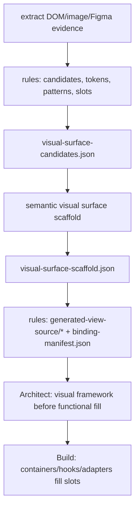

# Webpage Mirror Semantic Surfaces Plan

Date: 2026-05-28

## Decision

Replace the public mirror `sections` scaffold with semantic visual surfaces.
Extraction chunks may remain as local analyzer implementation details, but
downstream source generation, Architect, Build, and Integrity consume only
`ProjectScaffold.version = 2` with `surfaces`.

The implemented flow is:

Rules own deterministic extraction, token/pattern/slot evidence, schema
validation, path projection, and View materialization. The frontend-design agent
owns the frontend template interpretation of those semantic surfaces and the business
container handoff.

## Implemented Contract

`ProjectScaffold` now exposes:

- `version: 2`
- `tokensFile`
- `sharedViews`
- `surfaces: VisualSurfaceContract[]`
- `appFile`
- `tokens`
- `catalog`

`VisualSurfaceContract` contains:

- semantic `id`, `name`, and `kind`
- `bounds`
- `sourceRefs`
- presentational `view: FileContract`
- `slots`
- `repeatedPatterns`
- `containerContract`

The old public `sections` field and `sectionIR` file field are replaced by
`surfaces` and `surfaceIR`. Binding manifest shapes are Zod-validated instead
of TypeScript-only interfaces.

## Artifact Contract

URL analysis writes:

- `reference.png`
- `page-ir.xml`
- `shared-context.md`
- `prd-evidence-summary.md`
- `visual-surface-candidates.json`
- `visual-surface-scaffold.json`
- `binding-manifest.json`
- `generated-view-source/*`

It does not write `generated-source/*` or `generated-visual-source/*`.

## Acceptance

- Generated files use semantic names such as `HeaderNavigationView`,
  `SearchHeroView`, `FooterLegalLinksView`, and `FloatingToolsView`.
- No generated file or manifest component is named `section-0`.
- `ProjectScaffoldSchema` rejects legacy payloads with a public `sections`
  field.
- URL, image, and Figma analyzers converge on the same semantic `surfaces`
  contract.
- Prompt and skill text point downstream agents at `visual-surface-scaffold`,
  `binding-manifest`, and `generated-view-source`.
