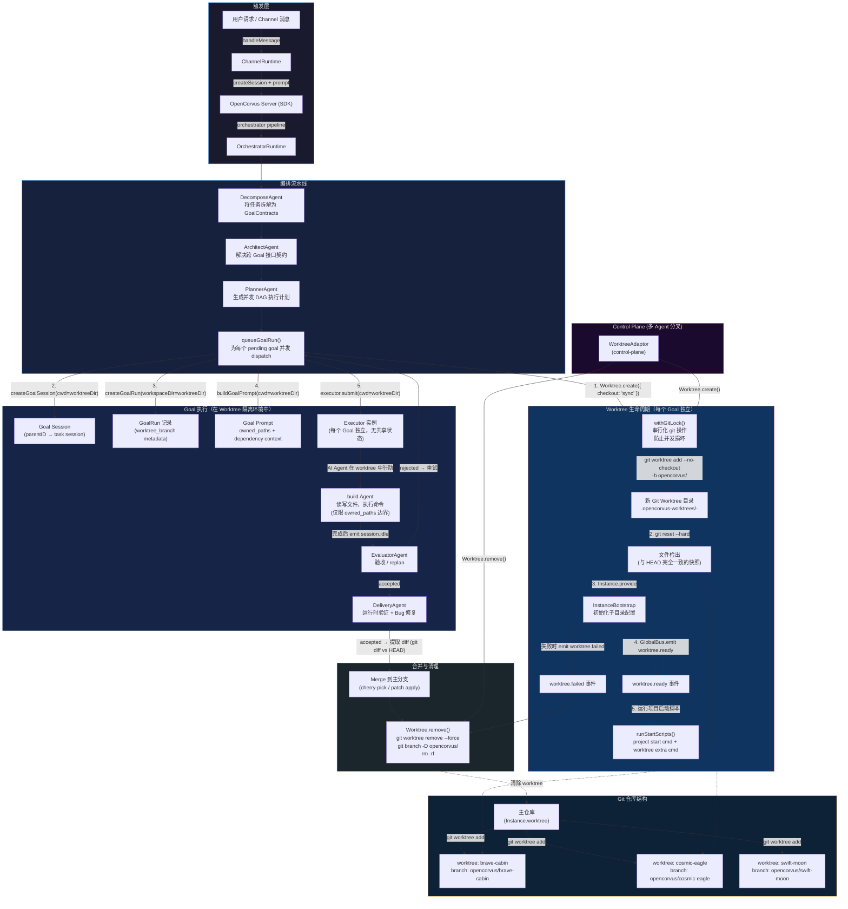

# Worktree Lifecycle

```mermaid
flowchart TD
    subgraph TRIGGER["触发层"]
        User["用户请求 / Channel 消息"] --> |"handleMessage"| CR["ChannelRuntime"]
        CR --> |"createSession + prompt"| OC["OpenCorvus Server (SDK)"]
        OC --> |"orchestrator pipeline"| ORCH["OrchestratorRuntime"]
    end

    subgraph PIPELINE["编排流水线"]
        ORCH --> DECOMP["DecomposeAgent\n将任务拆解为 GoalContracts"]
        DECOMP --> ARCH["ArchitectAgent\n解决跨 Goal 接口契约"]
        ARCH --> PLAN["PlannerAgent\n生成并发 DAG 执行计划"]
        PLAN --> DISPATCH["queueGoalRun()\n为每个 pending goal 并发 dispatch"]
    end

    subgraph WORKTREE_LIFECYCLE["Worktree 生命周期（每个 Goal 独立）"]
        DISPATCH --> |"1. Worktree.create({ checkout: 'sync' })"| LOCK["withGitLock()\n串行化 git 操作\n防止并发损坏"]
        LOCK --> |"git worktree add --no-checkout\n-b opencorvus/<name>"| GWT["新 Git Worktree 目录\n.opencorvus-worktrees/<adj>-<noun>"]
        GWT --> |"2. git reset --hard"| CHECKOUT["文件检出\n(与 HEAD 完全一致的快照)"]
        CHECKOUT --> |"3. Instance.provide"| BOOT["InstanceBootstrap\n初始化子目录配置"]
        BOOT --> |"4. GlobalBus.emit worktree.ready"| READY["worktree.ready 事件"]
        BOOT --> |"失败时 emit worktree.failed"| FAIL["worktree.failed 事件"]
        READY --> |"5. 运行项目启动脚本"| START["runStartScripts()\nproject start cmd + worktree extra cmd"]
    end

    subgraph GOAL_EXEC["Goal 执行（在 Worktree 隔离环境中）"]
        DISPATCH --> |"2. createGoalSession(cwd=worktreeDir)"| GSESS["Goal Session\n(parentID → task session)"]
        DISPATCH --> |"3. createGoalRun(workspaceDir=worktreeDir)"| GRR["GoalRun 记录\n(worktree_branch metadata)"]
        DISPATCH --> |"4. buildGoalPrompt(cwd=worktreeDir)"| PROMPT["Goal Prompt\nowned_paths + dependency context"]
        DISPATCH --> |"5. executor.submit(cwd=worktreeDir)"| EXEC["Executor 实例\n(每个 Goal 独立，无共享状态)"]
        EXEC --> |"AI Agent 在 worktree 中行动"| AGENT["build Agent\n读写文件、执行命令\n(仅限 owned_paths 边界)"]
        AGENT --> |"完成后 emit session.idle"| EVAL["EvaluatorAgent\n验收 / replan"]
        EVAL --> |"accepted"| DLVR["DeliveryAgent\n运行时验证 + Bug 修复"]
    end

    subgraph MERGE_CLEANUP["合并与清理"]
        DLVR --> |"accepted → 提取 diff (git diff vs HEAD)"| MERGE["Merge 到主分支\n(cherry-pick / patch apply)"]
        MERGE --> CLEANUP["Worktree.remove()\ngit worktree remove --force\ngit branch -D opencorvus/<name>\nrm -rf <directory>"]
        FAIL --> CLEANUP
        EVAL --> |"rejected → 重试"| DISPATCH
    end

    subgraph GIT_STRUCTURE["Git 仓库结构"]
        MAIN["主仓库\n(Instance.worktree)"]
        WT1["worktree: brave-cabin\nbranch: opencorvus/brave-cabin"]
        WT2["worktree: cosmic-eagle\nbranch: opencorvus/cosmic-eagle"]
        WTN["worktree: swift-moon\nbranch: opencorvus/swift-moon"]
        MAIN --> |"git worktree add"| WT1
        MAIN --> |"git worktree add"| WT2
        MAIN --> |"git worktree add"| WTN
    end

    subgraph CONTROL_PLANE["Control Plane (多 Agent 分叉)"]
        CP["WorktreeAdaptor\n(control-plane)"]
        CP --> |"Worktree.create()"| LOCK
        CP --> |"Worktree.remove()"| CLEANUP
    end

    CHECKOUT -.-> WT1
    CHECKOUT -.-> WT2
    CLEANUP -.-> |"清除 worktree"| MAIN

    style TRIGGER fill:#1a1a2e,stroke:#4a90d9,color:#e0e0e0
    style PIPELINE fill:#16213e,stroke:#4a90d9,color:#e0e0e0
    style WORKTREE_LIFECYCLE fill:#0f3460,stroke:#e94560,color:#e0e0e0
    style GOAL_EXEC fill:#162447,stroke:#1f4068,color:#e0e0e0
    style MERGE_CLEANUP fill:#1b262c,stroke:#4a90d9,color:#e0e0e0
    style GIT_STRUCTURE fill:#0d2137,stroke:#f5a623,color:#e0e0e0
    style CONTROL_PLANE fill:#1a0a2e,stroke:#9b59b6,color:#e0e0e0
```
