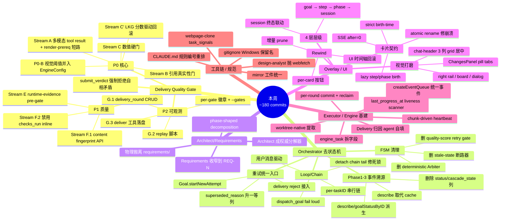
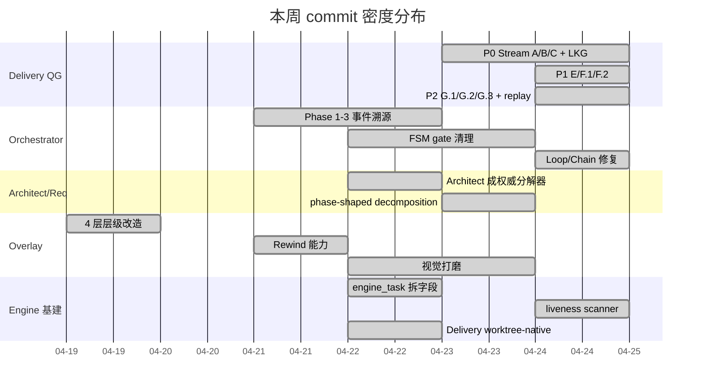
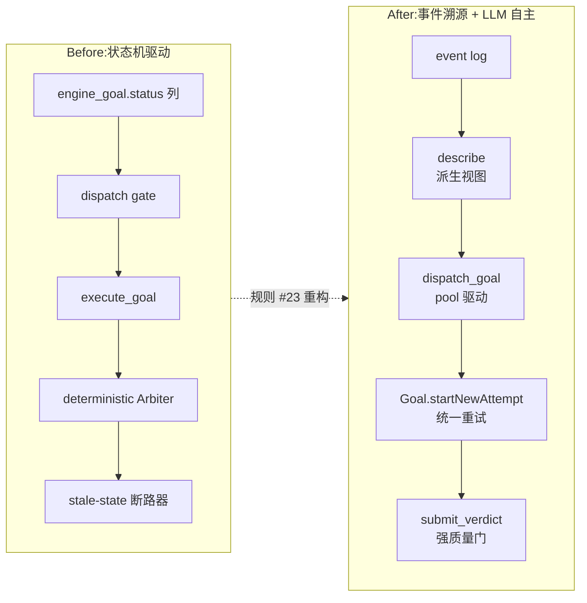
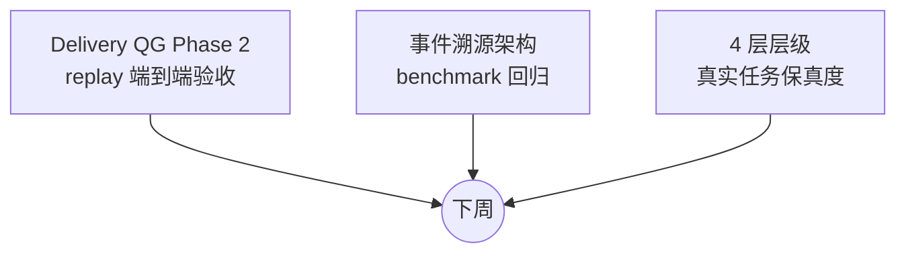

# 周报 2026-04-17 ~ 2026-04-24

## 本周逻辑主线（一条因果链）

> 一句话：**为了让「交付是否合格」这件事从"模糊判断"变成"可度量的硬门"，先拆掉所有藏着决策权的状态机，让状态由事件派生；再把分解权收归 Architect、重试权收归 `startNewAttempt`；最后在 Delivery 出口架上 Quality Gate 做终审。**

```mermaid
flowchart LR
    Q0["❓ 本周起点问题<br/>Delivery 验收靠 agent 自说自话<br/>无法度量,无法复现,无法回滚"]

    Q0 --> S1["① 先拆状态机<br/>(规则#23)"]
    S1 --> S1a["engine_goal.status 列删除<br/>cascade_state 删除<br/>stale-breaker/Arbiter/FSM gate 全清"]
    S1a --> S1b["describe 派生视图成唯一状态源<br/>事件日志 → goalStatusByID"]

    S1b --> S2["② 收归决策入口"]
    S2 --> S2a["分解权 → Architect<br/>(Requirements 收窄到 REQ-N)"]
    S2 --> S2b["重试权 → Goal.startNewAttempt<br/>(所有 retry intent 统一)"]
    S2 --> S2c["调度权 → dispatch_goal + pool<br/>(loop 不再 auto-restart,<br/>用户消息驱动 per-taskID 串行链)"]

    S2a --> S3["③ 架质量门"]
    S2b --> S3
    S2c --> S3

    S3 --> S3a["P0 核心<br/>多模态 tool result / 引用真实性 /<br/>数值硬门 / LKG 回滚"]
    S3 --> S3b["P1 质量<br/>runtime-evidence pre-gate /<br/>fingerprint / 禁 checks_run"]
    S3 --> S3c["P2 可观测<br/>delivery_round 落盘 /<br/>replay 脚本 / per-gate 徽章"]
    S3 --> S3d["submit_verdict<br/>拒绝自相矛盾的 accepted"]

    S3a --> S4["④ 让结果看得见"]
    S3b --> S4
    S3c --> S4
    S3d --> S4

    S4 --> S4a["Overlay 4 层层级<br/>goal→step→phase→session"]
    S4 --> S4b["Rewind per-card<br/>UI 时间轴作为投影"]
    S4 --> S4c["卡片严格 birth-time<br/>SSE after=0 不丢历史"]

    S4a --> S5["⑤ 打底基建"]
    S4b --> S5
    S4c --> S5

    S5 --> S5a["engine_task 拆字段<br/>attachments vs system_artifacts"]
    S5 --> S5b["createEventQueue 统一事件<br/>chunk-driven heartbeat"]
    S5 --> S5c["last_progress_at 独立 liveness scanner"]
    S5 --> S5d["delivery worktree-native<br/>per-round commit + reclaim"]

    S5a --> Q1["✅ 本周终点<br/>交付质量从 agent 自述<br/>变成事件派生 + 硬门 + 可 replay"]
    S5b --> Q1
    S5c --> Q1
    S5d --> Q1

    classDef phase fill:#2d3748,stroke:#4a5568,color:#fff
    classDef pain fill:#742a2a,stroke:#c53030,color:#fff
    classDef win fill:#22543d,stroke:#38a169,color:#fff
    class S1,S2,S3,S4,S5 phase
    class Q0 pain
    class Q1 win
```

### 为什么是这条顺序

| 步骤 | 必须先做它的原因 |
|---|---|
| ① 拆状态机 | 状态机里藏着的 gate 会拦截事件,事件溯源就无从谈起 |
| ② 收归入口 | 如果分解/重试/调度有多个入口,质量门就有多个绕路 |
| ③ 架质量门 | 入口收敛后,才有唯一出口可以装门 |
| ④ UI 层级 | 门的判决需要被人看见,否则 agent 陷入"自嗨回路" |
| ⑤ 打底基建 | 前四步暴露出来的基础设施缺口(事件队列/liveness/worktree 提取)补齐 |

---

## 工作主题分布（Mermaid 思维导图）

## 时间分布（Gantt）

## 架构演进（Before → After）

## 下周焦点

